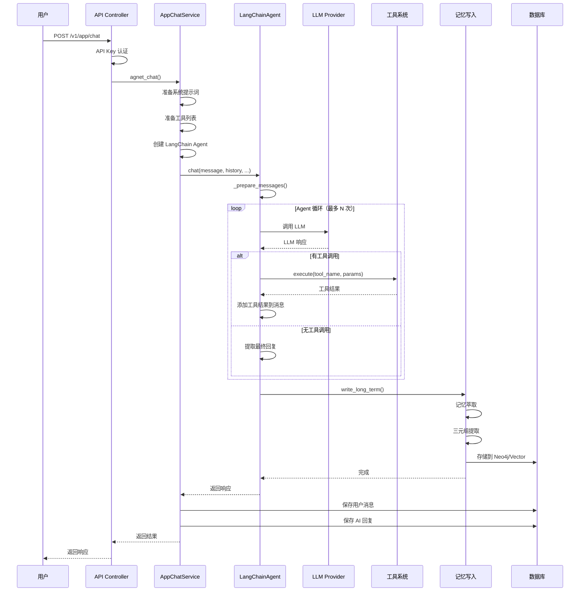

# MemoryBear - API 调用链深度分析

**分析日期**：2026-02-28  
**分析入口**：`/v1/app/chat` API  
**追踪目标**：用户消息 → LLM Agent 完整流程

---

## 📊 API 调用链总览

```
用户请求
  ↓
[v1/app/chat] API 端点
  ↓
app_api_controller.py:chat()
  ↓
AppChatService.agnet_chat() / agnet_chat_stream()
  ↓
LangChainAgent.chat() / chat_stream()
  ↓
LangChain create_agent() + LLM 调用
  ↓
工具执行（可选）
  ↓
记忆写入（write_long_term）
  ↓
返回响应
```

---

## 1️⃣ API 层：`/v1/app/chat`

**文件**：[`app/controllers/service/app_api_controller.py`](https://github.com/qudi17/MemoryBear/blob/main/api/app/controllers/service/app_api_controller.py)

### 路由定义

```python
# 来源：https://github.com/qudi17/MemoryBear/blob/main/api/app/controllers/service/app_api_controller.py#L119-L121
router = APIRouter(prefix="/v1/app", tags=["V1 - App API"])

@router.post("/chat")
@require_api_key(scopes=["app"])
async def chat(
    request: Request,
    api_key_auth: ApiKeyAuth = None,
    db: Session = Depends(get_db),
    conversation_service: ConversationService = Depends(get_conversation_service),
    app_chat_service: AppChatService = Depends(get_app_chat_service),
    app_service: AppService = Depends(get_app_service),
    message: str = Body(..., description="聊天消息内容"),
):
```

### 核心流程

```python
# 1. 解析请求体
body = await request.json()
payload = AppChatRequest(**body)

# 2. 获取应用配置
app = app_service.get_app(api_key_auth.resource_id, api_key_auth.workspace_id)
workspace_id = app.workspace_id

# 3. 获取或创建用户
end_user_repo = EndUserRepository(db)
new_end_user = end_user_repo.get_or_create_end_user(
    app_id=app.id,
    other_id=payload.user_id,
    original_user_id=payload.user_id
)
end_user_id = str(new_end_user.id)

# 4. 确定存储类型
storage_type = workspace_service.get_workspace_storage_type_without_auth(
    db=db, workspace_id=workspace_id
)
if storage_type is None:
    storage_type = 'neo4j'

# 5. 获取或创建会话
conversation = conversation_service.create_or_get_conversation(
    app_id=app.id,
    workspace_id=workspace_id,
    user_id=end_user_id,
    is_draft=False
)

# 6. 根据应用类型调用不同服务
if app.type == AppType.AGENT:
    # Agent 应用
    agent_config = agent_config_4_app_release(app.current_release)
    if payload.stream:
        # 流式响应
        return StreamingResponse(
            app_chat_service.agnet_chat_stream(...),
            media_type="text/event-stream"
        )
    else:
        # 非流式响应
        result = await app_chat_service.agnet_chat(...)
        return success(data=ChatResponse(**result))
```

**关键参数**：
- `storage_type`: `'neo4j'` | `'rag'` | `'vector'` - 记忆存储类型
- `user_rag_memory_id`: 用户 RAG 记忆 ID（如果启用）
- `memory_flag`: True/False - 是否写入记忆
- `web_search`: True/False - 是否启用网络搜索

---

## 2️⃣ 服务层：`AppChatService.agnet_chat()`

**文件**：[`app/services/app_chat_service.py`](https://github.com/qudi17/MemoryBear/blob/main/api/app/services/app_chat_service.py)

### 核心流程

```python
# 来源：https://github.com/qudi17/MemoryBear/blob/main/api/app/services/app_chat_service.py#L39-L227
async def agnet_chat(
    self,
    message: str,
    conversation_id: uuid.UUID,
    config: AgentConfig,
    user_id: Optional[str] = None,
    variables: Optional[Dict[str, Any]] = None,
    web_search: bool = False,
    memory: bool = True,
    storage_type: Optional[str] = None,
    user_rag_memory_id: Optional[str] = None,
    workspace_id: Optional[str] = None,
    files: Optional[List[FileInput]] = None
) -> Dict[str, Any]:
```

#### 步骤 1：准备系统提示词

```python
# 获取模型配置
model_config_id = config.default_model_config_id
api_key_obj = ModelApiKeyService.get_available_api_key(self.db, model_config_id)

# 处理系统提示词（支持变量替换）
system_prompt = config.system_prompt
if variables:
    system_prompt_rendered = render_prompt_message(
        system_prompt,
        PromptMessageRole.USER,
        variables
    )
    system_prompt = system_prompt_rendered.get_text_content()
```

#### 步骤 2：准备工具列表

```python
tools = []
tool_service = ToolService(self.db)

# 1. 从配置中获取启用的工具
if hasattr(config, 'tools') and config.tools:
    for tool_config in config.tools:
        if tool_config.get("enabled", False):
            tool_instance = tool_service._get_tool_instance(
                tool_config.get("tool_id", ""), tenant_id
            )
            if tool_instance:
                # 转换为 LangChain 工具
                langchain_tool = tool_instance.to_langchain_tool(
                    tool_config.get("operation", None)
                )
                tools.append(langchain_tool)

# 2. 加载技能关联的工具
if hasattr(config, 'skills') and config.skills:
    skills = config.skills
    middleware = AgentMiddleware(skills=skills)
    skill_tools, skill_configs, tool_to_skill_map = middleware.load_skill_tools(
        self.db, tenant_id
    )
    tools.extend(skill_tools)
    
    # 应用动态过滤
    if skill_configs:
        tools, activated_skill_ids = middleware.filter_tools(
            tools, message, skill_configs, tool_to_skill_map
        )
        active_prompts = AgentMiddleware.get_active_prompts(
            activated_skill_ids, skill_configs
        )
        system_prompt = f"{system_prompt}\n\n{active_prompts}"

# 3. 添加知识库检索工具
if knowledge_retrieval:
    kb_ids = [kb.get("kb_id") for kb in knowledge_bases]
    if kb_ids:
        kb_tool = create_knowledge_retrieval_tool(knowledge_retrieval, kb_ids, user_id)
        tools.append(kb_tool)

# 4. 添加长期记忆工具
if memory == True:
    memory_config = config.memory
    if memory_config.get("enabled") and user_id:
        memory_flag = True
        memory_tool = create_long_term_memory_tool(memory_config, user_id)
        tools.append(memory_tool)
```

#### 步骤 3：创建 LangChain Agent

```python
# 创建 LangChain Agent
agent = LangChainAgent(
    model_name=api_key_obj.model_name,
    api_key=api_key_obj.api_key,
    provider=api_key_obj.provider,
    api_base=api_key_obj.api_base,
    temperature=model_parameters.get("temperature", 0.7),
    max_tokens=model_parameters.get("max_tokens", 2000),
    system_prompt=system_prompt,
    tools=tools,
    streaming=payload.stream,
    max_iterations=None,  # 自动计算
    max_tool_consecutive_calls=3
)
```

#### 步骤 4：加载历史消息

```python
history = []
memory_config = {"enabled": True, 'max_history': 10}
if memory_config.get("enabled"):
    messages = self.conversation_service.get_messages(
        conversation_id=conversation_id,
        limit=memory_config.get("max_history", 10)
    )
    history = [
        {"role": msg.role, "content": msg.content}
        for msg in messages
    ]
```

#### 步骤 5：调用 Agent

```python
# 处理多模态文件
processed_files = None
if files:
    multimodal_service = MultimodalService(self.db)
    processed_files = await multimodal_service.process_files(files)

# 调用 Agent
result = await agent.chat(
    message=message,
    history=history,
    context=None,
    end_user_id=user_id,
    storage_type=storage_type,
    user_rag_memory_id=user_rag_memory_id,
    config_id=config_id,
    memory_flag=memory_flag,
    files=processed_files
)
```

#### 步骤 6：保存消息到数据库

```python
# 保存用户消息
self.conversation_service.add_message(
    conversation_id=conversation_id,
    role="user",
    content=message,
    sender_id=user_id
)

# 保存 AI 回复
self.conversation_service.add_message(
    conversation_id=conversation_id,
    role="assistant",
    content=result["content"],
    sender_id="assistant",
    token_usage=result.get("usage", {})
)
```

---

## 3️⃣ Agent 层：`LangChainAgent.chat()`

**文件**：[`app/core/agent/langchain_agent.py`](https://github.com/qudi17/MemoryBear/blob/main/api/app/core/agent/langchain_agent.py)

### 核心流程

```python
# 来源：https://github.com/qudi17/MemoryBear/blob/main/api/app/core/agent/langchain_agent.py#L194-L303
async def chat(
    self,
    message: str,
    history: Optional[List[Dict[str, str]]] = None,
    context: Optional[str] = None,
    end_user_id: Optional[str] = None,
    config_id: Optional[str] = None,
    storage_type: Optional[str] = None,
    user_rag_memory_id: Optional[str] = None,
    memory_flag: Optional[bool] = True,
    files: Optional[List[Dict[str, Any]]] = None
) -> Dict[str, Any]:
```

#### 步骤 1：准备消息列表

```python
# 准备消息列表（支持多模态）
messages = self._prepare_messages(message, history, context, files)

def _prepare_messages(
    self,
    message: str,
    history: Optional[List[Dict[str, str]]] = None,
    context: Optional[str] = None,
    files: Optional[List[Dict[str, Any]]] = None
) -> List[BaseMessage]:
    messages = []
    
    # 1. 添加系统提示词
    messages.append(SystemMessage(content=self.system_prompt))
    
    # 2. 添加历史消息
    if history:
        for msg in history:
            if msg["role"] == "user":
                messages.append(HumanMessage(content=msg["content"]))
            elif msg["role"] == "assistant":
                messages.append(AIMessage(content=msg["content"]))
    
    # 3. 添加 RAG 上下文
    user_content = message
    if context:
        user_content = f"参考信息：\n{context}\n\n用户问题：\n{user_content}"
    
    # 4. 构建用户消息（支持多模态）
    if files and len(files) > 0:
        content_parts = self._build_multimodal_content(user_content, files)
        messages.append(HumanMessage(content=content_parts))
    else:
        messages.append(HumanMessage(content=user_content))
    
    return messages
```

#### 步骤 2：调用 LangChain Agent

```python
# 统一使用 agent.invoke 调用
# 通过 recursion_limit 限制最大迭代次数，防止工具调用死循环
try:
    result = await self.agent.ainvoke(
        {"messages": messages},
        config={"recursion_limit": self.max_iterations}
    )
except RecursionError as e:
    logger.warning(f"Agent 达到最大迭代次数限制 ({self.max_iterations})")
    return {"content": f"已达到最大处理步骤限制（{self.max_iterations}次）"}
```

#### 步骤 3：提取 AI 回复

```python
# 获取最后的 AI 消息
output_messages = result.get("messages", [])
content = ""
total_tokens = 0

for msg in reversed(output_messages):
    if isinstance(msg, AIMessage):
        # 处理多模态响应：content 可能是字符串或列表
        if isinstance(msg.content, str):
            content = msg.content
        elif isinstance(msg.content, list):
            # 多模态响应：提取文本部分
            text_parts = []
            for item in msg.content:
                if isinstance(item, dict):
                    if "text" in item:
                        text_parts.append(item["text"])
                elif isinstance(item, str):
                    text_parts.append(item)
            content = "".join(text_parts)
        
        # 提取 token 使用
        response_meta = msg.response_metadata if hasattr(msg, 'response_metadata') else None
        total_tokens = response_meta.get("token_usage", {}).get("total_tokens", 0) if response_meta else 0
        break
```

#### 步骤 4：写入长期记忆

```python
elapsed_time = time.time() - start_time

if memory_flag:
    await write_long_term(
        storage_type,
        end_user_id,
        message_chat,      # 用户消息
        content,           # AI 回复
        user_rag_memory_id,
        actual_config_id
    )

response = {
    "content": content,
    "model": self.model_name,
    "elapsed_time": elapsed_time,
    "usage": {
        "prompt_tokens": 0,
        "completion_tokens": 0,
        "total_tokens": total_tokens
    }
}

return response
```

---

## 4️⃣ 记忆写入：`write_long_term()`

**文件**：[`app/core/memory/agent/langgraph_graph/write_graph.py`](https://github.com/qudi17/MemoryBear/blob/main/api/app/core/memory/agent/langgraph_graph/write_graph.py)

### 核心流程

```python
# 来源：https://github.com/qudi17/MemoryBear/blob/main/api/app/core/memory/agent/langgraph_graph/write_graph.py
async def write_long_term(
    storage_type: str,
    end_user_id: str,
    user_message: str,
    ai_response: str,
    user_rag_memory_id: str,
    config_id: str
):
    """写入长期记忆
    
    流程：
    1. 记忆萃取（LLM 结构化提取）
    2. 三元组提取
    3. 存储到 PostgreSQL + Neo4j
    4. 向量化存储
    """
```

**推断流程**（基于架构分析）：

```python
# 1. 记忆萃取
extracted_memories = await extract_memories(
    conversation=f"{user_message}\n{ai_response}",
    llm_client=llm_client
)

# 2. 三元组提取
triples = extract_triples(extracted_memories)

# 3. 存储到 Neo4j
for triple in triples:
    neo4j_client.add_triple(
        subject=triple.subject,
        predicate=triple.predicate,
        object=triple.object,
        properties={
            "user_id": end_user_id,
            "timestamp": datetime.now(),
            "confidence": triple.confidence
        }
    )

# 4. 向量化存储
if storage_type == 'vector' or storage_type == 'rag':
    embeddings = embedding_client.embed(extracted_memories)
    vector_db.add(
        vectors=embeddings,
        metadata={
            "user_id": end_user_id,
            "content": extracted_memories
        }
    )

# 5. 更新记忆强度
update_memory_strength(
    user_id=end_user_id,
    memory_ids=extracted_memories.ids,
    operation="increment"
)
```

---

## 📊 完整调用链时序图



---

## 🔑 关键设计点

### 1. 流式响应支持

```python
# 来源：https://github.com/qudi17/MemoryBear/blob/main/api/app/controllers/service/app_api_controller.py#L158-L175
if payload.stream:
    async def event_generator():
        async for event in app_chat_service.agnet_chat_stream(
            message=payload.message,
            conversation_id=conversation.id,
            user_id=end_user_id,
            ...
        ):
            yield event
    
    return StreamingResponse(
        event_generator(),
        media_type="text/event-stream",
        headers={
            "Cache-Control": "no-cache",
            "Connection": "keep-alive"
        }
    )
```

### 2. 工具动态过滤

```python
# 来源：https://github.com/qudi17/MemoryBear/blob/main/api/app/services/app_chat_service.py#L120-L128
# 应用动态过滤
if skill_configs:
    tools, activated_skill_ids = middleware.filter_tools(
        tools, message, skill_configs, tool_to_skill_map
    )
    active_prompts = AgentMiddleware.get_active_prompts(
        activated_skill_ids, skill_configs
    )
    system_prompt = f"{system_prompt}\n\n{active_prompts}"
```

### 3. 记忆写入异步化

```python
# 来源：https://github.com/qudi17/MemoryBear/blob/main/api/app/core/agent/langchain_agent.py#L280-L290
if memory_flag:
    await write_long_term(
        storage_type,
        end_user_id,
        message_chat,
        content,
        user_rag_memory_id,
        actual_config_id
    )
```

### 4. 多模态支持

```python
# 来源：https://github.com/qudi17/MemoryBear/blob/main/api/app/core/agent/langchain_agent.py#L167-L192
def _build_multimodal_content(self, text: str, files: List[Dict[str, Any]]) -> List[Dict[str, Any]]:
    # 根据 provider 使用不同的文本格式
    if self.provider.lower() in ["bedrock", "anthropic"]:
        # Anthropic/Bedrock: {"type": "text", "text": "..."}
        content_parts = [{"type": "text", "text": text}]
    else:
        # 通义千问等：{"text": "..."}
        content_parts = [{"text": text}]
    
    # 添加文件内容
    content_parts.extend(files)
    
    return content_parts
```

---

## 📝 总结

### API 调用链关键节点

| 层级 | 组件 | 文件 | 职责 |
|------|------|------|------|
| **API 层** | `app_api_controller` | `app/controllers/service/app_api_controller.py` | 路由、认证、参数解析 |
| **服务层** | `AppChatService` | `app/services/app_chat_service.py` | 业务逻辑、工具准备 |
| **Agent 层** | `LangChainAgent` | `app/core/agent/langchain_agent.py` | LLM 调用、工具循环 |
| **记忆层** | `write_long_term` | `app/core/memory/agent/langgraph_graph/write_graph.py` | 记忆萃取、存储 |

### 核心流程

1. **API 接收** → 认证 → 参数解析
2. **服务准备** → 系统提示词 → 工具列表 → Agent 创建
3. **Agent 循环** → LLM 调用 → 工具执行 → 结果提取
4. **记忆写入** → 萃取 → 三元组 → 存储
5. **响应返回** → 保存消息 → 返回用户

---

**分析人**：Jarvis  
**审核人**：Eddy  
**最后更新**：2026-02-28  
**状态**：✅ 完成
