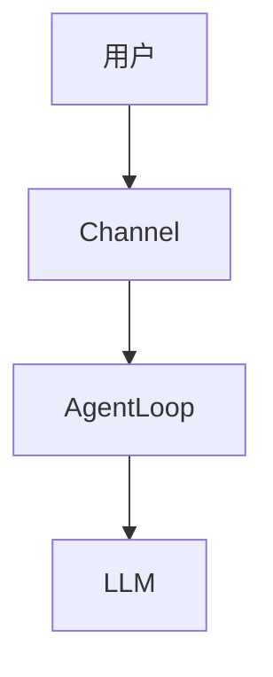

# GitHub 项目研究文档

> 从优秀 GitHub 项目中提炼通用 RAG 和 Agent 方案

**研究计划**：2026-02-28 启动  
**目标**：8 个项目 → 通用架构 → 可复用组件

---

## 📚 研究项目清单

### 已完成

| 项目 | 分析文档 | 提炼组件 | 状态 |
|------|---------|---------|------|
| **nanobot** | [分析报告](./GitHub/nanobot/分析报告.md) | Agent Core, Tool System | ✅ 完成 |

### 进行中

| 项目 | 分析文档 | 优先级 | 预计完成 |
|------|---------|-------|---------|
| **langchain** | 待创建 | ⭐⭐⭐ | 2026-03-03 |
| **llama_index** | 待创建 | ⭐⭐⭐ | 2026-03-05 |
| **dify** | 待创建 | ⭐⭐⭐ | 2026-03-07 |

### 计划中

| 项目 | 类型 | Stars | 优先级 |
|------|------|-------|-------|
| **auto-gen** | Multi-Agent | 25k+ | ⭐⭐ |
| **crewAI** | Role-Agent | 15k+ | ⭐⭐ |
| **openclaw** | Agent | - | ⭐⭐⭐ |
| **haystack** | RAG | 15k+ | ⭐ |

---

## 🎯 研究目标

### 产出物

1. **项目分析报告**（8 份）
   - 架构分析
   - 核心流程
   - 优缺点评估

2. **通用架构设计**
   - Agent Core
   - RAG Pipeline
   - Tool System
   - Memory System

3. **可复用代码库**
   - universal_agent
   - 场景示例

### 成功标准

- [ ] 核心代码 <2,000 行
- [ ] 组件可替换率 >80%
- [ ] 支持 80% 常见场景
- [ ] 文档完整度 >90%

---

## 📋 文档规范

### 文件命名

```
GitHub/
├── <项目名>/
│   ├── 分析报告.md          # 完整分析
│   ├── 核心流程.md          # 关键流程图
│   ├── 可复用组件.md        # 提炼清单
│   └── 源码链接.md          # 重要文件索引
```

### 代码引用格式

**行内代码**：
```markdown
使用 [`Agent.process_message()`](https://github.com/HKUDS/nanobot/blob/main/nanobot/agent/loop.py#L123) 处理消息
```

**代码块**：
```python
# 来源：https://github.com/HKUDS/nanobot/blob/main/nanobot/agent/loop.py#L191-L236
async def _run_agent_loop(self, messages):
    while iteration < max_iterations:
        response = await provider.chat(messages, tools)
        ...
```

### 流程图格式

使用 Mermaid，例如：



---

## 🔗 快速链接

### 项目仓库

- [nanobot](https://github.com/HKUDS/nanobot)
- [langchain](https://github.com/langchain-ai/langchain)
- [llama_index](https://github.com/run-llama/llama_index)
- [dify](https://github.com/langgenius/dify)
- [auto-gen](https://github.com/microsoft/autogen)
- [crewAI](https://github.com/crewAIInc/crewAI)
- [openclaw](https://github.com/openclaw/openclaw)

### 研究文档

- [研究计划](./研究计划.md)
- [通用架构设计](./通用架构设计.md)
- [项目分析模板](./项目分析模板.md)

### 代码仓库

- [universal_agent](../universal_agent/) - 提炼的通用框架

---

## 📊 进度追踪

### Week 1-2：核心项目

| 日期 | 项目 | 状态 | 文档 |
|------|------|------|------|
| 2/28 | nanobot | ✅ 完成 | [链接](./GitHub/nanobot/) |
| 3/1-3/3 | langchain | ⏳ 进行中 | - |
| 3/4-3/5 | llama_index | ⏳ 待开始 | - |

### Week 3：应用类项目

| 日期 | 项目 | 状态 | 文档 |
|------|------|------|------|
| 3/6-3/7 | dify | ⏳ 待开始 | - |
| 3/8-3/9 | auto-gen | ⏳ 待开始 | - |
| 3/10 | crewAI | ⏳ 待开始 | - |

### Week 4：总结提炼

| 日期 | 任务 | 状态 |
|------|------|------|
| 3/11-3/12 | openclaw 分析 | ⏳ 待开始 |
| 3/13-3/14 | 通用架构设计 | ⏳ 待开始 |
| 3/15 | 场景验证 | ⏳ 待开始 |

---

## 🛠️ 使用指南

### 查看项目分析

```bash
# 查看 nanobot 分析
cat GitHub/nanobot/分析报告.md

# 或直接在 Obsidian 中打开
```

### 添加新项目

1. 创建目录：`mkdir GitHub/<项目名>`
2. 复制模板：`cp 项目分析模板.md GitHub/<项目名>/分析报告.md`
3. 填写分析内容
4. 提交到 GitHub

### 引用代码

使用以下格式添加源码链接：

```markdown
[`函数名`](https://github.com/用户/项目/blob/分支/路径/文件.py#L 起始-L 结束)
```

例如：
```markdown
[`Agent._run_agent_loop()`](https://github.com/HKUDS/nanobot/blob/main/nanobot/agent/loop.py#L191-L236)
```

---

**最后更新**：2026-02-28  
**维护者**：Eddy  
**AI 助手**：Jarvis
