# GitHub 项目对比报告

> 深度对比分析不同 GitHub 项目的架构、设计模式和适用场景

**创建日期**：2026-02-28  
**更新频率**：每分析 2 个项目后创建对比报告

---

## 📊 对比报告清单

### Completed

| Comparison | Report Link | Date | Key Findings |
|---------|---------|---------|---------|
| **nanobot vs MemoryBear** | [Agent Runtime](./nanobot%20vs%20MemoryBear/agent-runtime-comparison.md) | 2026-02-28 | MemoryBear 2.1x latency, +7% accuracy |
| | [Core Mechanisms](./nanobot%20vs%20MemoryBear/agent-core-mechanisms-comparison.md) | 2026-02-28 | System Prompt, Memory, Tools |

### Planned

| Comparison | ETA | Dimensions |
|---------|---------|---------|
| langchain vs llama_index | 2026-03-06 | RAG Pipeline |
| dify vs flowise | 2026-03-08 | Workflow Orchestration |
| auto-gen vs crewAI | 2026-03-10 | Multi-Agent Collaboration |

---

## 📋 对比报告规范

### 目录结构

```
GitHub/comparison/
└── <项目 A> vs <项目 B>/
    ├── 对比总览.md           # 快速对比表
    ├── Agent 运行步骤对比.md  # 核心流程对比
    ├── 架构设计对比.md        # 架构差异
    ├── 性能对比.md           # 基准测试
    └── 适用场景对比.md        # 场景推荐
```

### 文件命名

- **目录名**：`<项目 A> vs <项目 B>`（空格分隔）
- **文件名**：`<对比维度> 对比.md`
- **示例**：`nanobot vs MemoryBear/Agent 运行步骤对比.md`

### 对比维度

每个对比报告应包含：

1. **核心差异概览** - 表格形式，一句话差异
2. **架构对比** - 架构图 + 核心模块
3. **运行流程对比** - 流程图 + 步骤耗时
4. **关键代码对比** - 源码链接 + 代码片段
5. **性能指标对比** - 延迟、并发、准确性
6. **适用场景对比** - 场景推荐表
7. **演进建议** - 如何从 A 演进到 B

### 源码引用规范

**格式**：
```markdown
[`函数名`](https://github.com/用户/项目/blob/分支/路径/文件.py#L 起始-L 结束)
```

**示例**：
```markdown
[`Agent._run_agent_loop()`](https://github.com/HKUDS/nanobot/blob/main/nanobot/agent/loop.py#L191-L236)
```

### 流程图规范

使用 Mermaid 语法：

```mermaid
graph TB
    Start[开始] --> Process[处理]
    Process --> End[结束]
```



---

## 🎯 对比方法论

### 选择对比项目

**原则**：
1. 同类型项目（如都是 Agent 框架）
2. 不同定位（轻量 vs 平台）
3. 有代表性（Stars 高或创新性强）

**示例组合**：
- nanobot vs MemoryBear（轻量 vs 平台）
- langchain vs llama_index（全能 vs 专注）
- dify vs flowise（可视化 vs Low-code）

### 对比流程

```
1. 深度分析项目 A → 分析报告
2. 深度分析项目 B → 分析报告
3. 提取共同维度 → 对比清单
4. 逐项对比分析 → 对比报告
5. 总结推荐建议 → 选择指南
```

### 对比维度模板

| 维度 | 说明 | 数据来源 |
|------|------|---------|
| **定位** | 项目目标和场景 | README |
| **架构** | 核心模块和数据流 | 源码分析 |
| **性能** | 延迟、并发、准确性 | 实验室数据 |
| **代码量** | 核心代码行数 | cloc 统计 |
| **复杂度** | 部署难度、依赖数量 | 实际体验 |
| **生态** | 社区活跃度、插件数量 | GitHub Stars |

---

## 📊 对比报告模板

### 快速对比表

```markdown
| 维度 | 项目 A | 项目 B | 差异倍数 |
|------|--------|--------|---------|
| **定位** | ... | ... | - |
| **代码量** | ... | ... | Xx |
| **响应延迟** | ... | ... | Xx |
| **准确性** | ... | ... | +X% |
```

### 运行流程对比

```mermaid
graph TB
    Start[用户请求]
    
    subgraph 项目 A
        A1[步骤 1]
        A2[步骤 2]
    end
    
    subgraph 项目 B
        B1[步骤 1]
        B2[步骤 2]
        B3[步骤 3]
    end
```

### 核心代码对比

```python
# 项目 A
# 来源：https://github.com/...
def method_a():
    ...

# 项目 B
# 来源：https://github.com/...
def method_b():
    ...
```

---

## 🔗 Related Documents

- [Project Analysis Template](../project-analysis-template.md)
- [Research Plan](../research-plan.md)
- [Universal Architecture](../universal-architecture.md)

---

## 📝 Changelog

| Date | Update | Author |
|------|---------|-------|
| 2026-02-28 | Created comparison index and guidelines | Jarvis |
| 2026-02-28 | Added nanobot vs MemoryBear comparison | Jarvis |

---

**维护者**：Eddy  
**AI 助手**：Jarvis  
**最后更新**：2026-02-28
