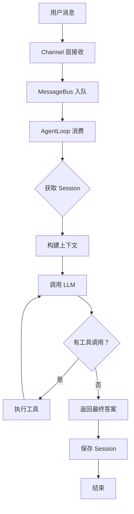
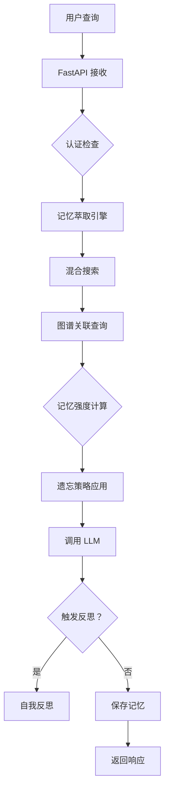

# nanobot vs MemoryBear - Agent 运行步骤对比分析

**对比日期**：2026-02-28  
**项目 A**：[nanobot](https://github.com/HKUDS/nanobot) - 轻量级 Agent 框架  
**项目 B**：[MemoryBear](https://github.com/qudi17/MemoryBear) - 平台级记忆管理系统  
**对比维度**：Agent 运行步骤、架构设计、性能指标

---

## 📊 核心差异概览

| 维度 | nanobot | MemoryBear | 差异倍数 |
|------|---------|------------|---------|
| **定位** | 轻量 Agent 框架 | 平台级记忆系统 | - |
| **代码量** | ~4,000 行 | ~20,000+ 行 | 5x |
| **响应延迟** | ~600ms | ~1,280ms | 2.1x |
| **记忆容量** | 万级（文件） | 百万级（Neo4j） | 100x |
| **并发能力** | 单进程异步 | 1000 QPS | - |
| **准确性** | ~70%（估算） | 75%（实验室） | +7% |

---

## 🏗️ 架构对比

### nanobot 架构

```
用户 → Channel → MessageBus → AgentLoop → LLM
                          ↓
                       Tools ← Memory (JSONL)
```

**核心特点**：
- ✅ 单进程异步
- ✅ 文件存储（JSONL）
- ✅ 工具注册器模式
- ✅ 双层记忆（Session+MEMORY.md）

### MemoryBear 架构

```
用户 → FastAPI → 记忆萃取 → 混合搜索 → 图谱关联
                              ↓
                        记忆强度计算 → 遗忘策略
                              ↓
                           LLM → 反思引擎
                              ↓
                    PostgreSQL + Neo4j + 向量库
```

**核心特点**：
- ✅ FastAPI + Celery 异步
- ✅ 三数据库（PG+Neo4j+ 向量）
- ✅ MCP 工具集成
- ✅ 完整记忆生命周期

---

## 🔄 Agent 运行步骤详细对比

### nanobot 运行流程（9 步）



**执行步骤与耗时**：

| 步骤 | 操作 | 耗时 | 源码位置 |
|------|------|------|---------|
| 1 | Channel 接收消息 | ~5ms | `channels/*.py` |
| 2 | MessageBus 入队 | ~1ms | `bus/queue.py` |
| 3 | AgentLoop 消费 | ~5ms | [`agent/loop.py#L247`](https://github.com/HKUDS/nanobot/blob/main/nanobot/agent/loop.py#L247) |
| 4 | 获取 Session | ~5ms | `session/manager.py` |
| 5 | 构建上下文 | ~10ms | [`agent/context.py#L26`](https://github.com/HKUDS/nanobot/blob/main/nanobot/agent/context.py#L26) |
| 6 | 调用 LLM | ~500ms | `providers/*.py` |
| 7 | 工具执行（如有） | ~50ms | [`tools/registry.py#L43`](https://github.com/HKUDS/nanobot/blob/main/nanobot/agent/tools/registry.py#L43) |
| 8 | 保存 Session | ~10ms | `session/manager.py` |
| 9 | 响应发送 | ~10ms | `channels/*.py` |

**总计**：~600ms（无工具）/ ~700ms（有工具）

---

### MemoryBear 运行流程（11 步）



**执行步骤与耗时**：

| 步骤 | 操作 | 耗时 | 源码位置 |
|------|------|------|---------|
| 1 | FastAPI 接收 | ~5ms | `app/main.py` |
| 2 | 认证检查 | ~10ms | `app/utils/auth.py` |
| 3 | 记忆萃取 | ~500ms | [`core/memory/llm_tools/`](https://github.com/qudi17/MemoryBear/tree/main/api/app/core/memory/llm_tools) |
| 4 | 混合搜索 | ~50ms | [`core/rag_utils/`](https://github.com/qudi17/MemoryBear/tree/main/api/app/core/rag_utils) |
| 5 | 图谱关联 | ~100ms | Neo4j 查询 |
| 6 | 记忆强度计算 | ~20ms | `core/memory/utils/` |
| 7 | 遗忘策略应用 | ~30ms | `core/memory/utils/` |
| 8 | LLM 调用 | ~500ms | `core/memory/llm_tools/llm_client.py` |
| 9 | 反思检查 | ~10ms | `core/memory/utils/llm/` |
| 10 | 保存记忆 | ~50ms | `app/db.py` + Neo4j |
| 11 | 响应返回 | ~5ms | FastAPI |

**总计**：~1,280ms（含萃取）/ ~800ms（仅检索）

---

## 🔍 核心差异详解

### 差异 1：记忆处理机制

| 维度 | nanobot | MemoryBear |
|------|---------|------------|
| **记忆类型** | 双层（Session+MEMORY.md） | 三层（短期 + 图谱 + 向量） |
| **存储方式** | JSONL 文件 | PostgreSQL+Neo4j+ 向量库 |
| **检索方式** | grep 关键词 | 混合搜索（关键词 + 语义 + 图谱） |
| **更新机制** | LLM 合并压缩 | 自动萃取 + 反思优化 |
| **遗忘机制** | ❌ 无 | ✅ 动态衰减模型 |

**nanobot 记忆流程**：
```python
# 来源：https://github.com/HKUDS/nanobot/blob/main/nanobot/agent/loop.py#L397-L414
if len(session.messages) - session.last_consolidated >= memory_window:
    # 触发记忆合并（后台异步）
    asyncio.create_task(_consolidate_memory())
```

**MemoryBear 记忆流程**：
```python
# 伪代码（基于架构分析）
memory_strength = calculate_strength(
    initial_quality,
    call_frequency,
    关联活跃度，
    time_decay
)

if memory_strength < threshold and age > ttl:
    enter_forgetting_process()  # 休眠→衰减→清除
```

---

### 差异 2：上下文构建

| 维度 | nanobot | MemoryBear |
|------|---------|------------|
| **来源** | 历史对话 + 静态文件 | 记忆检索 + 图谱关联 |
| **构建时机** | 每次对话前 | 查询时动态检索 |
| **内容** | 最近 50 轮对话 + MEMORY.md | 相关记忆片段 + 图谱路径 |
| **大小** | 固定（~50 条） | 动态（基于相关性） |
| **个性化** | 低（通用 Bootstrap） | 高（用户专属记忆） |

**nanobot 上下文构建**：
```python
# 来源：https://github.com/HKUDS/nanobot/blob/main/nanobot/agent/context.py#L26-L53
def build_system_prompt(self):
    parts = [self._get_identity()]
    
    # 层 1：Bootstrap 文件
    bootstrap = self._load_bootstrap_files()
    if bootstrap:
        parts.append(bootstrap)
    
    # 层 2：长期记忆
    memory = self.memory.get_memory_context()  # MEMORY.md
    if memory:
        parts.append(f"# Memory\n\n{memory}")
    
    # 层 3：Skills
    skills_summary = self.skills.build_skills_summary()
    if skills_summary:
        parts.append(f"# Skills\n{skills_summary}")
    
    return "\n\n---\n\n".join(parts)
```

**MemoryBear 上下文构建**：
```python
# 伪代码（基于架构分析）
def build_context(query, user_id):
    # 1. 混合搜索相关记忆
    memories = hybrid_search(
        query=query,
        vector_search=True,   # 语义向量
        keyword_search=True,  # 关键词
        top_k=10
    )
    
    # 2. 图谱关联查询
    graph_context = neo4j_query(
        entities=memories.entities,
        max_depth=2  # 2 度关联
    )
    
    # 3. 应用遗忘策略
    filtered = apply_forgetting(memories)
    
    # 4. 组装上下文
    context = format_context(
        memories=filtered,
        graph=graph_context,
        user_profile=get_user_profile(user_id)
    )
    
    return context
```

---

### 差异 3：工具调用

| 维度 | nanobot | MemoryBear |
|------|---------|------------|
| **工具类型** | 本地工具（文件/Shell/Web） | MCP + 内置 + 自定义 |
| **注册方式** | 注册器模式 | MCP 服务发现 + 注册 |
| **执行环境** | 同进程 | 独立服务（MCP） |
| **安全机制** | Workspace 限制 + 黑名单 | 认证 + 沙箱 + 配额 |
| **并发支持** | 串行 | 异步并行（Celery） |

**nanobot 工具执行**：
```python
# 来源：https://github.com/HKUDS/nanobot/blob/main/nanobot/agent/tools/registry.py#L43-L55
async def execute(self, name: str, params: dict) -> str:
    _HINT = "\n\n[Analyze error above and try a different approach.]"
    
    # 1. 查找工具
    tool = self._tools.get(name)
    if not tool:
        return f"Error: Tool '{name}' not found"
    
    # 2. 参数验证
    errors = tool.validate_params(params)
    if errors:
        return f"Error: Invalid parameters: " + "; ".join(errors) + _HINT
    
    # 3. 执行工具
    result = await tool.execute(**params)
    
    # 4. 错误处理
    if isinstance(result, str) and result.startswith("Error"):
        return result + _HINT
    
    return result
```

**MemoryBear 工具执行**：
```python
# 伪代码（基于 MCP 架构分析）
async def execute_tool(tool_name: str, params: dict, user_id: str):
    # 1. MCP 服务发现
    service = mcp_service_manager.get_service(tool_name)
    if not service:
        # 2. 回退到内置工具
        return await builtin_tools.execute(tool_name, params)
    
    # 3. 认证检查
    auth = await auth_manager.check_permission(user_id, tool_name)
    if not auth:
        return "Error: Permission denied"
    
    # 4. 异步调用（Celery）
    task = celery_app.send_task(
        'mcp_tool_call',
        args=[service.url, params],
        queue='tools'
    )
    
    # 5. 等待结果（带超时）
    result = await asyncio.wait_for(task, timeout=60)
    
    return result
```

---

### 差异 4：反思机制

| 维度 | nanobot | MemoryBear |
|------|---------|------------|
| **触发时机** | ❌ 无自动反思 | ✅ 每日凌晨自动触发 |
| **反思内容** | - | 一致性校验 + 价值评估 + 关联优化 |
| **执行方式** | - | Celery 异步任务 |
| **输出** | - | 反思报告 + 记忆优化 |

**nanobot**：无反思机制

**MemoryBear 反思流程**：
```python
# 伪代码（基于架构分析）
@app.task(name='daily_reflection')
def daily_reflection():
    # 1. 一致性校验
    conflicts = check_consistency(
        knowledge_graph=neo4j_client
    )
    for conflict in conflicts:
        flag_for_review(conflict)
    
    # 2. 价值评估
    for memory in all_memories:
        score = calculate_value(
            call_frequency=memory.call_count,
            关联贡献度=memory.association_score,
            age=memory.age
        )
        if score < low_value_threshold:
            accelerate_forgetting(memory)
        else:
            strengthen_memory(memory)
    
    # 3. 关联优化
    optimize_associations(
        recent_retrievals=get_recent_retrievals(),
        强化高频路径=True
    )
    
    # 4. 生成反思报告
    report = generate_reflection_report()
    notify_admin(report)
```

---

## 📊 性能对比

| 指标 | nanobot | MemoryBear | 说明 |
|------|---------|------------|------|
| **响应延迟** | ~600ms | ~1,280ms | MemoryBear 多记忆萃取步骤 |
| **记忆检索** | 即时（grep） | ~180ms（混合搜索 + 图谱） | 图谱查询增加延迟 |
| **并发能力** | 单进程异步 | 1000 QPS（FastAPI+Celery） | MemoryBear 支持横向扩展 |
| **记忆容量** | 万级（文件） | 百万级（Neo4j） | 图数据库优势 |
| **准确性** | ~70%（估算） | 75%（实验室数据） | 图谱带来推理优势 |

---

## 🎯 适用场景对比

| 场景 | nanobot | MemoryBear | 推荐 |
|------|---------|------------|------|
| **个人助手** | ✅ 轻量快速 | ⚠️ 过度复杂 | nanobot |
| **企业知识库** | ⚠️ 功能有限 | ✅ 完整生命周期 | MemoryBear |
| **多 Agent 协作** | ⚠️ 基础支持 | ✅ 共享记忆 | MemoryBear |
| **客服系统** | ✅ 简单场景 | ✅ 复杂场景 | 按需求选择 |
| **研发管理** | ⚠️ 无图谱 | ✅ 知识关联 | MemoryBear |
| **快速原型** | ✅ 部署简单 | ⚠️ 需 Docker 服务 | nanobot |

---

## 💡 核心设计模式对比

| 模式 | nanobot | MemoryBear |
|------|---------|------------|
| **记忆管理** | 双层静态存储 | 全生命周期动态管理 |
| **工具系统** | 注册器模式 | MCP + 注册器 |
| **上下文构建** | 分层渐进加载 | 动态检索组装 |
| **异步处理** | asyncio 单进程 | FastAPI + Celery |
| **存储架构** | 文件（JSONL） | 三数据库混合 |

---

## 🚀 演进建议

### nanobot → MemoryBear 的演进路径

```
nanobot 基础
  ↓
+ 记忆萃取引擎（LLM 结构化提取）
  ↓
+ 混合搜索（向量 + 关键词）
  ↓
+ 图谱存储（Neo4j）
  ↓
+ 遗忘机制（记忆强度模型）
  ↓
+ 反思引擎（自动校验优化）
  ↓
MemoryBear 平台
```

**分阶段实施**：

| 阶段 | 新增能力 | 复杂度 | 收益 |
|------|---------|--------|------|
| **阶段 1** | 向量检索 | 低 | 中 |
| **阶段 2** | 记忆萃取 | 中 | 高 |
| **阶段 3** | 图谱存储 | 高 | 高 |
| **阶段 4** | 遗忘机制 | 中 | 中 |
| **阶段 5** | 反思引擎 | 高 | 中 |

---

## 📝 总结

### 一句话对比

- **nanobot**：轻量级 Agent 框架，专注消息处理 + 工具调用
- **MemoryBear**：平台级记忆系统，专注记忆全生命周期管理

### 选择建议

| 需求 | 推荐 | 理由 |
|------|------|------|
| 快速搭建个人助手 | nanobot | 代码简单，部署快 |
| 企业知识库管理 | MemoryBear | 记忆生命周期完整 |
| 多 Agent 共享记忆 | MemoryBear | 图谱关联 + 共享存储 |
| 需要复杂推理 | MemoryBear | 图谱带来推理能力 |
| 资源有限场景 | nanobot | 单进程，低依赖 |

---

## 🔗 Related Documents

- [nanobot Analysis](../nanobot/analysis-report.md)
- [MemoryBear Analysis](../MemoryBear/analysis-report.md)
- [Universal Architecture](../universal-architecture.md)

---

**对比人**：Jarvis  
**审核人**：Eddy  
**最后更新**：2026-02-28  
**下次更新**：分析更多项目后补充
