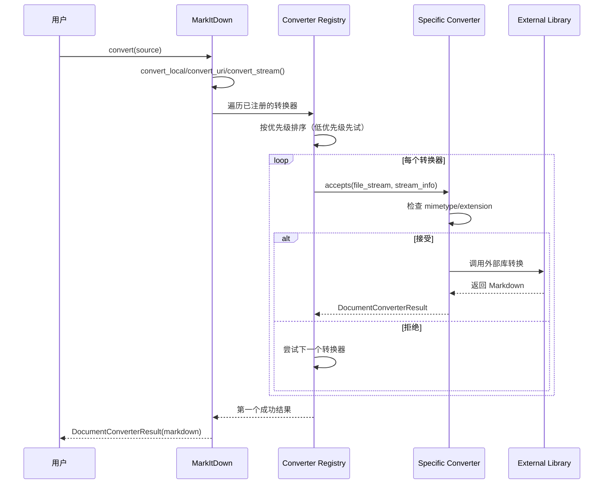

# MarkItDown 研究文档

**研究日期**：2026-02-28  
**研究方法**：毛线团研究法（Yarn Ball Method）  
**项目 Fork**：https://github.com/qudi17/markitdown.git  
**原始项目**：https://github.com/microsoft/markitdown.git

---

## 📊 项目概览

### 项目定位

MarkItDown 是一个轻量级 Python 工具，用于将各种文件格式转换为 Markdown，专为 LLM 和文本分析管道设计。

**核心特点**：
- 类似于 [textract](https://github.com/deanmalmgren/textract)
- 专注于保留文档结构和内容（标题、列表、表格、链接等）
- 输出适合 LLM 消费，而非人类高保真阅读

### 支持格式

- **文档**：PDF, Word, PowerPoint, Excel
- **图片**：EXIF 元数据 + OCR
- **音频**：EXIF 元数据 + 语音转录
- **Web**：HTML, YouTube URLs, Wikipedia
- **数据格式**：CSV, JSON, XML
- **其他**：ZIP, EPUB, Outlook MSG

### 代码规模

| 指标 | 数值 |
|------|------|
| **Python 文件数** | ~55 个 |
| **核心代码行数** | ~4,600 行 |
| **核心模块** | 25+ 个转换器 |
| **测试文件** | ~10 个 |

---

## 🏗️ 系统架构

### 分层架构

```
┌─────────────────────────────────────┐
│          CLI 层                      │
│  markitdown path-to-file.pdf        │
└─────────────────────────────────────┘
                ↓
┌─────────────────────────────────────┐
│        MarkItDown 核心               │
│  - convert() 统一入口                │
│  - convert_local()                   │
│  - convert_uri()                     │
│  - convert_stream()                  │
└─────────────────────────────────────┘
                ↓
┌─────────────────────────────────────┐
│      Converter 注册表                │
│  - 按优先级排序                      │
│  - 特定格式优先                      │
└─────────────────────────────────────┘
                ↓
┌─────────────────────────────────────┐
│        转换器层                      │
│  - PdfConverter                      │
│  - DocxConverter                     │
│  - XlsxConverter                     │
│  - ... (25+ 个转换器)                 │
└─────────────────────────────────────┘
                ↓
┌─────────────────────────────────────┐
│        依赖库                        │
│  - pdfminer.six                      │
│  - python-docx                       │
│  - openpyxl                          │
│  - ...                              │
└─────────────────────────────────────┘
```

### 核心模块

| 模块 | 文件 | 代码行 | 职责 |
|------|------|--------|------|
| **_markitdown.py** | _markitdown.py | ~700 行 | 核心类，统一入口 |
| **_base_converter.py** | _base_converter.py | ~100 行 | 转换器抽象基类 |
| **converters/** | 25 个文件 | ~3,300 行 | 具体转换器实现 |
| **tests/** | 10 个文件 | ~500 行 | 测试用例 |

---

## 🧶 入口点分析

### CLI 入口

**文件**：`packages/markitdown/src/markitdown/cli.py`（推断）

**使用方式**：
```bash
# 基本用法
markitdown path-to-file.pdf > document.md

# 指定输出文件
markitdown path-to-file.pdf -o document.md

# 管道输入
cat path-to-file.pdf | markitdown
```

### Python API 入口

**文件**：[`packages/markitdown/src/markitdown/__init__.py`](https://github.com/qudi17/markitdown/blob/main/packages/markitdown/src/markitdown/__init__.py)

```python
from .__about__ import __version__
from ._markitdown import (
    MarkItDown,
    PRIORITY_SPECIFIC_FILE_FORMAT,
    PRIORITY_GENERIC_FILE_FORMAT,
)
from ._base_converter import DocumentConverterResult, DocumentConverter
from ._stream_info import StreamInfo
from ._exceptions import (
    MarkItDownException,
    MissingDependencyException,
    FailedConversionAttempt,
    FileConversionException,
    UnsupportedFormatException,
)
```

---

## 📋 核心调用链

### 转换流程



### 核心代码追踪

**1. 统一入口**：
```python
# packages/markitdown/src/markitdown/_markitdown.py#L228-L267
def convert(
    self,
    source: Union[str, requests.Response, Path, BinaryIO],
    *,
    stream_info: Optional[StreamInfo] = None,
    **kwargs: Any,
) -> DocumentConverterResult:
    """
    Args:
        - source: 可以是路径、URL、requests.response、或二进制流
        - stream_info: 可选的流信息
    """
    
    # 本地路径
    if isinstance(source, str):
        if source.startswith("http:") or source.startswith("https:"):
            return self.convert_uri(source, stream_info=stream_info, **kwargs)
        else:
            return self.convert_local(source, stream_info=stream_info, **kwargs)
    elif isinstance(source, Path):
        return self.convert_local(source, stream_info=stream_info, **kwargs)
    elif isinstance(source, requests.Response):
        return self.convert_response(source, stream_info=stream_info, **kwargs)
    elif hasattr(source, "read"):  # BinaryIO
        return self.convert_stream(source, stream_info=stream_info, **kwargs)
    else:
        raise TypeError(f"Invalid source type: {type(source)}")
```

**2. 转换器注册**：
```python
# packages/markitdown/src/markitdown/_markitdown.py#L132-L180
def enable_builtins(self, **kwargs) -> None:
    """启用内置转换器"""
    if not self._builtins_enabled:
        # 注册转换器（后注册的优先级更高）
        self.register_converter(
            PlainTextConverter(), priority=PRIORITY_GENERIC_FILE_FORMAT
        )
        self.register_converter(
            ZipConverter(markitdown=self), priority=PRIORITY_GENERIC_FILE_FORMAT
        )
        self.register_converter(
            HtmlConverter(), priority=PRIORITY_GENERIC_FILE_FORMAT
        )
        # ... 更具体的转换器
        self.register_converter(DocxConverter())
        self.register_converter(XlsxConverter())
        self.register_converter(PptxConverter())
        self.register_converter(PdfConverter())
        # ...
        
        self._builtins_enabled = True
```

**3. 转换器优先级**：
```python
# 优先级常量
PRIORITY_SPECIFIC_FILE_FORMAT = 0.0   # 特定格式（如.docx, .pdf）
PRIORITY_GENERIC_FILE_FORMAT = 10.0   # 通用格式（如 text/*）

# 低优先级先试，高优先级后试
# 特定格式转换器会覆盖通用格式转换器
```

---

## 🔍 转换器详解

### 转换器抽象基类

**文件**：[`packages/markitdown/src/markitdown/_base_converter.py`](https://github.com/qudi17/markitdown/blob/main/packages/markitdown/src/markitdown/_base_converter.py)

```python
class DocumentConverter:
    """所有转换器的抽象基类"""
    
    def accepts(
        self,
        file_stream: BinaryIO,
        stream_info: StreamInfo,
        **kwargs: Any,
    ) -> bool:
        """
        判断是否接受该文档进行转换
        
        主要基于：
        - stream_info.mimetype
        - stream_info.extension
        - stream_info.url (特殊情况如 Wikipedia/YouTube)
        """
        raise NotImplementedError()
    
    def convert(
        self,
        file_stream: BinaryIO,
        stream_info: StreamInfo,
        **kwargs: Any,
    ) -> DocumentConverterResult:
        """
        将文档转换为 Markdown
        
        Returns:
            DocumentConverterResult(markdown, title)
        """
        raise NotImplementedError()
```

### 转换器列表

| 转换器 | 文件 | 代码行 | 支持格式 |
|--------|------|--------|---------|
| **PdfConverter** | _pdf_converter.py | ~500 行 | PDF |
| **DocxConverter** | _docx_converter.py | ~60 行 | Word |
| **XlsxConverter** | _xlsx_converter.py | ~160 行 | Excel |
| **PptxConverter** | _pptx_converter.py | ~240 行 | PowerPoint |
| **HtmlConverter** | _html_converter.py | ~70 行 | HTML |
| **ImageConverter** | _image_converter.py | ~70 行 | 图片（EXIF+OCR） |
| **AudioConverter** | _audio_converter.py | ~80 行 | 音频（EXIF+ 转录） |
| **YouTubeConverter** | _youtube_converter.py | ~170 行 | YouTube URLs |
| **WikipediaConverter** | _wikipedia_converter.py | ~60 行 | Wikipedia |
| **ZipConverter** | _zip_converter.py | ~90 行 | ZIP |
| **EpubConverter** | _epub_converter.py | ~130 行 | EPUB |
| **OutlookMsgConverter** | _outlook_msg_converter.py | ~120 行 | Outlook MSG |
| **IpynbConverter** | _ipynb_converter.py | ~80 行 | Jupyter Notebook |
| **CsvConverter** | _csv_converter.py | ~60 行 | CSV |
| **RssConverter** | _rss_converter.py | ~160 行 | RSS |

---

## 💡 核心设计模式

### 1. 责任链模式（Chain of Responsibility）

```python
class MarkItDown:
    def __init__(self):
        self._converters: List[ConverterRegistration] = []
    
    def register_converter(self, converter: DocumentConverter, priority: float = 0.0):
        """注册转换器"""
        self._converters.append(ConverterRegistration(converter, priority))
        # 按优先级排序（低优先级在前，先试）
        self._converters.sort(key=lambda reg: reg.priority)
    
    def convert_stream(self, file_stream: BinaryIO, stream_info: StreamInfo):
        """尝试所有转换器"""
        for reg in self._converters:
            if reg.converter.accepts(file_stream, stream_info):
                try:
                    result = reg.converter.convert(file_stream, stream_info)
                    return result
                except Exception as e:
                    # 尝试下一个转换器
                    continue
        
        # 所有转换器都失败了
        raise UnsupportedFormatException()
```

**优势**：
- ✅ 易于扩展新格式
- ✅ 自动回退机制
- ✅ 优先级控制

---

### 2. 策略模式（Strategy Pattern）

每个转换器都是一个独立的策略：

```python
class PdfConverter(DocumentConverter):
    def accepts(self, file_stream, stream_info):
        return stream_info.mimetype == "application/pdf"
    
    def convert(self, file_stream, stream_info):
        # 使用 pdfminer.six 转换
        ...

class DocxConverter(DocumentConverter):
    def accepts(self, file_stream, stream_info):
        return stream_info.extension == ".docx"
    
    def convert(self, file_stream, stream_info):
        # 使用 python-docx 转换
        ...
```

---

### 3. 流式处理模式

```python
def convert_stream(self, file_stream: BinaryIO, stream_info: StreamInfo):
    """
    从流中读取并转换，不创建临时文件
    
    关键设计：
    1. 接受 file-like object
    2. 支持 seek(), tell(), read()
    3. 转换器可以读取流，但必须重置位置
    """
    
    # 检测文件类型
    if stream_info is None:
        stream_info = self._detect_stream_info(file_stream)
    
    # 尝试所有转换器
    for reg in self._converters:
        if reg.converter.accepts(file_stream, stream_info):
            # 重置流位置（因为 accepts() 可能读取了流）
            file_stream.seek(0)
            return reg.converter.convert(file_stream, stream_info)
    
    raise UnsupportedFormatException()
```

---

## 📊 性能优化

### 1. 延迟加载插件

```python
_plugins: Union[None, List[Any]] = None  # 懒加载

def _load_plugins() -> Union[None, List[Any]]:
    """懒加载插件"""
    global _plugins
    if _plugins is not None:
        return _plugins  # 已加载，直接返回
    
    _plugins = []
    for entry_point in entry_points(group="markitdown.plugin"):
        try:
            _plugins.append(entry_point.load())
        except Exception:
            warn(f"Plugin failed to load")
    
    return _plugins
```

---

### 2. 优先级排序

```python
# 低优先级先试（特定格式）
# 高优先级后试（通用格式）
PRIORITY_SPECIFIC_FILE_FORMAT = 0.0
PRIORITY_GENERIC_FILE_FORMAT = 10.0

# 排序确保：
# 1. PDF 转换器先于纯文本转换器尝试
# 2. Docx 转换器先于 HTML 转换器尝试
self._converters.sort(key=lambda reg: reg.priority)
```

---

## 🎯 使用示例

### 基本用法

```python
from markitdown import MarkItDown

md = MarkItDown()

# 本地文件
result = md.convert("document.pdf")
print(result.markdown)
print(result.title)

# URL
result = md.convert("https://example.com/document.pdf")

# 二进制流
with open("document.pdf", "rb") as f:
    result = md.convert(f)
```

### 高级用法

```python
# 使用 Document Intelligence（Azure）
md = MarkItDown(
    docintel_endpoint="https://your-resource.cognitiveservices.azure.com/",
    docintel_credential=credential,
    docintel_file_types=["pdf", "docx", "xlsx"]
)

# 使用 LLM 标注图片
md = MarkItDown(
    llm_client=openai_client,
    llm_model="gpt-4o",
    llm_prompt="Describe this image in detail"
)

# 启用插件
md.enable_plugins()
```

---

## 📝 待研究分支

- [ ] **详细分析每个转换器实现**
- [ ] **研究插件系统架构**
- [ ] **分析测试用例覆盖度**
- [ ] **性能基准测试**
- [ ] **对比其他转换工具（textract 等）**

---

**研究人**：Jarvis  
**日期**：2026-02-28  
**方法**：毛线团研究法  
**状态**：🔄 进行中
