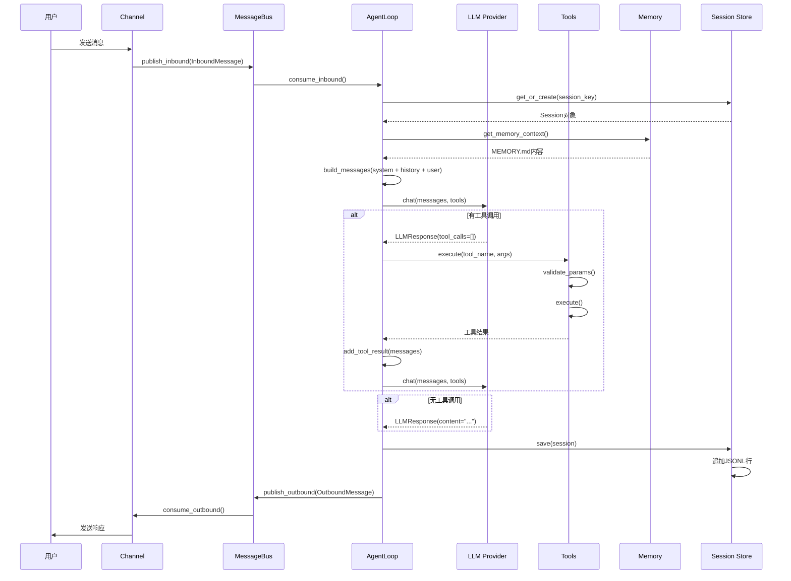

# nanobot 整体架构

## 🏗️ 系统架构图

```mermaid
graph TB
    subgraph "用户层"
        U1[CLI终端]
        U2[Telegram]
        U3[Discord]
        U4[Feishu]
        U5[WhatsApp]
        U6[Email]
        U7[Slack]
        U8[QQ]
    end
    
    subgraph "Channel层 nanobot/channels/"
        C1[TelegramChannel]
        C2[DiscordChannel]
        C3[FeishuChannel]
        C4[WhatsAppChannel]
        C5[EmailChannel]
        C6[SlackChannel]
        C7[QQChannel]
        CM[ChannelManager]
    end
    
    subgraph "消息总线 nanobot/bus/"
        MB[MessageBus]
        QI[(inbound队列)]
        QO[(outbound队列)]
    end
    
    subgraph "核心代理层 nanobot/agent/"
        AL[AgentLoop]
        CB[ContextBuilder]
        MS[MemoryStore]
        SK[SkillsLoader]
        TR[ToolRegistry]
        SM[SubagentManager]
    end
    
    subgraph "工具系统 nanobot/agent/tools/"
        T1[read_file]
        T2[write_file]
        T3[edit_file]
        T4[list_dir]
        T5[exec]
        T6[web_search]
        T7[web_fetch]
        T8[message]
        T9[spawn]
        TC[CronTool]
        TM[McpTool]
    end
    
    subgraph "Provider层 nanobot/providers/"
        PR[LiteLLMProvider]
        CP[CustomProvider]
        OC[OpenAICodexProvider]
        RG[ProviderRegistry]
    end
    
    subgraph "数据层"
        S1[Session JSONL]
        S2[MEMORY.md]
        S3[HISTORY.md]
        S4[Workspace]
        S5[Skills/]
    end
    
    U1 -->|socket| C1
    U2 -->|webhook/long-poll| C1
    U3 -->|WebSocket| C2
    U4 -->|WebSocket| C3
    U5 -->|WebSocket| C4
    U6 -->|IMAP/SMTP| C5
    U7 -->|Socket Mode| C6
    U8 -->|WebSocket| C7
    
    C1 --> CM
    C2 --> CM
    C3 --> CM
    C4 --> CM
    C5 --> CM
    C6 --> CM
    C7 --> CM
    
    CM -.发布.-> QI
    QI -.消费.-> AL
    
    AL -.调用.-> CB
    AL -.调用.-> MS
    AL -.调用.-> SK
    AL -.调用.-> TR
    AL -.调用.-> SM
    
    CB -.加载.-> S2
    CB -.加载.-> S3
    CB -.加载.-> S5
    
    MS -.读写.-> S2
    MS -.读写.-> S3
    
    SK -.加载.-> S5
    
    TR -.注册.-> T1
    TR -.注册.-> T2
    TR -.注册.-> T3
    TR -.注册.-> T4
    TR -.注册.-> T5
    TR -.注册.-> T6
    TR -.注册.-> T7
    TR -.注册.-> T8
    TR -.注册.-> T9
    TR -.注册.-> TC
    TR -.注册.-> TM
    
    AL -.LLM调用.-> PR
    PR -.API调用.-> RG
    
    AL -.保存会话.-> S1
    
    AL -.发布响应.-> QO
    QO -.分发.-> CM
    CM -.路由.-> C1
    CM -.路由.-> C2
    CM -.路由.-> C3
    CM -.路由.-> C4
    CM -.路由.-> C5
    CM -.路由.-> C6
    CM -.路由.-> C7
    
    SM -.创建后台任务.-> AL
    
    style AL fill:#fff4e1
    style MB fill:#e1f5ff
    style CM fill:#ffe1e1
    style PR fill:#e1ffe1
    style S1 fill:#f0f0f0
    style S2 fill:#f0f0f0
    style S3 fill:#f0f0f0
```



## 📦 模块职责详解

### 1. Channel层 - 多平台接入

**位置：** `nanobot/channels/`

**职责：**
- 封装各平台的API差异
- 统一消息格式为 `InboundMessage`
- 处理平台特定逻辑（回复格式、线程等）

**支持平台：**
- Telegram - Bot API
- Discord - WebSocket Gateway
- Feishu - WebSocket长连接
- WhatsApp - 通过Node.js bridge
- Email - IMAP（收）+ SMTP（发）
- Slack - Socket Mode
- QQ - botpy SDK
- DingTalk - Stream Mode

**关键类：** `BaseChannel` (抽象基类)
```python
class BaseChannel:
    async def start(self) -> None
    async def stop(self) -> None
    async def send(self, msg: OutboundMessage) -> None
    @property
    def is_running(self) -> bool
```

---

### 2. MessageBus - 消息路由中枢

**位置：** `nanobot/bus/queue.py`

**核心设计：** 使用 `asyncio.Queue` 实现解耦

```python
class MessageBus:
    inbound: Queue[InboundMessage]  # Channel → Agent
    outbound: Queue[OutboundMessage] # Agent → Channel
```

**优势：**
- 异步非阻塞
- 内建背压处理
- Channel和Agent独立扩展

---

### 3. AgentLoop - 核心处理引擎

**位置：** `nanobot/agent/loop.py`

**核心方法：**

| 方法 | 作用 |
|------|------|
| `run()` | 主循环，消费inbound队列 |
| `_process_message()` | 单条消息处理逻辑 |
| `_run_agent_loop()` | LLM↔工具交互循环 |
| `_consolidate_memory()` | 后台记忆合并 |

**状态管理：**
```python
self._running: bool                    # 运行标志
self._processing_lock: asyncio.Lock     # 全局处理锁
self._active_tasks: dict              # session→tasks映射
self._consolidating: set             # 正在合并的session
```

---

### 4. ContextBuilder - 上下文构建器

**位置：** `nanobot/agent/context.py`

**构建的prompt层次：**
```
1. Identity (_get_identity)
   ├─ nanobot身份
   ├─ 运行时信息（OS, Python版本）
   ├─ Workspace路径
   └─ 行为指南

2. Bootstrap Files (_load_bootstrap_files)
   ├─ AGENTS.md
   ├─ SOUL.md
   ├─ USER.md
   └─ TOOLS.md

3. Long-term Memory (memory.get_memory_context)
   └─ MEMORY.md内容

4. Active Skills (skills.get_always_skills)
   └─ always=true的技能内容

5. Skills Summary
   └─ 所有技能XML概览
```

**为什么分层？**
- Identity: 固定不变
- Bootstrap: 个性化配置
- Memory: 动态长时记忆
- Skills: 可选能力
- Summary: 进阶发现入口

---

### 5. ToolRegistry - 工具注册中心

**位置：** `nanobot/agent/tools/registry.py`

**核心机制：**
```python
# 注册
tools.register(ReadFileTool())

# 获取定义（OpenAI格式）
definitions = tools.get_definitions()
# → [{"type": "function", "function": {...}}, ...]

# 执行工具
result = await tools.execute("read_file", {"path": "test.txt"})
```

**验证流程：**
```
参数输入
  ↓
JSON Schema验证 (validate_params)
  ↓
检查类型、枚举、范围
  ↓
execute() 调用
  ↓
错误检测与追加提示
  ↓
返回结果
```

---

### 6. MemoryStore - 双层记忆系统

**位置：** `nanobot/agent/memory.py`

**两层设计：**

| 层级 | 文件 | 用途 |
|------|------|------|
| **长期记忆** | `MEMORY.md` | 结构化事实（用户偏好、项目信息） |
| **历史日志** | `HISTORY.md` | 时间线日志（grep可搜索） |

**合并触发：**
```python
if len(session.messages) - session.last_consolidated >= memory_window:
    # 异步触发合并，不阻塞主流程
    asyncio.create_task(_consolidate_and_unlock())
```

**LLM合并prompt：**
```
你是记忆合并助手。阅读下面的对话，调用save_memory工具：

## Current Long-term Memory
{MEMORY.md内容或"(empty)"}

## Conversation to Process
[timestamp] USER: ...
[timestamp] ASSISTANT: ...
...
```

---

### 7. Provider层 - LLM统一接口

**位置：** `nanobot/providers/`

**抽象接口：**
```python
class LLMProvider:
    @abstractmethod
    async def chat(
        messages: list[dict],
        tools: list[dict] | None,
        model: str,
        max_tokens: int,
        temperature: float,
    ) -> LLMResponse:
        pass
```

**实现类：**
- `LiteLLMProvider` - 通过LiteLLM支持15+提供商
- `CustomProvider` - OpenAI兼容的自定义端点
- `OpenAICodexProvider` - OAuth认证的OpenAI

**ProviderRegistry功能：**
```python
# 自动检测provider
spec = find_by_model("claude-opus-4-5")
# → ProviderSpec(name="anthropic", keywords=["claude"])

# 模型前缀处理
model = "claude-opus-4-5"
# → "anthropic/claude-opus-4-5"

# 网关检测
spec = find_gateway(None, "sk-or-", None)
# → ProviderSpec(name="openrouter", is_gateway=True)
```

---

### 8. SessionManager - 会话持久化

**位置：** `nanobot/session/manager.py`

**存储格式：** JSONL（每行一个JSON对象）

```jsonl
{"_type": "metadata", "key": "telegram:123", "created_at": "...", "last_consolidated": 10}
{"role": "user", "content": "Hello", "timestamp": "..."}
{"role": "assistant", "content": "Hi!", "timestamp": "..."}
{"role": "tool", "name": "read_file", "content": "...", "timestamp": "..."}
```

**为什么要用JSONL？**
- 增量追加，无需重写整个文件
- LLM缓存友好（OpenAI API支持）
- 易于grep和日志分析

---

## 🔑 核心设计模式

### 1. 注册器模式（工具系统）

```python
# 工具主动注册
class MyCustomTool(Tool):
    @property
    def name(self) -> str:
        return "my_tool"
    # ...

# Agent不知道具体工具
tools.register(MyCustomTool())
# → 后续所有工具通过字符串名称调用
await tools.execute("my_tool", {...})
```

**优势：**
- 运行时动态扩展
- 无需修改AgentLoop代码
- MCP支持基于此模式

---

### 2. 消息总线模式（解耦）

```
Channels ←→ MessageBus ←→ AgentLoop
   ↓              ↓             ↓
 平台API        队列         LLM
```

**优势：**
- Channel和Agent独立开发/测试
- 支持多Channel并发
- 易于添加新Channel

---

### 3. 适配器模式（Provider）

```python
# 统一接口
async def chat(messages, tools, model, ...):
    # LiteLLM/Custom/OpenAI
    # 不同实现细节被隐藏
```

**优势：**
- 新增Provider只需实现接口
- 运行时动态切换
- 配置驱动（无需代码修改）

---

### 4. 沙箱模式（安全）

```python
# 文件系统
allowed_dir = workspace if restrict_to_workspace else None
Path(path).relative_to(allowed_dir)  # 抛出异常则禁止访问

# Shell命令
deny_patterns = [r"rm\s+-rf", r"format", ...]
if re.search(pattern, command.lower()):
    return "Error: Command blocked by safety guard"
```

---

## 📊 数据流全景



---

## 🚀 扩展点总结

| 扩展点 | 接口/类 | 示例 |
|---------|----------|------|
| **新增Channel** | `BaseChannel` | 实现新的聊天平台集成 |
| **新增Tool** | `Tool` | `class MyTool(Tool): ...` |
| **新增Provider** | `LLMProvider` | `class MyProvider(LLMProvider): ...` |
| **自定义Skill** | SKILL.md格式 | Markdown + frontmatter |
| **MCP服务器** | MCP协议 | 任意可执行工具 |

---

## 📝 核心代码文件索引

| 文件 | 行数 | 核心作用 |
|------|------|----------|
| `agent/loop.py` | 501 | Agent主循环 |
| `agent/context.py` | 161 | 上下文构建 |
| `agent/memory.py` | 150 | 记忆系统 |
| `agent/tools/registry.py` | 66 | 工具注册 |
| `agent/tools/base.py` | 102 | 工具基类 |
| `agent/subagent.py` | 256 | 后台任务 |
| `bus/queue.py` | 44 | 消息总线 |
| `session/manager.py` | 212 | 会话管理 |
| `providers/base.py` | 110 | Provider接口 |
| `providers/litellm_provider.py` | 273 | LiteLLM实现 |
| `providers/registry.py` | ~200 | Provider注册 |

下一步阅读：[02-消息处理流程.md](./02-消息处理流程.md)
