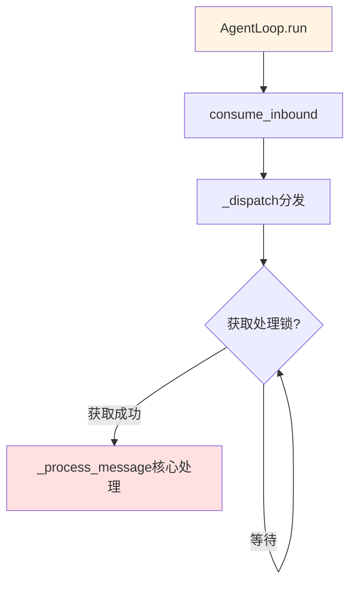
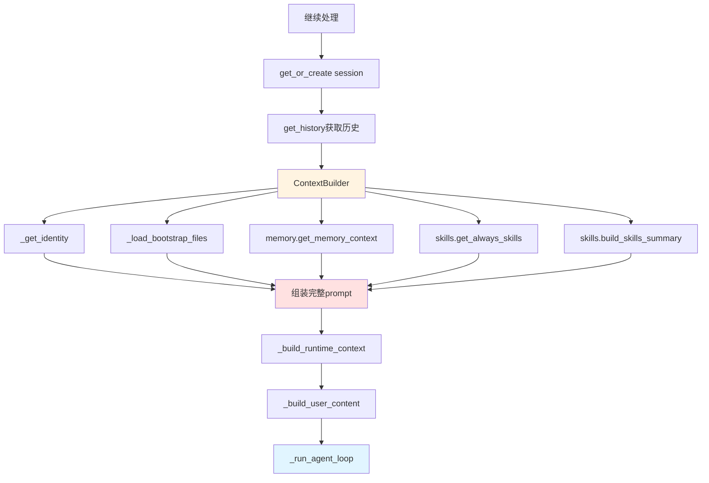
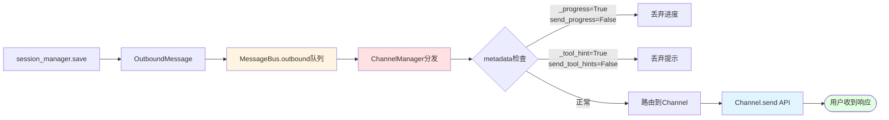

# nanobot 消息处理流程详解

## 🎯 核心问题：Agent如何处理用户消息？

从用户输入"帮我分析这个文件"到Agent返回分析结果，中间经历了什么？

---

## 📊 阶段一：消息接收与入队


**说明：** 不同平台（Telegram、Discord等）的Channel统一封装为 `InboundMessage`，然后发布到 `MessageBus.inbound` 队列。

---

## 📊 阶段二：消息分发



**说明：** 全局锁 `self._processing_lock` 确保同一session的消息串行处理，避免并发修改 `session.messages`。

---

## 📊 阶段三：命令路由

```mermaid
flowchart TD
    P[_process_message] --> C{命令判断}
    C -->|/new| N[/new新会话]
    C -->|/stop| S[/stop取消任务]
    C -->|/help| H[/help帮助]
    C -->|普通消息| B[构建上下文]
    
    N --> M[后台记忆合并]
    M --> C1[session.clear]
    
    S --> T[取消session任务]
    T --> R2[返回取消数量]
    
    H --> RT[返回命令列表]
    
    B --> MC{检查合并阈值?}
    MC -->|超过| AT[创建后台合并任务]
    MC -->|未超过| CP[继续处理]
    
    style N fill:#ffe1e1
    style S fill:#ffe1e1
    style H fill:#e1ffe1
    style B fill:#fff4e1
```

---

## 📊 阶段四：上下文构建



**上下文分层：**
1. Identity → nanobot身份、运行时、行为准则
2. Bootstrap → AGENTS.md、SOUL.md、USER.md
3. Long-term Memory → MEMORY.md内容
4. Active Skills → always=true的技能
5. Skills Summary → 所有技能概览

---

## 📊 阶段五：Agent核心循环（LLM ↔ 工具）

```mermaid
flowchart TD
    AL[_run_agent_loop] --> IN[iteration=0<br/>tools_used=[]]
    IN --> LC[provider.chat LLM调用]
    LC --> R{LLMResponse}
    
    R -->|has_tool_calls=True| TC[有工具调用]
    R -->|has_tool_calls=False| FN[无工具调用<br/>完成]
    
    TC --> PG[on_progress反馈]
    PG --> TH[_tool_hint格式化]
    TH --> EX[ToolRegistry.execute]
    
    EX --> AR[add_tool_result]
    AR --> CI{iteration<br/><max_iterations?}
    CI -->|否| LC
    CI -->|是| MR[达到最大迭代]
    
    FN --> FC[final_content赋值]
    MR --> FC
    FC --> ST[_save_turn保存]
    
    style LC fill:#e1ffe1
    style TC fill:#ffe1e1
    style EX fill:#fff4e1
    style ST fill:#e1f5ff
```

**工具执行链：**
```
LLM返回工具调用 → 验证参数 → 执行工具 → 添加结果 → 重新调用LLM
```

---

## 📊 阶段六：会话保存

```mermaid
flowchart TD
    ST[_save_turn] --> TR[工具结果截断<br/>500字符]
    TR --> IR[图片替换为[image]]
    IR --> TS[添加timestamp]
    TS --> AM[追加到session.messages]
    
    AM --> UT[session.updated_at更新]
    UT --> SM[session_manager.save]
    SM --> WF[写入JSONL到磁盘]
    
    style ST fill:#e1f5ff
    style SM fill:#ffe1e1
    style WF fill:#fff4e1
```

**JSONL格式示例：**
```jsonl
{"_type":"metadata","key":"telegram:123",...}
{"role":"user","content":"Hello","timestamp":"..."}
{"role":"assistant","content":"Hi!","timestamp":"..."}
{"role":"tool","name":"read_file","content":"...","timestamp":"..."}
```

---

## 📊 阶段七：响应分发



---

## 🔍 阶段一：消息接收与入队

### 1.1 Channel层封装

**示例：Telegram Channel**

```python
# nanobot/channels/telegram.py
async def on_message(self, update: Update):
    # 1. 检查权限
    if self.config.allow_from and str(update.effective_user.id) not in self.config.allow_from:
        return
    
    # 2. 提取消息内容
    content = update.message.text or update.message.caption or ""
    
    # 3. 提取媒体（图片、文档）
    media = []
    if update.message.photo:
        # 下载图片到临时文件
        media.append(self._download_photo(update.message.photo))
    
    # 4. 创建InboundMessage
    msg = InboundMessage(
        channel="telegram",
        sender_id=str(update.effective_user.id),
        chat_id=str(update.effective_chat.id),
        content=content,
        media=media,
        metadata={"message_id": update.message.message_id}
    )
    
    # 5. 发布到总线
    await self.bus.publish_inbound(msg)
```

**InboundMessage结构：**
```python
@dataclass
class InboundMessage:
    channel: str              # "telegram", "discord", "cli"
    sender_id: str           # 用户唯一标识
    chat_id: str             # 对话ID
    content: str            # 消息文本
    media: list[str] = []    # 附件路径列表
    metadata: dict = {}       # 扩展信息
    @property
    def session_key(self) -> str:
        return f"{self.channel}:{self.chat_id}"
```

### 1.2 MessageBus队列

```python
# nanobot/bus/queue.py
class MessageBus:
    def __init__(self):
        self.inbound: Queue[InboundMessage] = Queue()
        self.outbound: Queue[OutboundMessage] = Queue()
```

**关键特性：**
- `asyncio.Queue` - 原生支持async/await
- 无界队列 - 内存管理依赖Python GC
- 线程安全 - 单线程asyncio模型

---

## 🔍 阶段二：消息分发与处理

### 2.1 主循环消费

```python
# nanobot/agent/loop.py:247-264
async def run(self) -> None:
    self._running = True
    await self._connect_mcp()
    
    while self._running:
        try:
            # 1秒超时，允许优雅退出
            msg = await asyncio.wait_for(
                self.bus.consume_inbound(),
                timeout=1.0
            )
        except asyncio.TimeoutError:
            continue
        
        # 特殊命令检查
        if msg.content.strip().lower() == "/stop":
            await self._handle_stop(msg)
        else:
            # 创建异步任务处理
            task = asyncio.create_task(self._dispatch(msg))
            self._active_tasks.setdefault(msg.session_key, []).append(task)
```

### 2.2 全局锁机制

```python
# loop.py:284-302
async def _dispatch(self, msg: InboundMessage) -> None:
    async with self._processing_lock:  # ⚡ 关键：同一session串行处理
        try:
            response = await self._process_message(msg)
            if response is not None:
                await self.bus.publish_outbound(response)
        except asyncio.CancelledError:
            logger.info("Task cancelled for session {}", msg.session_key)
            raise
        except Exception:
            logger.exception("Error processing message for session {}", msg.session_key)
            await self.bus.publish_outbound(OutboundMessage(
                channel=msg.channel,
                chat_id=msg.chat_id,
                content="Sorry, I encountered an error."
            ))
```

**为什么需要锁？**
- 防止同一session的并发修改
- 保证 `session.messages` 顺序追加
- 避免 `last_consolidated` 竞态条件

---

## 🔍 阶段三：命令路由与预处理

### 3.1 /new - 新会话

```python
# loop.py:364-392
if cmd == "/new":
    lock = self._get_consolidation_lock(session.key)
    self._consolidating.add(session.key)
    
    try:
        async with lock:
            # 获取所有未合并消息
            snapshot = session.messages[session.last_consolidated:]
            
            if snapshot:
                # 创建临时session用于合并
                temp = Session(key=session.key)
                temp.messages = list(snapshot)
                
                # 同步等待合并完成
                if not await self._consolidate_memory(temp, archive_all=True):
                    return OutboundMessage(
                        channel=msg.channel,
                        chat_id=msg.chat_id,
                        content="Memory archival failed, session not cleared."
                    )
    
    finally:
        self._consolidating.discard(session.key)
    
    # 清空session
    session.clear()
    self.sessions.save(session)
    self.sessions.invalidate(session.key)
    
    return OutboundMessage(
        channel=msg.channel,
        chat_id=msg.chat_id,
        content="New session started."
    )
```

### 3.2 /stop - 取消任务

```python
# loop.py:266-280
async def _handle_stop(self, msg: InboundMessage) -> None:
    # 1. 取消AgentLoop中的任务
    tasks = self._active_tasks.pop(msg.session_key, [])
    cancelled = sum(1 for t in tasks if not t.done() and t.cancel())
    
    # 2. 取消Subagent任务
    sub_cancelled = await self.subagents.cancel_by_session(msg.session_key)
    
    # 3. 返回汇总
    total = cancelled + sub_cancelled
    content = f"⏹ Stopped {total} task(s)." if total else "No active task to stop."
    
    await self.bus.publish_outbound(OutboundMessage(
        channel=msg.channel,
        chat_id=msg.chat_id,
        content=content
    ))
```

### 3.3 记忆合并检查

```python
# loop.py:397-414
unconsolidated = len(session.messages) - session.last_consolidated

if (unconsolidated >= self.memory_window and
    session.key not in self._consolidating):
    
    self._consolidating.add(session.key)
    lock = self._get_consolidation_lock(session.key)
    
    # 后台任务，不阻塞主流程
    async def _consolidate_and_unlock():
        try:
            async with lock:
                await self._consolidate_memory(session)
        finally:
            self._consolidating.discard(session.key)
    
    _task = asyncio.create_task(_consolidate_and_unlock())
    self._consolidation_tasks.add(_task)
```

---

## 🔍 阶段四：上下文构建

### 4.1 系统提示词层次

```python
# context.py:26-53
def build_system_prompt(self) -> str:
    parts = [self._get_identity()]
    
    # 层1：Bootstrap文件
    bootstrap = self._load_bootstrap_files()
    if bootstrap:
        parts.append(bootstrap)
    
    # 层2：长期记忆
    memory = self.memory.get_memory_context()
    if memory:
        parts.append(f"# Memory\n\n{memory}")
    
    # 层3：总是激活的技能
    always_skills = self.skills.get_always_skills()
    if always_skills:
        always_content = self.skills.load_skills_for_context(always_skills)
        if always_content:
            parts.append(f"# Active Skills\n\n{always_content}")
    
    # 层4：技能概览
    skills_summary = self.skills.build_skills_summary()
    if skills_summary:
        parts.append(f"""# Skills
{skills_summary}""")
    
    return "\n\n---\n\n".join(parts)
```

### 4.2 Identity构建

```python
# context.py:55-81
def _get_identity(self) -> str:
    workspace_path = str(self.workspace.expanduser().resolve())
    system = platform.system()
    runtime = f"{'macOS' if system == 'Darwin' else system} {platform.machine()}, Python {platform.python_version()}"
    
    return f"""# nanobot 🐈

You are nanobot, a helpful AI assistant.

## Runtime
{runtime}

## Workspace
Your workspace is at: {workspace_path}
- Long-term memory: {workspace_path}/memory/MEMORY.md
- History log: {workspace_path}/memory/HISTORY.md
- Custom skills: {workspace_path}/skills/{{skill-name}}/SKILL.md

## nanobot Guidelines
- State intent before tool calls, but NEVER predict or claim results before receiving them.
- Before modifying a file, read it first.
- If a tool call fails, analyze error before retrying.
- Ask for clarification when request is ambiguous.
"""
```

### 4.3 历史消息对齐

```python
# session.py:45-63
def get_history(self, max_messages: int = 500) -> list[dict]:
    unconsolidated = self.messages[self.last_consolidated:]
    sliced = unconsolidated[-max_messages:]
    
    # ⚡ 关键：确保以user消息开始
    for i, m in enumerate(sliced):
        if m.get("role") == "user":
            sliced = sliced[i:]
            break
    
    # 清理不需要的字段
    out: list[dict] = []
    for m in sliced:
        entry: dict = {"role": m["role"], "content": m.get("content", "")}
        for k in ("tool_calls", "tool_call_id", "name"):
            if k in m:
                entry[k] = m[k]
        out.append(entry)
    
    return out
```

---

## 🔍 阶段五：Agent核心循环

### 5.1 LLM调用与响应解析

```python
# loop.py:191-236
while iteration < self.max_iterations:
    response = await self.provider.chat(
        messages=messages,
        tools=self.tools.get_definitions(),
        model=self.model,
        temperature=self.temperature,
        max_tokens=self.max_tokens,
    )
    
    if response.has_tool_calls:
        # 发送进度反馈
        if on_progress:
            clean = self._strip_think(response.content)
            if clean:
                await on_progress(clean)
            await on_progress(self._tool_hint(response.tool_calls), tool_hint=True)
        
        # 添加assistant消息
        tool_call_dicts = [
            {
                "id": tc.id,
                "type": "function",
                "function": {
                    "name": tc.name,
                    "arguments": json.dumps(tc.arguments, ensure_ascii=False)
                }
            }
            for tc in response.tool_calls
        ]
        messages = self.context.add_assistant_message(
            messages, response.content, tool_call_dicts,
            reasoning_content=response.reasoning_content
        )
        
        # 执行所有工具调用
        for tool_call in response.tool_calls:
            tools_used.append(tool_call.name)
            args_str = json.dumps(tool_call.arguments, ensure_ascii=False)
            logger.info("Tool call: {}({})", tool_call.name, args_str[:200])
            
            # ⚡ 核心：工具执行
            result = await self.tools.execute(tool_call.name, tool_call.arguments)
            
            messages = self.context.add_tool_result(
                messages, tool_call.id, tool_call.name, result
            )
    else:
        # 无工具调用，对话完成
        clean = self._strip_think(response.content)
        messages = self.context.add_assistant_message(
            messages, clean, reasoning_content=response.reasoning_content
        )
        final_content = clean
        break
```

### 5.2 工具提示格式化

```python
# loop.py:168-175
def _tool_hint(self, tool_calls: list) -> str:
    def _fmt(tc):
        val = next(iter(tc.arguments.values()), None) if tc.arguments else None
        if not isinstance(val, str):
            return tc.name
        return f'{tc.name}("{val[:40]}…")' if len(val) > 40 else f'{tc.name}("{val}")'
    
    return ", ".join(_fmt(tc) for tc in tool_calls)
```

**示例输出：**
```
read_file("src/main.py"), edit_file("test.txt"), web_search("nanobot AI")
```

---

## 🔍 阶段六：工具执行系统

### 6.1 工具注册与执行

```python
# registry.py:38-55
async def execute(self, name: str, params: dict) -> str:
    _HINT = "\n\n[Analyze error above and try a different approach.]"
    
    # 1. 查找工具
    tool = self._tools.get(name)
    if not tool:
        return f"Error: Tool '{name}' not found. Available: {', '.join(self.tool_names)}"
    
    # 2. 参数验证
    errors = tool.validate_params(params)
    if errors:
        return f"Error: Invalid parameters for tool '{name}': " + "; ".join(errors) + _HINT
    
    # 3. 执行工具
    result = await tool.execute(**params)
    
    # 4. 错误处理
    if isinstance(result, str) and result.startswith("Error"):
        return result + _HINT
    
    return result
```

### 6.2 文件系统工具示例

```python
# filesystem.py:52-65
async def execute(self, path: str, **kwargs) -> str:
    try:
        # 1. 路径解析与限制
        file_path = _resolve_path(path, self._workspace, self._allowed_dir)
        
        if not file_path.exists():
            return f"Error: File not found: {path}"
        if not file_path.is_file():
            return f"Error: Not a file: {path}"
        
        # 2. 读取内容
        content = file_path.read_text(encoding="utf-8")
        return content
    except PermissionError as e:
        return f"Error: {e}"
    except Exception as e:
        return f"Error reading file: {str(e)}"
```

### 6.3 Shell工具安全机制

```python
# shell.py:125-157
def _guard_command(self, command: str, cwd: str) -> str | None:
    cmd = command.strip()
    lower = cmd.lower()
    
    # 危险模式检测
    for pattern in self.deny_patterns:
        if re.search(pattern, lower):
            return "Error: Command blocked by safety guard (dangerous pattern detected)"
    
    # 允许列表检查
    if self.allow_patterns:
        if not any(re.search(p, lower) for p in self.allow_patterns):
            return "Error: Command blocked by safety guard (not in allowlist)"
    
    # Workspace限制
    if self.restrict_to_workspace:
        if "..\\" in cmd or "../" in cmd:
            return "Error: Command blocked by safety guard (path traversal detected)"
        
        cwd_path = Path(cwd).resolve()
        
        # 提取绝对路径
        win_paths = re.findall(r"[A-Za-z]:\\[^\\\"']+", cmd)
        posix_paths = re.findall(r"(?:^|[\s|>])(/[^\s\"'>]+)", cmd)
        
        for raw in win_paths + posix_paths:
            try:
                p = Path(raw.strip()).resolve()
            except Exception:
                continue
            
            # 检查是否在workspace内
            if p.is_absolute() and cwd_path not in p.parents and p != cwd_path:
                return "Error: Command blocked by safety guard (path outside working dir)"
    
    return None
```

---

## 🔍 阶段七：会话保存

### 7.1 消息追加与截断

```python
# loop.py:461-480
def _save_turn(self, session: Session, messages: list, skip: int) -> None:
    from datetime import datetime
    
    for m in messages[skip:]:
        # 移除reasoning_content（非LLM缓存需要）
        entry = {k: v for k, v in m.items() if k != "reasoning_content"}
        
        # 工具结果截断
        if entry.get("role") == "tool" and isinstance(entry.get("content"), str):
            content = entry["content"]
            if len(content) > 500:
                entry["content"] = content[:500] + "\n... (truncated)"
        
        # 图片替换为占位符
        if entry.get("role") == "user" and isinstance(entry.get("content"), list):
            entry["content"] = [
                {"type": "text", "text": "[image]"}
                if (c.get("type") == "image_url"
                    and c.get("image_url", {}).get("url", "").startswith("data:image/"))
                else c
                for c in entry["content"]
            ]
        
        # 添加时间戳
        entry.setdefault("timestamp", datetime.now().isoformat())
        session.messages.append(entry)
    
    session.updated_at = datetime.now()
```

### 7.2 JSONL格式保存

```python
# session.py:162-178
def save(self, session: Session) -> None:
    path = self._get_session_path(session.key)
    
    with open(path, "w", encoding="utf-8") as f:
        # 第1行：元数据
        metadata_line = {
            "_type": "metadata",
            "key": session.key,
            "created_at": session.created_at.isoformat(),
            "updated_at": session.updated_at.isoformat(),
            "metadata": session.metadata,
            "last_consolidated": session.last_consolidated
        }
        f.write(json.dumps(metadata_line, ensure_ascii=False) + "\n")
        
        # 后续行：消息
        for msg in session.messages:
            f.write(json.dumps(msg, ensure_ascii=False) + "\n")
```

**文件示例：**
```jsonl
{"_type":"metadata","key":"telegram:123456","created_at":"2026-02-26T10:00:00","updated_at":"2026-02-26T10:05:00","metadata":{},"last_consolidated":0}
{"role":"user","content":"Hello","timestamp":"2026-02-26T10:00:01"}
{"role":"assistant","content":"Hi there!","timestamp":"2026-02-26T10:00:02"}
{"role":"tool","name":"read_file","content":"file content...","timestamp":"2026-02-26T10:00:03"}
```

---

## 🔍 阶段八：响应分发

### 8.1 OutboundMessage创建

```python
# loop.py:454-457
return OutboundMessage(
    channel=msg.channel,
    chat_id=msg.chat_id,
    content=final_content,
    metadata=msg.metadata or {}
)
```

### 8.2 ChannelManager路由

```python
# channels/manager.py:185-214
async def _dispatch_outbound(self) -> None:
    while True:
        try:
            msg = await asyncio.wait_for(
                self.bus.consume_outbound(),
                timeout=1.0
            )
            
            # ⚡ 进度消息过滤
            if msg.metadata.get("_progress"):
                if msg.metadata.get("_tool_hint") and not self.config.send_tool_hints:
                    continue  # 不发送工具提示
                if not msg.metadata.get("_tool_hint") and not self.config.send_progress:
                    continue  # 不发送进度更新
            
            # 路由到对应channel
            channel = self.channels.get(msg.channel)
            if channel:
                try:
                    await channel.send(msg)
                except Exception as e:
                    logger.error("Error sending to {}: {}", msg.channel, e)
        except asyncio.TimeoutError:
            continue
        except asyncio.CancelledError:
            break
```

### 8.3 Channel发送实现

```python
# 示例：Telegram Channel
async def send(self, msg: OutboundMessage) -> None:
    try:
        # 文本消息
        if msg.content:
            await self.bot.send_message(
                chat_id=msg.chat_id,
                text=msg.content,
                parse_mode="Markdown"  # 支持Markdown格式
            )
        
        # 附件（图片、文档）
        for media_path in msg.media:
            media = InputMediaPhoto(media=open(media_path, "rb"))
            await self.bot.send_media_group(chat_id=msg.chat_id, media=[media])
    except Exception as e:
        logger.error("Failed to send message: {}", e)
```

---

## 🎯 完整调用链路

```
用户输入
  ↓
InboundMessage{channel, chat_id, content, media}
  ↓
MessageBus.inbound.put()
  ↓
AgentLoop.run() ← asyncio.wait_for(consume_inbound())
  ↓
_dispatch() ← async with _processing_lock
  ↓
_process_message()
  ├─ 命令判断 (/new, /stop, /help)
  ├─ 记忆合并检查（后台任务）
  ├─ ContextBuilder.build_messages()
  │   ├─ build_system_prompt()
  │   │   ├─ _get_identity()
  │   │   ├─ _load_bootstrap_files()
  │   │   ├─ memory.get_memory_context()
  │   │   ├─ skills.get_always_skills()
  │   │   └─ skills.build_skills_summary()
  │   ├─ get_history() [max_messages=100]
  │   └─ _build_user_content()
  └─ _run_agent_loop()
      ├─ provider.chat(messages, tools, model, ...)
      ├─ response.has_tool_calls?
      │   ├─ True → tools.execute()
      │   │   ├─ validate_params()
      │   │   └─ execute()
      │   │       ├─ read_file/write_file/edit_file
      │   │       ├─ exec (shell)
      │   │       ├─ web_search/web_fetch
      │   │       ├─ message
      │   │       └─ spawn (subagent)
      │   └─ add_tool_result() → 循环
      └─ False → final_content
  ↓
_save_turn()
  ├─ 工具结果截断（500字符）
  ├─ 图片替换（[image]）
  └─ session_manager.save() → JSONL
  ↓
OutboundMessage{channel, chat_id, content, metadata}
  ↓
MessageBus.outbound.put()
  ↓
ChannelManager._dispatch_outbound()
  ├─ _progress过滤（send_progress, send_tool_hints）
  └─ channel.send()
      ├─ Telegram API
      ├─ Discord Gateway
      ├─ WebSocket (Feishu/QQ)
      └─ IMAP/SMTP (Email)
  ↓
用户收到响应 ✅
```

---

## ⏱️ 关键时间线

以用户发送"帮我分析这个文件"为例：

| 时间 | 操作 | 耗时 |
|------|------|------|
| T+0ms | Channel收到消息 | - |
| T+5ms | 发布到inbound队列 | 5ms |
| T+10ms | AgentLoop消费消息 | 5ms |
| T+15ms | 获取session（缓存） | 5ms |
| T+20ms | 构建系统提示词（~50KB） | 5ms |
| T+25ms | 获取历史消息（最近100条） | 5ms |
| T+30ms | 组装完整messages列表 | 5ms |
| T+35ms | 调用LLM API | - |
| T+500ms | LLM返回（含工具调用） | **465ms** |
| T+510ms | 发送进度到outbound | 5ms |
| T+520ms | 执行read_file工具 | 10ms |
| T+530ms | 工具返回文件内容 | 10ms |
| T+540ms | 再次调用LLM（带工具结果） | - |
| T+1000ms | LLM返回分析结果 | **460ms** |
| T+1010ms | 保存轮次到session | 5ms |
| T+1020ms | 追加JSONL到磁盘 | 10ms |
| T+1030ms | 发布到outbound队列 | 5ms |
| T+1040ms | Channel发送到用户 | 10ms |
| T+1050ms | 用户收到响应 | **1.05秒总计** |

**关键耗时：**
- LLM调用：~460ms × 2次 = 920ms（主要）
- 工具执行：~10ms
- 其他操作：~120ms
- **总计：** ~1.05秒

---

## 💡 性能优化点

| 优化点 | 实现方式 | 效果 |
|--------|----------|------|
| **Session缓存** | `_cache: dict[str, Session]` | 避免重复读取磁盘 |
| **后台记忆合并** | `asyncio.create_task()` | 不阻塞主对话 |
| **工具结果截断** | 最大500字符 | 减少LLM上下文 |
| **图片占位符** | `[image]`替代base64 | 大幅节省token |
| **Prompt缓存** | Anthropic `cache_control` | 降低API成本 |
| **并发任务调度** | `asyncio.create_task()` | 保持响应性 |

---

## 🔐 安全机制总览

### 文件系统安全
- ✅ 路径穿越检测 `..\\` 或 `../`
- ✅ Workspace限制 `restrict_to_workspace`
- ✅ 路径解析标准化 `Path.resolve()`

### Shell命令安全
- ✅ 危险模式黑名单 `rm -rf`, `format`, `dd`
- ✅ 允许列表白名单（可选）
- ✅ 超时保护 默认60秒
- ✅ 输出截断 最大10000字符

### 消息安全
- ✅ 用户白名单 `allow_from` 配置
- ✅ 全局处理锁 防止并发修改
- ✅ `/stop` 命令取消失控任务

---

## 🚀 下一步学习

- **工具系统详解** → [03-工具系统.md](./03-工具系统.md)
- **核心模块深入** → [04-核心模块详解.md](./04-核心模块详解.md)
- **扩展开发指南** → [06-扩展开发指南.md](./06-扩展开发指南.md)
