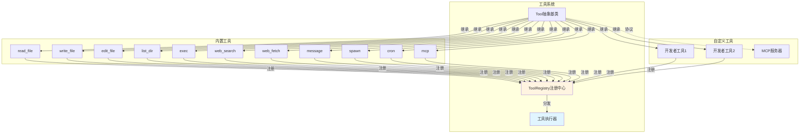
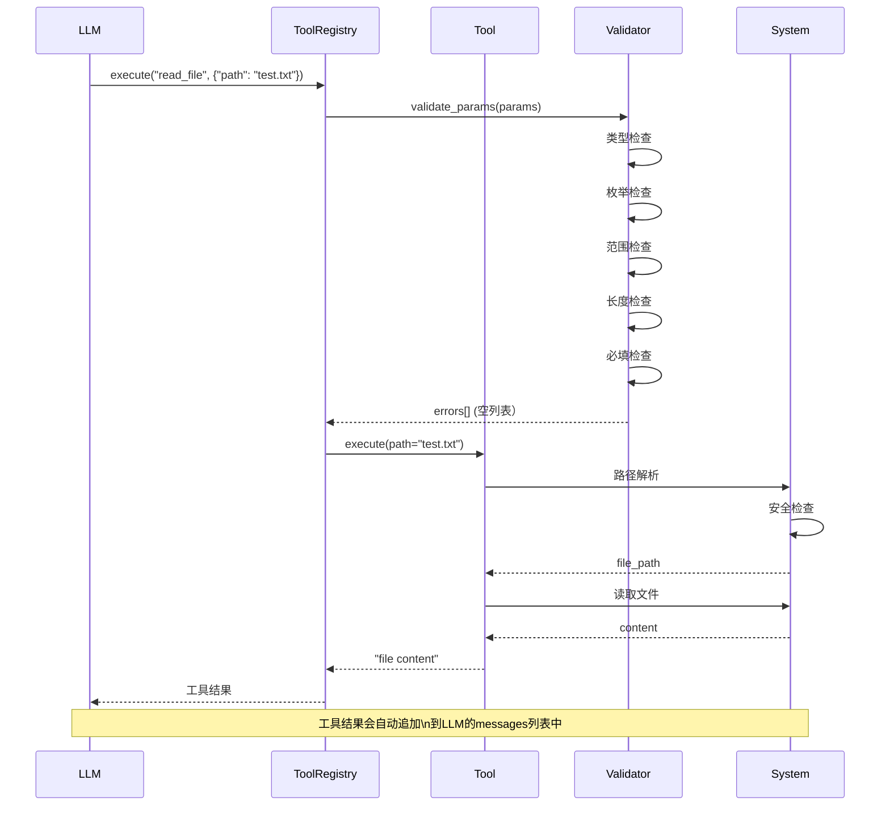

# nanobot 工具系统详解

## 🛠️ 工具系统架构



---

## 📐 Tool抽象基类

### 核心接口

```python
# nanobot/agent/tools/base.py
class Tool(ABC):
    """工具抽象基类"""
    
    @property
    @abstractmethod
    def name(self) -> str:
        """工具名称（函数调用标识）"""
        pass
    
    @property
    @abstractmethod
    def description(self) -> str:
        """工具描述（告诉LLM它能做什么）"""
        pass
    
    @property
    @abstractmethod
    def parameters(self) -> dict[str, Any]:
        """JSON Schema参数定义"""
        pass
    
    @abstractmethod
    async def execute(self, **kwargs: Any) -> str:
        """执行工具并返回结果字符串"""
        pass
```

### 参数类型映射

```python
_TYPE_MAP = {
    "string": str,
    "integer": int,
    "number": (int, float),
    "boolean": bool,
    "array": list,
    "object": dict,
}
```

### 工具Schema格式

```python
def to_schema(self) -> dict[str, Any]:
    """转换为OpenAI函数调用格式"""
    return {
        "type": "function",
        "function": {
            "name": self.name,              # "read_file"
            "description": self.description,    # "Read contents of a file"
            "parameters": self.parameters,      # JSON Schema
        }
    }
```

---

## 📋 参数验证系统

### 验证流程

```mermaid
flowchart TD
    Start[工具调用参数] --> Extract[提取params]
    Extract --> Validate[validate_params]
    Validate --> TypeCheck{类型检查}
    
    TypeCheck -->|不匹配| TypeErr[返回类型错误]
    TypeCheck -->|匹配| EnumCheck{枚举检查}
    
    EnumCheck -->|不匹配| EnumErr[返回枚举错误]
    EnumCheck -->|匹配| RangeCheck{范围检查}
    
    RangeCheck -->|超出范围| RangeErr[返回范围错误}
    RangeCheck -->|合法| LengthCheck{长度检查}
    
    LengthCheck -->|超出| LengthErr[返回长度错误]
    LengthCheck -->|合法| RequiredCheck{必填检查}
    
    RequiredCheck -->|缺失| ReqErr[返回必填错误}
    RequiredCheck -->|完整| ObjectCheck{嵌套对象}
    
    ObjectCheck -->|有嵌套| NestedRec[递归验证嵌套]
    ObjectCheck -->|无嵌套| Success[验证通过]
    
    NestedRec --> Success
    
    style Success fill:#e1ffe1
    style TypeErr fill:#ffe1e1
    style EnumErr fill:#ffe1e1
    style RangeErr fill:#ffe1e1
    style LengthErr fill:#ffe1e1
    style ReqErr fill:#ffe1e1
```

### 验证代码实现

```python
# base.py:55-91
def validate_params(self, params: dict) -> list[str]:
    """验证工具参数，返回错误列表"""
    schema = self.parameters or {}
    if schema.get("type") != "object":
        raise ValueError(f"Schema must be object type, got {schema.get('type')!r}")
    
    return self._validate(params, {**schema, "type": "object"}, "")

def _validate(self, val: Any, schema: dict, path: str) -> list[str]:
    t, label = schema.get("type"), path or "parameter"
    
    # 1. 类型检查
    if t in self._TYPE_MAP and not isinstance(val, self._TYPE_MAP[t]):
        return [f"{label} should be {t}"]
    
    errors = []
    
    # 2. 枚举检查
    if "enum" in schema and val not in schema["enum"]:
        errors.append(f"{label} must be one of {schema['enum']}")
    
    # 3. 范围检查
    if t in ("integer", "number"):
        if "minimum" in schema and val < schema["minimum"]:
            errors.append(f"{label} must be >= {schema['minimum']}")
        if "maximum" in schema and val > schema["maximum"]:
            errors.append(f"{label} must be <= {schema['maximum']}")
    
    # 4. 长度检查
    if t == "string":
        if "minLength" in schema and len(val) < schema["minLength"]:
            errors.append(f"{label} must be at least {schema['minLength']} chars")
        if "maxLength" in schema and len(val) > schema["maxLength"]:
            errors.append(f"{label} must be at most {schema['maxLength']} chars")
    
    # 5. 必填检查
    if t == "object":
        props = schema.get("properties", {})
        for k in schema.get("required", []):
            if k not in val:
                errors.append(f"missing required {k}")
        
        # 6. 递归验证嵌套属性
        for k, v in val.items():
            if k in props:
                errors.extend(self._validate(v, props[k], path + '.' + k if path else k))
    
    # 7. 数组元素验证
    if t == "array" and "items" in schema:
        for i, item in enumerate(val):
            errors.extend(self._validate(item, schema["items"], f"{path}[{i}]"))
    
    return errors
```

---

## 🗂️ 文件系统工具

### read_file

```python
class ReadFileTool(Tool):
    name = "read_file"
    description = "Read contents of a file at given path."
    
    parameters = {
        "type": "object",
        "properties": {
            "path": {
                "type": "string",
                "description": "The file path to read"
            }
        },
        "required": ["path"]
    }
    
    async def execute(self, path: str, **kwargs) -> str:
        # 1. 路径解析
        file_path = _resolve_path(path, self._workspace, self._allowed_dir)
        
        # 2. 存在性检查
        if not file_path.exists():
            return f"Error: File not found: {path}"
        if not file_path.is_file():
            return f"Error: Not a file: {path}"
        
        # 3. 读取内容
        content = file_path.read_text(encoding="utf-8")
        return content
```

**安全机制：**
```python
def _resolve_path(path: str, workspace: Path, allowed_dir: Path) -> Path:
    p = Path(path).expanduser()
    
    # 相对路径解析为workspace内
    if not p.is_absolute() and workspace:
        p = workspace / p
    
    resolved = p.resolve()
    
    # Workspace限制
    if allowed_dir:
        try:
            resolved.relative_to(allowed_dir.resolve())
        except ValueError:
            raise PermissionError(f"Path {path} is outside allowed directory {allowed_dir}")
    
    return resolved
```

### write_file

```python
class WriteFileTool(Tool):
    name = "write_file"
    description = "Write content to a file. Creates parent directories if needed."
    
    parameters = {
        "type": "object",
        "properties": {
            "path": {"type": "string", "description": "The file path to write to"},
            "content": {"type": "string", "description": "The content to write"}
        },
        "required": ["path", "content"]
    }
    
    async def execute(self, path: str, content: str, **kwargs) -> str:
        file_path = _resolve_path(path, self._workspace, self._allowed_dir)
        
        # 自动创建父目录
        file_path.parent.mkdir(parents=True, exist_ok=True)
        
        file_path.write_text(content, encoding="utf-8")
        return f"Successfully wrote {len(content)} bytes to {file_path}"
```

### edit_file

```python
class EditFileTool(Tool):
    name = "edit_file"
    description = "Edit a file by replacing old_text with new_text. The old_text must exist exactly."
    
    parameters = {
        "type": "object",
        "properties": {
            "path": {"type": "string", "description": "The file path to edit"},
            "old_text": {"type": "string", "description": "The exact text to find and replace"},
            "new_text": {"type": "string", "description": "The text to replace with"}
        },
        "required": ["path", "old_text", "new_text"]
    }
    
    async def execute(self, path: str, old_text: str, new_text: str, **kwargs) -> str:
        file_path = _resolve_path(path, self._workspace, self._allowed_dir)
        
        if not file_path.exists():
            return f"Error: File not found: {path}"
        
        content = file_path.read_text(encoding="utf-8")
        
        # 精确匹配检查
        if old_text not in content:
            return self._not_found_message(old_text, content, path)
        
        # 重复检查
        count = content.count(old_text)
        if count > 1:
            return f"Warning: old_text appears {count} times. Please provide more context."
        
        # 替换（仅第一次）
        new_content = content.replace(old_text, new_text, 1)
        file_path.write_text(new_content, encoding="utf-8")
        
        return f"Successfully edited {file_path}"
```

**智能错误提示：**
```python
def _not_found_message(self, old_text: str, content: str, path: str) -> str:
    """构建友好的错误提示"""
    lines = content.splitlines(keepends=True)
    old_lines = old_text.splitlines(keepends=True)
    window = len(old_lines)
    
    # 使用difflib查找最佳匹配
    best_ratio, best_start = 0.0, 0
    for i in range(max(1, len(lines) - window + 1)):
        ratio = difflib.SequenceMatcher(None, old_lines, lines[i:i + window]).ratio()
        if ratio > best_ratio:
            best_ratio, best_start = ratio, i
    
    if best_ratio > 0.5:
        diff = "\n".join(difflib.unified_diff(
            old_lines, lines[best_start:best_start + window],
            fromfile="old_text (provided)",
            tofile=f"{path} (actual, line {best_start + 1})",
            lineterm=""
        ))
        return f"Error: old_text not found.\nBest match ({best_ratio:.0%} similar):\n{diff}"
    
    return f"Error: old_text not found in {path}. No similar text found."
```

### list_dir

```python
class ListDirTool(Tool):
    name = "list_dir"
    description = "List contents of a directory."
    
    parameters = {
        "type": "object",
        "properties": {
            "path": {"type": "string", "description": "The directory path to list"}
        },
        "required": ["path"]
    }
    
    async def execute(self, path: str, **kwargs) -> str:
        dir_path = _resolve_path(path, self._workspace, self._allowed_dir)
        
        if not dir_path.exists():
            return f"Error: Directory not found: {path}"
        if not dir_path.is_dir():
            return f"Error: Not a directory: {path}"
        
        items = []
        for item in sorted(dir_path.iterdir()):
            prefix = "📁 " if item.is_dir() else "📄 "
            items.append(f"{prefix}{item.name}")
        
        return "\n".join(items) if items else f"Directory {path} is empty"
```

---

## 💻 Shell执行工具

### 安全检查机制

```python
class ExecTool(Tool):
    def __init__(self, ...):
        # 默认危险命令黑名单
        self.deny_patterns = [
            r"\brm\s+-[rf]{1,2}\b",          # rm -r, rm -rf
            r"\bdel\s+/[fq]\b",              # del /f, del /q
            r"\brmdir\s+/s\b",               # rmdir /s
            r"(?:^|[;&|]\s*)format\b",       # format
            r"\b(mkfs|diskpart)\b",          # 磁盘操作
            r"\bdd\s+if=",                   # dd
            r">\s*/dev/sd",                  # 写入设备
            r"\b(shutdown|reboot|poweroff)\b",  # 系统电源
            r":\(\)\s*\{.*\};\s*:",          # fork bomb
        ]
```

### 命令验证流程

```python
def _guard_command(self, command: str, cwd: str) -> str | None:
    cmd = command.strip()
    lower = cmd.lower()
    
    # 1. 危险模式检查
    for pattern in self.deny_patterns:
        if re.search(pattern, lower):
            return "Error: Command blocked by safety guard (dangerous pattern detected)"
    
    # 2. 允许列表检查（可选）
    if self.allow_patterns:
        if not any(re.search(p, lower) for p in self.allow_patterns):
            return "Error: Command blocked by safety guard (not in allowlist)"
    
    # 3. Workspace路径限制
    if self.restrict_to_workspace:
        # 路径穿越检测
        if "..\\" in cmd or "../" in cmd:
            return "Error: Command blocked by safety guard (path traversal detected)"
        
        cwd_path = Path(cwd).resolve()
        
        # 提取Windows和POSIX绝对路径
        win_paths = re.findall(r"[A-Za-z]:\\[^\\\"']+", cmd)
        posix_paths = re.findall(r"(?:^|[\s|>])(/[^\s\"'>]+)", cmd)
        
        for raw in win_paths + posix_paths:
            try:
                p = Path(raw.strip()).resolve()
            except Exception:
                continue
            
            # 检查路径是否在workspace内
            if p.is_absolute() and cwd_path not in p.parents and p != cwd_path:
                return "Error: Command blocked by safety guard (path outside working dir)"
    
    return None
```

### 执行实现

```python
async def execute(self, command: str, working_dir: str | None = None, **kwargs) -> str:
    cwd = working_dir or self.working_dir or os.getcwd()
    
    # 安全检查
    guard_error = self._guard_command(command, cwd)
    if guard_error:
        return guard_error
    
    # 环境变量
    env = os.environ.copy()
    if self.path_append:
        env["PATH"] = env.get("PATH", "") + os.pathsep + self.path_append
    
    try:
        # 创建子进程
        process = await asyncio.create_subprocess_shell(
            command,
            stdout=asyncio.subprocess.PIPE,
            stderr=asyncio.subprocess.PIPE,
            cwd=cwd,
            env=env,
        )
        
        try:
            # 超时等待
            stdout, stderr = await asyncio.wait_for(
                process.communicate(),
                timeout=self.timeout
            )
        except asyncio.TimeoutError:
            process.kill()
            # 等待进程完全退出
            try:
                await asyncio.wait_for(process.wait(), timeout=5.0)
            except asyncio.TimeoutError:
                pass
            return f"Error: Command timed out after {self.timeout} seconds"
        
        # 合并输出
        output_parts = []
        if stdout:
            output_parts.append(stdout.decode("utf-8", errors="replace"))
        if stderr:
            stderr_text = stderr.decode("utf-8", errors="replace")
            if stderr_text.strip():
                output_parts.append(f"STDERR:\n{stderr_text}")
        
        # 退出码
        if process.returncode != 0:
            output_parts.append(f"\nExit code: {process.returncode}")
        
        result = "\n".join(output_parts) if output_parts else "(no output)"
        
        # 输出截断
        max_len = 10000
        if len(result) > max_len:
            result = result[:max_len] + f"\n... (truncated, {len(result) - max_len} more chars)"
        
        return result
    except Exception as e:
        return f"Error executing command: {str(e)}"
```

---

## 🌐 Web工具

### web_search (Brave Search API)

```python
class WebSearchTool(Tool):
    name = "web_search"
    description = "Search the web. Returns titles, URLs, and snippets."
    
    parameters = {
        "type": "object",
        "properties": {
            "query": {"type": "string", "description": "Search query"},
            "count": {"type": "integer", "description": "Results (1-10)", "minimum": 1, "maximum": 10}
        },
        "required": ["query"]
    }
    
    async def execute(self, query: str, count: int | None = None, **kwargs) -> str:
        if not self.api_key:
            return "Error: Brave Search API key not configured."
        
        n = min(max(count or self.max_results, 1), 10)
        
        # 调用Brave API
        async with httpx.AsyncClient() as client:
            r = await client.get(
                "https://api.search.brave.com/res/v1/web/search",
                params={"q": query, "count": n},
                headers={
                    "Accept": "application/json",
                    "X-Subscription-Token": self.api_key
                },
                timeout=10.0
            )
            r.raise_for_status()
        
        results = r.json().get("web", {}).get("results", [])
        if not results:
            return f"No results for: {query}"
        
        # 格式化结果
        lines = [f"Results for: {query}\n"]
        for i, item in enumerate(results[:n], 1):
            lines.append(f"{i}. {item.get('title', '')}\n   {item.get('url', '')}")
            if desc := item.get("description"):
                lines.append(f"   {desc}")
        
        return "\n".join(lines)
```

### web_fetch (网页内容提取)

```python
class WebFetchTool(Tool):
    name = "web_fetch"
    description = "Fetch URL and extract readable content (HTML → markdown/text)."
    
    parameters = {
        "type": "object",
        "properties": {
            "url": {"type": "string", "description": "URL to fetch"},
            "extractMode": {"type": "string", "enum": ["markdown", "text"], "default": "markdown"},
            "maxChars": {"type": "integer", "minimum": 100}
        },
        "required": ["url"]
    }
    
    async def execute(self, url: str, extractMode: str = "markdown", maxChars: int | None = None, **kwargs) -> str:
        from readability import Document
        
        max_chars = maxChars or self.max_chars
        
        # URL验证
        is_valid, error_msg = _validate_url(url)
        if not is_valid:
            return json.dumps({"error": f"URL validation failed: {error_msg}", "url": url})
        
        try:
            async with httpx.AsyncClient(
                follow_redirects=True,
                max_redirects=5,
                timeout=30.0
            ) as client:
                r = await client.get(url, headers={"User-Agent": USER_AGENT})
                r.raise_for_status()
            
            # 内容类型判断
            ctype = r.headers.get("content-type", "")
            
            if "application/json" in ctype:
                text, extractor = json.dumps(r.json(), indent=2, ensure_ascii=False), "json"
            elif "text/html" in ctype or r.text[:256].lower().startswith(("<!doctype", "<html")):
                doc = Document(r.text)
                content = self._to_markdown(doc.summary()) if extractMode == "markdown" else _strip_tags(doc.summary())
                text = f"# {doc.title()}\n\n{content}" if doc.title() else content
                extractor = "readability"
            else:
                text, extractor = r.text, "raw"
            
            truncated = len(text) > max_chars
            if truncated:
                text = text[:max_chars]
            
            return json.dumps({
                "url": url,
                "finalUrl": str(r.url),
                "status": r.status_code,
                "extractor": extractor,
                "truncated": truncated,
                "length": len(text),
                "text": text
            }, ensure_ascii=False)
        except Exception as e:
            return json.dumps({"error": str(e), "url": url}, ensure_ascii=False)
```

---

## 💬 消息工具

```python
class MessageTool(Tool):
    name = "message"
    description = "Send a message to user. Use this when you want to communicate something."
    
    parameters = {
        "type": "object",
        "properties": {
            "content": {"type": "string", "description": "The message content to send"},
            "channel": {"type": "string", "description": "Optional: target channel"},
            "chat_id": {"type": "string", "description": "Optional: target chat/user ID"},
            "media": {"type": "array", "items": {"type": "string"}, "description": "Optional: list of file paths"}
        },
        "required": ["content"]
    }
    
    async def execute(self, content: str, channel: str | None = None, chat_id: str | None = None, **kwargs) -> str:
        # 使用默认上下文
        channel = channel or self._default_channel
        chat_id = chat_id or self._default_chat_id
        
        if not channel or not chat_id:
            return "Error: No target channel/chat specified"
        if not self._send_callback:
            return "Error: Message sending not configured"
        
        msg = OutboundMessage(
            channel=channel,
            chat_id=chat_id,
            content=content,
            media=media or [],
            metadata={"message_id": self._default_message_id}
        )
        
        await self._send_callback(msg)
        self._sent_in_turn = True
        
        media_info = f" with {len(media)} attachments" if media else ""
        return f"Message sent to {channel}:{chat_id}{media_info}"
```

---

## 🧩 子代理工具

```python
class SpawnTool(Tool):
    name = "spawn"
    description = (
        "Spawn a subagent to handle a task in background. "
        "Use this for complex or time-consuming tasks that can run independently. "
        "The subagent will complete the task and report back when done."
    )
    
    parameters = {
        "type": "object",
        "properties": {
            "task": {"type": "string", "description": "The task for subagent to complete"},
            "label": {"type": "string", "description": "Optional short label for task"}
        },
        "required": ["task"]
    }
    
    async def execute(self, task: str, label: str | None = None, **kwargs) -> str:
        return await self._manager.spawn(
            task=task,
            label=label,
            origin_channel=self._origin_channel,
            origin_chat_id=self._origin_chat_id,
            session_key=self._session_key
        )
```

**Subagent特性：**
- 独立asyncio任务
- 最多15次迭代
- 独立ToolRegistry（无message/spawn）
- 完成后通过bus通知主代理

---

## 📊 工具执行链路



---

## 🎯 工具开发示例

### 示例1：数据库查询工具

```python
import sqlite3
from pathlib import Path
from nanobot.agent.tools.base import Tool

class DatabaseQueryTool(Tool):
    """查询SQLite数据库"""
    
    def __init__(self, db_path: str):
        self.db_path = Path(db_path)
    
    @property
    def name(self) -> str:
        return "db_query"
    
    @property
    def description(self) -> str:
        return "Execute SQL query on local SQLite database."
    
    @property
    def parameters(self) -> dict:
        return {
            "type": "object",
            "properties": {
                "query": {
                    "type": "string",
                    "description": "SQL SELECT query to execute"
                }
            },
            "required": ["query"]
        }
    
    async def execute(self, query: str, **kwargs) -> str:
        try:
            conn = sqlite3.connect(self.db_path)
            conn.row_factory = sqlite3.Row
            cursor = conn.cursor()
            
            cursor.execute(query)
            rows = cursor.fetchall()
            
            columns = [desc[0] for desc in cursor.description]
            result = []
            for row in rows:
                result.append(dict(zip(columns, row)))
            
            conn.close()
            
            # 格式化结果
            if not result:
                return "Query returned no results."
            
            lines = [f"{', '.join(columns)}"]
            for row in result:
                lines.append(', '.join(str(v) for v in row.values()))
            
            return '\n'.join(lines)
        except Exception as e:
            return f"Error executing query: {str(e)}"
```

### 示例2：天气查询工具

```python
import httpx
from nanobot.agent.tools.base import Tool

class WeatherTool(Tool):
    """查询天气信息"""
    
    @property
    def name(self) -> str:
        return "weather"
    
    @property
    def description(self) -> str:
        return "Get current weather for a city."
    
    @property
    def parameters(self) -> dict:
        return {
            "type": "object",
            "properties": {
                "city": {
                    "type": "string",
                    "description": "City name"
                }
            },
            "required": ["city"]
        }
    
    async def execute(self, city: str, **kwargs) -> str:
        try:
            async with httpx.AsyncClient(timeout=10.0) as client:
                r = await client.get(
                    f"https://api.weatherapi.com/v1/current.json?key=YOUR_API_KEY&q={city}"
                )
                r.raise_for_status()
                
                data = r.json()
                location = data["location"]
                current = data["current"]
                
                return f"""Weather in {city}:
📍 {location['name']}, {location['country']}
🌡️ {current['temp_c']}°C (feels like {current['feelslike_c']}°C)
💨 {current['wind_kph']} km/h, {current['wind_dir']}
💧 {current['humidity']}%
☁️ {current['condition']['text']}
"""
        except Exception as e:
            return f"Error fetching weather: {str(e)}"
```

---

## 🔧 工具注册最佳实践

### 1. 参数设计原则

```python
# ✅ 好的参数定义
parameters = {
    "type": "object",
    "properties": {
        "file_path": {
            "type": "string",
            "description": "Absolute or relative path to file"  # 清晰描述
        },
        "max_results": {
            "type": "integer",
            "description": "Maximum number of results",
            "minimum": 1,
            "maximum": 100  # 合理范围
        }
    },
    "required": ["file_path"]  # 必填字段
}

# ❌ 不好的参数定义
parameters = {
    "properties": {
        "p": {"type": "string", "description": "path"},  # 名称不清晰
        "n": {"type": "integer"}  # 无描述、无范围
    }
}
```

### 2. 返回值格式

```python
# ✅ 标准返回
async def execute(self, **kwargs) -> str:
    try:
        result = self._do_work()
        return f"Success: {result}"  # 明确成功状态
    except PermissionError as e:
        return f"Error: Permission denied - {e}"  # 特定错误类型
    except Exception as e:
        return f"Error: {str(e)}"  # 通用错误
```

### 3. 异步处理

```python
# ✅ 正确的异步实现
async def execute(self, url: str, **kwargs) -> str:
    async with httpx.AsyncClient() as client:
        r = await client.get(url, timeout=30.0)
        return r.text

# ❌ 错误的同步阻塞
async def execute(self, url: str, **kwargs) -> str:
    # 阻塞event loop！
    r = requests.get(url)
    return r.text
```

---

## 🚀 下一步学习

- **核心模块详解** → [04-核心模块详解.md](./04-核心模块详解.md)
- **扩展开发指南** → [06-扩展开发指南.md](./06-扩展开发指南.md)
