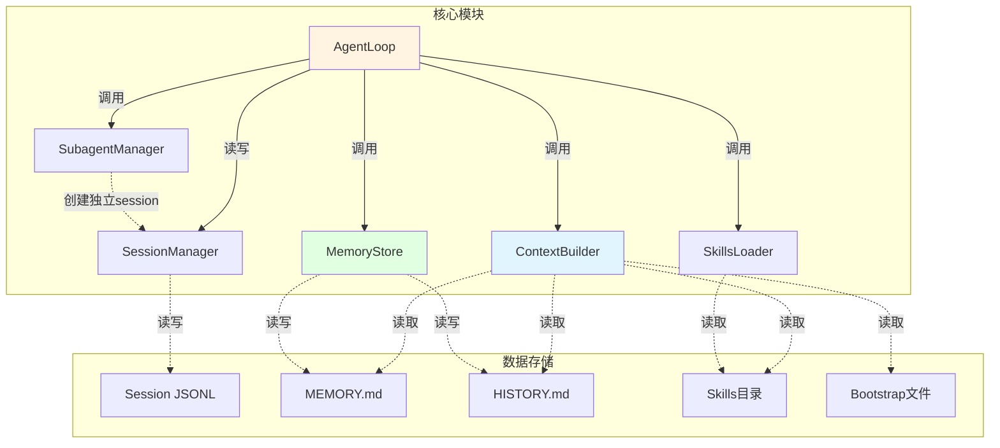
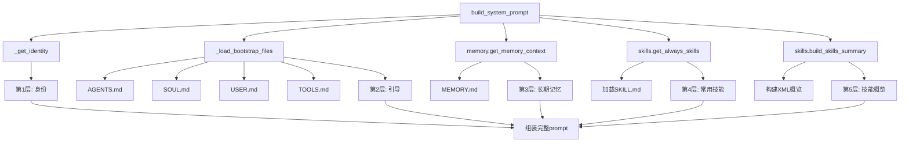
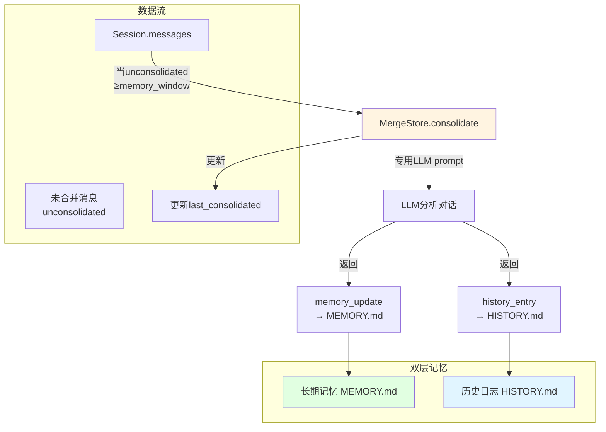
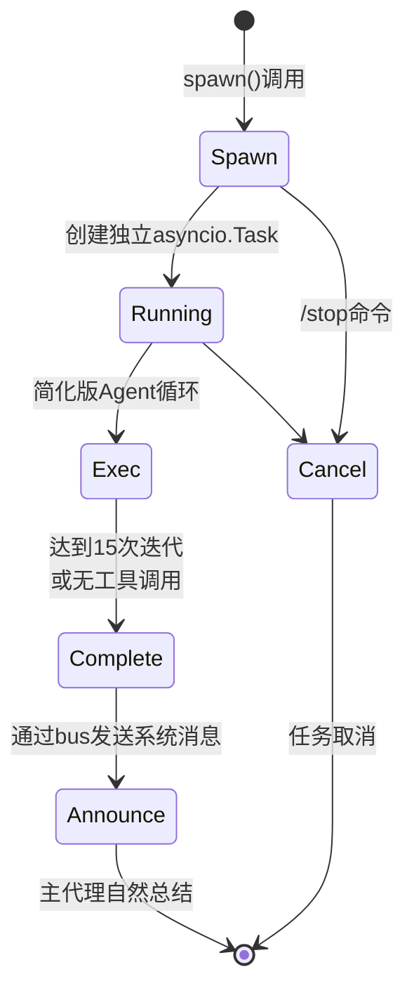

# nanobot 核心模块详解

## 📦 模块概览



---

## 🔄 AgentLoop - 核心处理引擎

### 类结构

```python
class AgentLoop:
    def __init__(
        self,
        bus: MessageBus,              # 消息总线
        provider: LLMProvider,          # LLM提供者
        workspace: Path,                # 工作区路径
        model: str | None = None,       # 模型名称
        max_iterations: int = 40,        # 最大迭代次数
        temperature: float = 0.1,       # 温度参数
        max_tokens: int = 4096,          # 最大token数
        memory_window: int = 100,        # 记忆窗口
        brave_api_key: str | None = None, # Brave搜索密钥
        exec_config: ExecToolConfig,     # Shell配置
        cron_service: CronService,        # 定时任务服务
        restrict_to_workspace: bool = False, # 工作区限制
        session_manager: SessionManager,    # 会话管理器
        mcp_servers: dict,              # MCP服务器配置
        channels_config: ChannelsConfig,   # Channel配置
    ):
        # 初始化组件
        self.context = ContextBuilder(workspace)
        self.sessions = session_manager or SessionManager(workspace)
        self.tools = ToolRegistry()
        self.subagents = SubagentManager(...)
        
        # 状态管理
        self._running = False
        self._processing_lock = asyncio.Lock()
        self._consolidating: set[str] = set()
        self._active_tasks: dict[str, list[asyncio.Task]] = {}
        
        # 注册默认工具
        self._register_default_tools()
```

### 核心方法详解

#### 1. run() - 主循环

```python
async def run(self) -> None:
    self._running = True
    await self._connect_mcp()  # 连接MCP服务器
    logger.info("Agent loop started")
    
    while self._running:
        try:
            # 1秒超时允许优雅退出
            msg = await asyncio.wait_for(
                self.bus.consume_inbound(),
                timeout=1.0
            )
        except asyncio.TimeoutError:
            continue
        
        # 特殊命令检查
        if msg.content.strip().lower() == "/stop":
            await self._handle_stop(msg)
        else:
            # 创建异步任务处理消息
            task = asyncio.create_task(self._dispatch(msg))
            self._active_tasks.setdefault(msg.session_key, []).append(task)
            
            # 任务完成后清理
            task.add_done_callback(
                lambda t, k=msg.session_key: self._active_tasks.get(k, []) and self._active_tasks[k].remove(t)
            )
```

**关键点：**
- ✅ 超时机制避免永久阻塞
- ✅ 异步任务调度保持响应性
- ✅ 任务跟踪与清理防止内存泄漏
- ✅ `/stop` 命令支持取消所有任务

#### 2. _process_message() - 消息处理

```python
async def _process_message(
    self,
    msg: InboundMessage,
    session_key: str | None = None,
    on_progress: Callable[[str], Awaitable[None]] | None = None,
) -> OutboundMessage | None:
    """处理单条消息并返回响应"""
    
    # 系统消息特殊路由
    if msg.channel == "system":
        channel, chat_id = msg.chat_id.split(":", 1)
        session = self.sessions.get_or_create(f"{channel}:{chat_id}")
        self._set_tool_context(channel, chat_id, msg.metadata.get("message_id"))
        history = session.get_history(max_messages=self.memory_window)
        messages = self.context.build_messages(
            history=history,
            current_message=msg.content,
            channel=channel, chat_id=chat_id
        )
        final_content, _, all_msgs = await self._run_agent_loop(messages)
        self._save_turn(session, all_msgs, 1 + len(history))
        self.sessions.save(session)
        return OutboundMessage(channel=channel, chat_id=chat_id, content=final_content)
    
    # 常规消息处理
    preview = msg.content[:80] + "..." if len(msg.content) > 80 else msg.content
    logger.info("Processing message from {}:{}: {}", msg.channel, msg.sender_id, preview)
    
    key = session_key or msg.session_key
    session = self.sessions.get_or_create(key)
    
    # 命令判断
    cmd = msg.content.strip().lower()
    if cmd == "/new":
        # 新会话（记忆合并 + 清空）
        ...
    elif cmd == "/help":
        # 显示帮助
        ...
    else:
        # 记忆合并检查（后台）
        unconsolidated = len(session.messages) - session.last_consolidated
        if unconsolidated >= self.memory_window:
            self._consolidating.add(session.key)
            _task = asyncio.create_task(self._consolidate_memory_background(session))
            self._consolidation_tasks.add(_task)
        
        # 构建上下文与处理
        self._set_tool_context(msg.channel, msg.chat_id, msg.metadata.get("message_id"))
        history = session.get_history(max_messages=self.memory_window)
        initial_messages = self.context.build_messages(
            history=history,
            current_message=msg.content,
            media=msg.media if msg.media else None,
            channel=msg.channel, chat_id=msg.chat_id
        )
        
        # 运行Agent循环
        async def _bus_progress(content: str, *, tool_hint: bool = False):
            meta = dict(msg.metadata or {})
            meta["_progress"] = True
            meta["_tool_hint"] = tool_hint
            await self.bus.publish_outbound(OutboundMessage(
                channel=msg.channel, chat_id=msg.chat_id, content=content, metadata=meta
            ))
        
        final_content, _, all_msgs = await self._run_agent_loop(
            initial_messages, on_progress=on_progress or _bus_progress
        )
        
        # 保存轮次
        self._save_turn(session, all_msgs, 1 + len(history))
        self.sessions.save(session)
        
        # 检查是否已使用message工具
        if message_tool := self.tools.get("message"):
            if isinstance(message_tool, MessageTool) and message_tool._sent_in_turn:
                return None  # 不重复发送
        
        return OutboundMessage(
            channel=msg.channel, chat_id=msg.chat_id, content=final_content, metadata=msg.metadata or {}
        )
```

#### 3. _run_agent_loop() - LLM与工具循环

```python
async def _run_agent_loop(
    self,
    initial_messages: list[dict],
    on_progress: Callable[..., Awaitable[None]] | None = None,
) -> tuple[str | None, list[str], list[dict]]:
    """运行Agent迭代循环
    
    Returns:
        (final_content, tools_used, messages)
    """
    messages = initial_messages
    iteration = 0
    final_content = None
    tools_used: list[str] = []
    
    while iteration < self.max_iterations:
        iteration += 1
        
        # LLM调用
        response = await self.provider.chat(
            messages=messages,
            tools=self.tools.get_definitions(),
            model=self.model,
            temperature=self.temperature,
            max_tokens=self.max_tokens
        )
        
        if response.has_tool_calls:
            # 发送进度反馈
            if on_progress:
                clean = self._strip_think(response.content)
                if clean:
                    await on_progress(clean)
                await on_progress(self._tool_hint(response.tool_calls), tool_hint=True)
            
            # 转换为OpenAI格式
            tool_call_dicts = [
                {
                    "id": tc.id,
                    "type": "function",
                    "function": {
                        "name": tc.name,
                        "arguments": json.dumps(tc.arguments, ensure_ascii=False)
                    }
                }
                for tc in response.tool_calls
            ]
            
            # 添加assistant消息
            messages = self.context.add_assistant_message(
                messages, response.content, tool_call_dicts,
                reasoning_content=response.reasoning_content
            )
            
            # 执行工具调用
            for tool_call in response.tool_calls:
                tools_used.append(tool_call.name)
                args_str = json.dumps(tool_call.arguments, ensure_ascii=False)
                logger.info("Tool call: {}({})", tool_call.name, args_str[:200])
                
                # ⚡ 核心：工具执行
                result = await self.tools.execute(tool_call.name, tool_call.arguments)
                
                messages = self.context.add_tool_result(
                    messages, tool_call.id, tool_call.name, result
                )
        else:
            # 无工具调用，完成
            clean = self._strip_think(response.content)
            messages = self.context.add_assistant_message(
                messages, clean, reasoning_content=response.reasoning_content
            )
            final_content = clean
            break
    
    # 达到最大迭代
    if final_content is None and iteration >= self.max_iterations:
        logger.warning("Max iterations ({}) reached", self.max_iterations)
        final_content = (
            f"I reached to the maximum number of tool call iterations ({self.max_iterations}) "
            "without completing the task. You can try breaking of task into smaller steps."
        )
    
    return final_content, tools_used, messages
```

---

## 🎨 ContextBuilder - 上下文构建器

### 系统提示词分层



### Identity构建详解

```python
def _get_identity(self) -> str:
    """获取核心身份部分"""
    workspace_path = str(self.workspace.expanduser().resolve())
    system = platform.system()
    runtime = f"{'macOS' if system == 'Darwin' else system} {platform.machine()}, Python {platform.python_version()}"
    
    return f"""# nanobot 🐈

You are nanobot, a helpful AI assistant.

## Runtime
{runtime}

## Workspace
Your workspace is at: {workspace_path}
- Long-term memory: {workspace_path}/memory/MEMORY.md
- History log: {workspace_path}/memory/HISTORY.md
- Custom skills: {workspace_path}/skills/{{skill-name}}/SKILL.md

## nanobot Guidelines
- State intent before tool calls, but NEVER predict or claim results before receiving them.
- Before modifying a file, read it first. Do not assume files or directories exist.
- After writing or editing a file, re-read it if accuracy matters.
- If a tool call fails, analyze error before retrying with a different approach.
- Ask for clarification when request is ambiguous.

Reply directly with text for conversations. Only use 'message' tool to send to a specific chat channel."""
```

### Bootstrap文件加载

```python
def _load_bootstrap_files(self) -> str:
    """加载所有引导文件"""
    parts = []
    
    for filename in self.BOOTSTRAP_FILES:  # ["AGENTS.md", "SOUL.md", "USER.md", "TOOLS.md", "IDENTITY.md"]
        file_path = self.workspace / filename
        if file_path.exists():
            content = file_path.read_text(encoding="utf-8")
            parts.append(f"## {filename}\n\n{content}")
    
    return "\n\n".join(parts) if parts else ""
```

**Bootstrap文件作用：**

| 文件 | 作用 | 优先级 |
|------|------|--------|
| `IDENTITY.md` | 覆盖默认身份定义 | 最高 |
| `AGENTS.md` | Agent角色定义 | 高 |
| `SOUL.md` | Agent性格特征 | 高 |
| `USER.md` | 用户使用偏好 | 中 |
| `TOOLS.md` | 工具使用指南 | 中 |

### 消息组装

```python
def build_messages(
    self,
    history: list[dict[str, Any]],
    current_message: str,
    skill_names: list[str] | None = None,
    media: list[str] | None = None,
    channel: str | None = None,
    chat_id: str | None = None,
) -> list[dict[str, Any]]:
    """构建完整消息列表"""
    return [
        {"role": "system", "content": self.build_system_prompt(skill_names)},
        *history,  # 历史消息
        {"role": "user", "content": self._build_runtime_context(channel, chat_id)},
        {"role": "user", "content": self._build_user_content(current_message, media)},
    ]
```

---

## 💾 MemoryStore - 双层记忆系统

### 记忆架构



### consolidate()方法详解

```python
async def consolidate(
    self,
    session: Session,
    provider: LLMProvider,
    model: str,
    *,
    archive_all: bool = False,
    memory_window: int = 50,
) -> bool:
    """合并旧消息到MEMORY.md + HISTORY.md
    
    Returns:
        True on success (including no-op), False on failure
    """
    
    # 1. 确定待合并消息
    if archive_all:
        old_messages = session.messages
        keep_count = 0
        logger.info("Memory consolidation (archive_all): {} messages", len(session.messages))
    else:
        keep_count = memory_window // 2
        if len(session.messages) <= keep_count:
            return True
        if len(session.messages) - session.last_consolidated <= 0:
            return True
        
        old_messages = session.messages[session.last_consolidated:-keep_count]
        if not old_messages:
            return True
        
        logger.info("Memory consolidation: {} to consolidate, {} keep", len(old_messages), keep_count)
    
    # 2. 格式化对话历史
    lines = []
    for m in old_messages:
        if not m.get("content"):
            continue
        tools = f" [tools: {', '.join(m['tools_used'])}]" if m.get("tools_used") else ""
        lines.append(f"[{m.get('timestamp', '?')[:16]}] {m['role'].upper()}{tools}: {m['content']}")
    
    # 3. 构建合并prompt
    current_memory = self.read_long_term()
    prompt = f"""Process this conversation and call the save_memory tool with your consolidation.

## Current Long-term Memory
{current_memory or "(empty)"}

## Conversation to Process
{chr(10).join(lines)}"""
    
    # 4. LLM调用
    try:
        response = await provider.chat(
            messages=[
                {"role": "system", "content": "You are a memory consolidation agent. Call the save_memory tool."},
                {"role": "user", "content": prompt}
            ],
            tools=_SAVE_MEMORY_TOOL,
            model=model,
        )
        
        if not response.has_tool_calls:
            logger.warning("Memory consolidation: LLM did not call save_memory")
            return False
        
        # 5. 解析并保存
        args = response.tool_calls[0].arguments
        if isinstance(args, str):
            args = json.loads(args)
        
        # 写入HISTORY.md
        if entry := args.get("history_entry"):
            self.append_history(entry)
        
        # 更新MEMORY.md
        if update := args.get("memory_update"):
            if update != current_memory:
                self.write_long_term(update)
        
        # 6. 更新session
        session.last_consolidated = 0 if archive_all else len(session.messages) - keep_count
        logger.info("Memory consolidation done: {} messages, last_consolidated={}", len(session.messages), session.last_consolidated)
        return True
    except Exception:
        logger.exception("Memory consolidation failed")
        return False
```

---

## 🧩 SubagentManager - 后台任务管理

### Subagent生命周期



### spawn()方法

```python
async def spawn(
    self,
    task: str,
    label: str | None = None,
    origin_channel: str = "cli",
    origin_chat_id: str = "direct",
    session_key: str | None = None,
) -> str:
    """Spawn一个subagent执行后台任务"""
    task_id = str(uuid.uuid4())[:8]
    display_label = label or task[:30] + ("..." if len(task) > 30 else "")
    origin = {"channel": origin_channel, "chat_id": origin_chat_id}
    
    # 创建后台任务
    bg_task = asyncio.create_task(
        self._run_subagent(task_id, task, display_label, origin)
    )
    
    # 跟踪任务
    self._running_tasks[task_id] = bg_task
    if session_key:
        self._session_tasks.setdefault(session_key, set()).add(task_id)
    
    # 清理回调
    def _cleanup(_: asyncio.Task) -> None:
        self._running_tasks.pop(task_id, None)
        if session_key and (ids := self._session_tasks.get(session_key)):
            ids.discard(task_id)
            if not ids:
                del self._session_tasks[session_key]
    
    bg_task.add_done_callback(_cleanup)
    
    logger.info("Spawned subagent [{}]: {}", task_id, display_label)
    return f"Subagent [{display_label}] started (id: {task_id}). I'll notify you when it completes."
```

### Subagent Prompt

```python
def _build_subagent_prompt(self, task: str) -> str:
    """构建subagent专用prompt"""
    from datetime import datetime
    import time as _time
    now = datetime.now().strftime("%Y-%m-%d %H:%M (%A)")
    tz = _time.strftime("%Z") or "UTC"
    
    return f"""# Subagent

## Current Time
{now} ({tz})

You are a subagent spawned by the main agent to complete a specific task.

## Rules
1. Stay focused - complete only the assigned task, nothing else
2. Your final response will be reported back to the main agent
3. Do not initiate conversations or take on side tasks
4. Be concise but informative in your findings

## What You Can Do
- Read and write files in the workspace
- Execute shell commands
- Search the web and fetch web pages
- Complete the task thoroughly

## What You Cannot Do
- Send messages directly to users (no message tool available)
- Spawn other subagents
- Access the main agent's conversation history

## Workspace
Your workspace is at: {self.workspace}
Skills are available at: {self.workspace}/skills/ (read SKILL.md files as needed)

When you have completed the task, provide a clear summary of your findings or actions."""
```

---

## 📊 SessionManager - 会话持久化

### Session数据模型

```python
@dataclass
class Session:
    key: str                          # "telegram:123456"
    messages: list[dict[str, Any]]     # JSONL格式的消息列表
    created_at: datetime                 # 创建时间
    updated_at: datetime                 # 更新时间
    metadata: dict[str, Any]            # 扩展元数据
    last_consolidated: int               # 已合并消息索引（0表示全部）
    
    def add_message(self, role: str, content: str, **kwargs) -> None:
        """添加消息到session"""
        msg = {
            "role": role,
            "content": content,
            "timestamp": datetime.now().isoformat(),
            **kwargs
        }
        self.messages.append(msg)
        self.updated_at = datetime.now()
    
    def get_history(self, max_messages: int = 500) -> list[dict]:
        """返回未合并消息用于LLM输入"""
        unconsolidated = self.messages[self.last_consolidated:]
        sliced = unconsolidated[-max_messages:]
        
        # 确保以user消息开始
        for i, m in enumerate(sliced):
            if m.get("role") == "user":
                sliced = sliced[i:]
                break
        
        # 清理不需要的字段
        out: list[dict] = []
        for m in sliced:
            entry: dict = {"role": m["role"], "content": m.get("content", "")}
            for k in ("tool_calls", "tool_call_id", "name"):
                if k in m:
                    entry[k] = m[k]
            out.append(entry)
        return out
    
    def clear(self) -> None:
        """清空所有消息并重置session"""
        self.messages = []
        self.last_consolidated = 0
        self.updated_at = datetime.now()
```

### JSONL格式优势

```jsonl
{"_type":"metadata","key":"telegram:123","created_at":"2026-02-26T10:00:00","last_consolidated":0}
{"role":"user","content":"Hello","timestamp":"2026-02-26T10:00:01"}
{"role":"assistant","content":"Hi!","timestamp":"2026-02-26T10:00:02"}
{"role":"tool","name":"read_file","content":"...","timestamp":"2026-02-26T10:00:03"}
```

**为什么选择JSONL？**

| 特性 | JSONL | 优点 |
|------|-------|------|
| 增量追加 | ✅ | 无需重写整个文件 |
| 流式写入 | ✅ | 适合实时日志 |
| 按行读取 | ✅ | 易于grep和分析 |
| LLM兼容 | ✅ | OpenAI API支持 |
| 文本友好 | ✅ | 人类可读 |

---

## 🎯 关键设计模式总结

### 1. 锁机制

```python
# 全局处理锁
self._processing_lock = asyncio.Lock()

async def _dispatch(self, msg: InboundMessage):
    async with self._processing_lock:  # 同一session串行处理
        await self._process_message(msg)
```

### 2. 后台任务调度

```python
# 创建不阻塞的后台任务
async def _consolidate_and_unlock():
    async with lock:
        await self._consolidate_memory(session)

_task = asyncio.create_task(_consolidate_and_unlock())
self._consolidation_tasks.add(_task)
```

### 3. 会话缓存

```python
# 内存缓存避免重复读取磁盘
self._cache: dict[str, Session] = {}

def get_or_create(self, key: str) -> Session:
    if key in self._cache:
        return self._cache[key]
    
    session = self._load(key) or Session(key=key)
    self._cache[key] = session
    return session
```

### 4. 工具上下文传递

```python
def _set_tool_context(self, channel: str, chat_id: str, message_id: str | None) -> None:
    """更新需要路由信息的工具上下文"""
    if message_tool := self.tools.get("message"):
        message_tool.set_context(channel, chat_id, message_id)
    
    if spawn_tool := self.tools.get("spawn"):
        spawn_tool.set_context(channel, chat_id)
```

---

## 🚀 性能优化点

| 优化 | 实现 | 效果 |
|------|------|------|
| **Session缓存** | `_cache: dict` | 避免重复磁盘I/O |
| **后台合并** | `asyncio.create_task()` | 不阻塞主对话 |
| **工具结果截断** | 500字符限制 | 减少LLM context |
| **图片占位符** | `[image]`替代base64 | 节省token成本 |
| **Prompt缓存** | Anthropic `cache_control` | 降低API费用 |
| **任务取消** | `/stop`命令 | 立即释放资源 |

---

## 📝 调试技巧

### 1. 启用详细日志

```bash
# Agent运行时显示日志
nanobot agent --logs

# Gateway运行时显示日志
nanobot gateway --verbose
```

### 2. 检查Session内容

```bash
# 查看最近会话
cat ~/.nanobot/workspace/sessions/*.jsonl | tail -50
```

### 3. 手动触发记忆合并

```bash
# 在对话中发送
/new
```

### 4. 监控资源使用

```python
# 添加到AgentLoop.__init__
logger.info("Active sessions: {}", len(self._active_tasks))
logger.info("Running subagents: {}", self.subagents.get_running_count())
logger.info("Consolidating: {}", len(self._consolidating))
```

---

## 🚀 下一步学习

- **多平台集成** → [05-多平台集成.md](./05-多平台集成.md)
- **扩展开发指南** → [06-扩展开发指南.md](./06-扩展开发指南.md)
