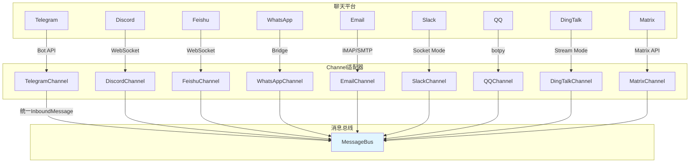

# nanobot 多平台集成详解

## 🌐 支持平台概览



---

## 📨 Channel统一接口

### BaseChannel抽象

```python
class BaseChannel(ABC):
    """所有Channel的抽象基类"""
    
    @abstractmethod
    async def start(self) -> None:
        """启动channel，开始接收消息"""
        pass
    
    @abstractmethod
    async def stop(self) -> None:
        """停止channel，清理资源"""
        pass
    
    @abstractmethod
    async def send(self, msg: OutboundMessage) -> None:
        """发送消息到用户"""
        pass
    
    @property
    @abstractmethod
    def is_running(self) -> bool:
        """检查channel是否运行中"""
        pass
```

### InboundMessage结构

```python
@dataclass
class InboundMessage:
    channel: str              # "telegram", "discord", "cli"
    sender_id: str           # 用户唯一标识
    chat_id: str             # 对话/群组ID
    content: str            # 消息文本内容
    media: list[str] = []    # 附件路径列表（下载到本地）
    metadata: dict = {}       # 扩展信息（message_id, reply_to等）
    
    @property
    def session_key(self) -> str:
        return f"{self.channel}:{self.chat_id}"
```

### OutboundMessage结构

```python
@dataclass
class OutboundMessage:
    channel: str              # 目标channel
    chat_id: str             # 目标chat_id
    content: str            # 响应内容
    media: list[str] = []    # 附件列表
    metadata: dict = {}       # 特殊标记（_progress, _tool_hint）
```

---

## 📱 各平台实现详解

### 1. Telegram Channel

#### 连接方式

```python
class TelegramChannel(BaseChannel):
    async def start(self) -> None:
        """启动Telegram bot"""
        self.bot = Bot(token=self.config.token)
        
        # 注册处理器
        self.bot.message_handler(self.on_message)
        self.bot.edited_message_handler(self.on_edited_message)
        
        # 启动轮询
        await self.start_polling()
```

#### 消息接收

```python
async def on_message(self, update: Update) -> None:
    # 1. 权限检查
    if self.config.allow_from:
        user_id = str(update.effective_user.id)
        if user_id not in self.config.allow_from:
            return
    
    # 2. 提取消息内容
    content = update.message.text or update.message.caption or ""
    
    # 3. 下载媒体
    media = []
    if update.message.photo:
        photo = update.message.photo[-1]  # 最大分辨率
        file = await self.bot.get_file(photo.file_id)
        media.append(await self._download_file(file))
    
    if update.message.document:
        file = await self.bot.get_file(update.message.document.file_id)
        media.append(await self._download_file(file))
    
    # 4. 创建InboundMessage
    msg = InboundMessage(
        channel="telegram",
        sender_id=str(update.effective_user.id),
        chat_id=str(update.effective_chat.id),
        content=content,
        media=media,
        metadata={
            "message_id": update.message.message_id,
            "reply_to_message_id": update.message.reply_to_message.message_id if update.message.reply_to_message else None
        }
    )
    
    # 5. 发布到总线
    await self.bus.publish_inbound(msg)
```

#### 消息发送

```python
async def send(self, msg: OutboundMessage) -> None:
    """发送消息到Telegram"""
    try:
        # 文本消息
        if msg.content:
            await self.bot.send_message(
                chat_id=msg.chat_id,
                text=msg.content,
                parse_mode="Markdown",  # 支持Markdown格式
                disable_web_page_preview=True  # 禁用链接预览
            )
        
        # 媒体附件
        for media_path in msg.media:
            if not Path(media_path).exists():
                continue
            
            media_obj = InputMediaPhoto(
                media=open(media_path, "rb"),
                caption=msg.content if msg.content else None
            )
            
            await self.bot.send_media_group(
                chat_id=msg.chat_id,
                media=[media_obj]
            )
    except Exception as e:
        logger.error("Failed to send to Telegram: {}", e)
```

#### 配置示例

```json
{
  "channels": {
    "telegram": {
      "enabled": true,
      "token": "123456:ABC-DEF...",
      "allowFrom": ["123456789"],  // 可选：白名单
      "replyToMessage": false  // 可选：回复原消息
    }
  }
}
```

---

### 2. Discord Channel

#### 连接方式

```python
class DiscordChannel(BaseChannel):
    async def start(self) -> None:
        """启动Discord bot"""
        intents = discord.Intents(
            guilds=True,
            messages=True,
            message_content=True,
            dm_messages=True
        )
        
        self.client = discord.Client(intents=intents)
        
        # 注册事件
        self.client.event(self.on_ready)
        self.client.event(self.on_message)
        
        # 启动WebSocket连接
        await self.client.start(self.config.gateway_url)
```

#### 消息接收

```python
async def on_message(self, message: discord.Message) -> None:
    # 1. 忽略自己的消息
    if message.author == self.client.user:
        return
    
    # 2. 权限检查
    if self.config.allow_from and str(message.author.id) not in self.config.allow_from:
        return
    
    # 3. 提取内容
    content = message.content or ""
    
    # 4. 下载附件
    media = []
    for attachment in message.attachments:
        media_path = await self._download_attachment(attachment)
        if media_path:
            media.append(media_path)
    
    # 5. 创建InboundMessage
    msg = InboundMessage(
        channel="discord",
        sender_id=str(message.author.id),
        chat_id=str(message.channel.id),
        content=content,
        media=media,
        metadata={
            "message_id": message.id,
            "guild_id": str(message.guild.id) if message.guild else None,
            "is_dm": message.channel.type == discord.ChannelType.private
        }
    )
    
    await self.bus.publish_inbound(msg)
```

#### 消息发送

```python
async def send(self, msg: OutboundMessage) -> None:
    """发送消息到Discord"""
    try:
        # 获取channel对象
        channel = self.client.get_channel(int(msg.chat_id))
        if not channel:
            logger.warning("Channel not found: {}", msg.chat_id)
            return
        
        # 文本消息
        if msg.content:
            await channel.send(
                content=msg.content,
                allowed_mentions=discord.AllowedMentions.users  # 安全的提及
            )
        
        # 附件
        for media_path in msg.media:
            if not Path(media_path).exists():
                continue
            
            file = discord.File(media_path)
            await channel.send(file=file)
    except Exception as e:
        logger.error("Failed to send to Discord: {}", e)
```

---

### 3. Feishu Channel

#### 长连接模式

```python
class FeishuChannel(BaseChannel):
    async def start(self) -> None:
        """启动Feishu长连接"""
        from lark_oapi.api.ws.event import EventHandler
        from lark_oapi.api.ws import create
        
        # 创建事件处理器
        handler = EventHandler.builder()\
            .register(P2MessageReceiveEvent.self_handler(self.on_message))\
            .build()
        
        # 建立WebSocket长连接
        self.client = create(
            app_id=self.config.app_id,
            app_secret=self.config.app_secret,
            event_handler=handler
        )
        
        await self.client.start()
```

#### 消息接收

```python
async def on_message(self, event: P2MessageReceiveEvent) -> None:
    """处理Feishu消息"""
    # 1. 权限检查
    if self.config.allow_from:
        if event.sender.sender_id.open_id not in self.config.allow_from:
            return
    
    # 2. 提取文本
    content = event.message.content or ""
    
    # 3. 下载媒体
    media = []
    for msg_content in event.message.content or []:
        if msg_content.message_type == "image":
            media.append(await self._download_media(msg_content.image_key))
    
    # 4. 创建InboundMessage
    msg = InboundMessage(
        channel="feishu",
        sender_id=event.sender.sender_id.open_id,
        chat_id=event.message.chat_id,
        content=content,
        media=media,
        metadata={
            "message_id": event.message.message_id,
            "parent_id": event.message.parent_id
        }
    )
    
    await self.bus.publish_inbound(msg)
```

#### 消息发送

```python
async def send(self, msg: OutboundMessage) -> None:
    """发送消息到Feishu"""
    try:
        client = self.client.client
        
        # 文本消息
        if msg.content:
            client.message.create(params=CreateMessageRequest.builder()
                .receive_id_type("chat_id")
                .receive_id(msg.chat_id)
                .content(msg.content)
                .msg_type("text")
                .build()
            )
        
        # 媒体附件
        for media_path in msg.media:
            if not Path(media_path).exists():
                continue
            
            client.media.upload_all(media_path, msg.chat_id)
    except Exception as e:
        logger.error("Failed to send to Feishu: {}", e)
```

---

### 4. WhatsApp Channel

#### Bridge架构

```
nanobot (Python)
    ↓ WebSocket
WhatsApp Bridge (Node.js)
    ↓ Business API
WhatsApp服务器
```

#### 连接方式

```python
class WhatsAppChannel(BaseChannel):
    async def start(self) -> None:
        """启动WhatsApp bridge连接"""
        from socketio import AsyncClient
        
        # 连接到bridge
        self.client = AsyncClient(
            self.config.bridge_url,
            socket_path=self.config.socket_path,
            engineio_logger=False
        )
        
        # 注册事件
        self.client.on("message", self.on_message)
        self.client.on("ready", self.on_ready)
        
        await self.client.connect()
```

#### 消息接收

```python
async def on_message(self, data: dict) -> None:
    """处理WhatsApp消息（通过bridge）"""
    # 1. 权限检查
    if self.config.allow_from:
        phone = data.get("from")
        if phone not in self.config.allow_from:
            return
    
    # 2. 提取内容
    content = data.get("text", "")
    
    # 3. 下载媒体（bridge已下载到本地）
    media = data.get("media", [])
    
    # 4. 创建InboundMessage
    msg = InboundMessage(
        channel="whatsapp",
        sender_id=data.get("from"),
        chat_id=data.get("chatId"),
        content=content,
        media=media,
        metadata={
            "message_id": data.get("id"),
            "is_group": data.get("isGroup", False)
        }
    )
    
    await self.bus.publish_inbound(msg)
```

---

### 5. Email Channel

#### IMAP/SMTP架构

```
nanobot
    ↓ IMAP (接收)
邮件服务器
    ↓ SMTP (发送)
用户邮箱
```

#### 连接方式

```python
class EmailChannel(BaseChannel):
    async def start(self) -> None:
        """启动邮件轮询"""
        self._running = True
        
        # 启动接收轮询
        recv_task = asyncio.create_task(self._receive_loop())
        
        # 等待停止信号
        while self._running:
            await asyncio.sleep(1)
        
        recv_task.cancel()
    
    async def _receive_loop(self) -> None:
        """接收邮件循环"""
        while self._running:
            try:
                # 连接IMAP
                self.imap = imaplib.IMAP4_SSL(self.config.imap_host)
                self.imap.login(self.config.imap_username, self.config.imap_password)
                self.imap.select(self.config.imap_mailbox)
                
                # 搜索未读邮件
                typ, data = self.imap.search(None, "UNSEEN")
                
                for num in data[0]:
                    # 获取邮件内容
                    typ, data = self.imap.fetch(num, "(RFC822)")
                    
                    # 解析邮件
                    email_message = email.message_from_bytes(data[0][1])
                    
                    # 创建InboundMessage
                    msg = self._process_email(email_message, num)
                    await self.bus.publish_inbound(msg)
                
                # 等待下次轮询
                await asyncio.sleep(self.config.poll_interval_seconds)
                
            except Exception as e:
                logger.error("IMAP error: {}", e)
                await asyncio.sleep(5)
```

#### 消息发送

```python
async def send(self, msg: OutboundMessage) -> None:
    """通过SMTP发送邮件"""
    try:
        # 创建邮件
        email_msg = MIMEMultipart()
        email_msg["From"] = self.config.from_address
        email_msg["To"] = msg.chat_id  # 发件人邮箱
        email_msg["Subject"] = msg.content[:100]  # 简化主题
        email_msg["Date"] = formatdate(localtime=True)
        
        # 正文
        email_msg.attach(MIMEText(msg.content, "plain", "utf-8"))
        
        # 附件
        for media_path in msg.media:
            if Path(media_path).exists():
                with open(media_path, "rb") as f:
                    part = MIMEApplication(f.read(), Name=Path(media_path).name)
                    email_msg.attach(part)
        
        # SMTP发送
        with smtplib.SMTP(self.config.smtp_host, self.config.smtp_port) as server:
            if self.config.smtp_use_tls:
                server.starttls()
            
            server.login(self.config.smtp_username, self.config.smtp_password)
            server.send_message(email_msg)
            server.quit()
    
    except Exception as e:
        logger.error("Failed to send email: {}", e)
```

---

### 6. Slack Channel

#### Socket Mode架构

```python
class SlackChannel(BaseChannel):
    async def start(self) -> None:
        """启动Slack Socket Mode"""
        from slack_sdk.socket_mode.aiohttp import AsyncSocketModeClient
        
        self.socket_client = AsyncSocketModeClient(
            app_token=self.config.app_token,
            level=logging.INFO
        )
        
        # 注册处理器
        self.socket_client.app_mention_handler(self.on_mention)
        self.socket_client.message_handler(self.on_message)
        
        # 连接WebSocket
        await self.socket_client.connect()
```

#### 消息接收

```python
async def on_message(self, event: AsyncMessage) -> None:
    """处理Slack消息"""
    # 1. 检查是否是自己
    if event.user == self.socket_client.user_id:
        return
    
    # 2. 权限检查
    if self.config.dm.enabled:
        if event.channel_type == "im":
            if self.config.dm.policy == "allowlist":
                if event.user not in self.config.dm.allow_from:
                    return
    
    # 3. 提取内容
    content = event.text or ""
    
    # 4. 下载文件
    media = []
    for file_id in event.files or []:
        file_info = await self.socket_client.web_client.get_file_info(file_id)
        media_path = await self._download_file(file_info)
        if media_path:
            media.append(media_path)
    
    # 5. 创建InboundMessage
    msg = InboundMessage(
        channel="slack",
        sender_id=event.user,
        chat_id=event.channel,
        content=content,
        media=media,
        metadata={
            "message_id": event.ts,
            "thread_ts": event.thread_ts,
            "is_dm": event.channel_type == "im"
        }
    )
    
    await self.bus.publish_inbound(msg)
```

---

## 🔄 ChannelManager - 统一管理

### 初始化

```python
class ChannelManager:
    def __init__(self, config: Config, bus: MessageBus):
        self.config = config
        self.bus = bus
        self.channels: dict[str, BaseChannel] = {}
        self._dispatch_task: asyncio.Task | None = None
        
        # 初始化所有enabled的channel
        self._init_channels()
    
    def _init_channels(self) -> None:
        """初始化channels"""
        # Telegram
        if self.config.channels.telegram.enabled:
            from nanobot.channels.telegram import TelegramChannel
            self.channels["telegram"] = TelegramChannel(
                self.config.channels.telegram, self.bus,
                groq_api_key=self.config.providers.groq.api_key
            )
        
        # Discord
        if self.config.channels.discord.enabled:
            from nanobot.channels.discord import DiscordChannel
            self.channels["discord"] = DiscordChannel(self.config.channels.discord, self.bus)
        
        # ... 其他平台类似
```

### 启动所有Channel

```python
async def start_all(self) -> None:
    """启动所有channels和outbound分发器"""
    if not self.channels:
        logger.warning("No channels enabled")
        return
    
    # 启动outbound分发器
    self._dispatch_task = asyncio.create_task(self._dispatch_outbound())
    
    # 启动所有channels
    tasks = []
    for name, channel in self.channels.items():
        logger.info("Starting {} channel...", name)
        tasks.append(asyncio.create_task(self._start_channel(name, channel)))
    
    # 等待所有channel运行（应该永远运行）
    await asyncio.gather(*tasks, return_exceptions=True)

async def _start_channel(self, name: str, channel: BaseChannel) -> None:
    """启动单个channel并记录异常"""
    try:
        await channel.start()
    except Exception as e:
        logger.error("Failed to start channel {}: {}", name, e)
```

### Outbound分发

```python
async def _dispatch_outbound(self) -> None:
    """分发outbound消息到对应channel"""
    logger.info("Outbound dispatcher started")
    
    while True:
        try:
            msg = await asyncio.wait_for(
                self.bus.consume_outbound(),
                timeout=1.0
            )
            
            # ⚡ 进度消息过滤
            if msg.metadata.get("_progress"):
                if msg.metadata.get("_tool_hint") and not self.config.send_tool_hints:
                    continue  # 不发送工具提示
                if not msg.metadata.get("_tool_hint") and not self.config.send_progress:
                    continue  # 不发送进度更新
            
            # 路由到对应channel
            channel = self.channels.get(msg.channel)
            if channel:
                try:
                    await channel.send(msg)
                except Exception as e:
                    logger.error("Error sending to {}: {}", msg.channel, e)
            else:
                logger.warning("Unknown channel: {}", msg.channel)
        except asyncio.TimeoutError:
            continue
        except asyncio.CancelledError:
            break
```

---

## 🔐 进阶配置

### 全局Channel配置

```json
{
  "channels": {
    "sendProgress": true,        // 发送Agent的文本进度
    "sendToolHints": false,      // 发送工具调用提示
    "telegram": { ... },
    "discord": { ... },
    "feishu": { ... }
  }
}
```

### 权限白名单

| 平台 | 配置键 | 格式 |
|------|---------|------|
| Telegram | `allowFrom` | 用户ID或用户名 |
| Discord | `allowFrom` | 用户ID |
| Feishu | `allowFrom` | open_id |
| Slack | `allowFrom` | 用户ID |
| Email | `allowFrom` | 邮箱地址 |

### 群组策略

| 平台 | 配置键 | 值说明 |
|------|---------|----------|
| Slack | `groupPolicy` | `"mention"`（仅@触发）、`"open"`（所有消息）、`"allowlist"` |
| Slack | `groupAllowFrom` | 群组ID白名单 |
| Matrix | `groupPolicy` | `"open"`、`"mention"`、`"allowlist"` |

---

## 🎯 性能与可靠性

### 连接稳定性

```python
# 自动重连机制
async def start(self) -> None:
    while self._running:
        try:
            await self._connect()
        except Exception as e:
            logger.error("Connection error: {}", e)
            # 指数退避重连
            await asyncio.sleep(min(2 ** self._retry_count, 60))
            self._retry_count += 1
```

### 消息去重

```python
class BaseChannel:
    def __init__(self, ...):
        self._seen_messages: set[str] = set()
    
    async def _should_process(self, message: str) -> bool:
        """检查消息是否已处理"""
        message_hash = hashlib.md5(message.encode()).hexdigest()
        if message_hash in self._seen_messages:
            return False
        
        self._seen_messages.add(message_hash)
        return True
```

### 错误恢复

```python
async def _dispatch_outbound(self) -> None:
    while True:
        try:
            channel = self.channels.get(msg.channel)
            if channel:
                await channel.send(msg)
        except Exception as e:
            logger.error("Send error: {}", e)
            # 失败重试机制
            if self._retry_count < 3:
                await asyncio.sleep(1)
                await channel.send(msg)
                self._retry_count += 1
```

---

## 📊 平台对比表

| 特性 | Telegram | Discord | Feishu | WhatsApp | Email | Slack |
|------|----------|----------|----------|----------|-------|-------|
| **消息格式** | Markdown | Markdown | Markdown | 纯文本 | 纯文本 | Markdown |
| **图片支持** | ✅ | ✅ | ✅ | ✅ | ✅ | ✅ |
| **文件支持** | ✅ | ✅ | ✅ | ✅ | ✅ | ✅ |
| **群组支持** | ✅ | ✅ | ✅ | ✅ | ✅ | ✅ |
| **线程回复** | ✅ | ✅ | ✅ | ✅ | ❌ | ✅ |
| **提及支持** | ✅ | ✅ | ✅ | ❌ | ❌ | ✅ |
| **回复原消息** | ✅ | ✅ | ✅ | ❌ | ✅ | ✅ |
| **实时性** | 轮询 | WebSocket | WebSocket | Bridge | 轮询 | WebSocket | WebSocket |
| **公网需求** | ❌ | ❌ | ❌ | ❌ | ❌ | ❌ |
| **延迟** | 低~秒 | 低~秒 | 低~秒 | 中~秒 | 高~分钟 | 低~秒 |

---

## 🚀 下一步学习

- **扩展开发指南** → [06-扩展开发指南.md](./06-扩展开发指南.md)
