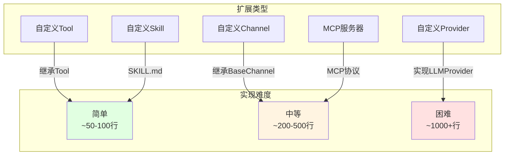

# nanobot 扩展开发指南

## 🎯 扩展点总览



---

## 🔧 扩展1：自定义Tool

### 步骤1：定义Tool类

```python
from pathlib import Path
from nanobot.agent.tools.base import Tool

class CustomTool(Tool):
    """你的自定义工具"""
    
    def __init__(self, config_param: str):
        self.config_param = config_param
    
    @property
    def name(self) -> str:
        return "custom_tool"
    
    @property
    def description(self) -> str:
        return "Execute custom operation with given parameters."
    
    @property
    def parameters(self) -> dict:
        return {
            "type": "object",
            "properties": {
                "input": {
                    "type": "string",
                    "description": "The input parameter to process"
                },
                "option": {
                    "type": "string",
                    "enum": ["fast", "accurate"],
                    "description": "Processing mode"
                }
            },
            "required": ["input"]
        }
    
    async def execute(self, input: str, option: str = "fast", **kwargs) -> str:
        try:
            # 你的工具逻辑
            result = self._do_work(input, option)
            return f"Success: {result}"
        except Exception as e:
            return f"Error: {str(e)}"
    
    def _do_work(self, input: str, option: str) -> str:
        # 实现具体逻辑
        if option == "fast":
            return f"Quick result for {input}"
        else:
            return f"Accurate result for {input}"
```

### 步骤2：注册到AgentLoop

**方法A：修改AgentLoop代码**

编辑 `nanobot/agent/loop.py`：

```python
def _register_default_tools(self) -> None:
    # ... 现有工具注册 ...
    
    # 注册你的工具
    from .custom_tools import CustomTool
    self.tools.register(CustomTool(config_param="value"))
```

**方法B：通过配置动态加载（推荐）**

编辑 `~/.nanobot/workspace/custom_tools/custom_tool.py`：

```python
# 在AgentLoop初始化时扫描workspace/skills/
# 对于不是技能的纯Python工具，需要扩展机制
```

### 步骤3：测试工具

```bash
# 启动nanobot
nanobot agent

# 测试工具调用
你：请使用custom_tool工具处理输入"hello"，使用fast模式
```

---

## 🤖 扩展2：自定义Provider

### 步骤1：实现Provider接口

```python
from nanobot.providers.base import LLMProvider, LLMResponse, ToolCallRequest

class CustomProvider(LLMProvider):
    """自定义LLM Provider"""
    
    def __init__(
        self,
        api_key: str | None = None,
        api_base: str | None = None,
        model: str = "custom-model"
    ):
        super().__init__(api_key, api_base)
        self.model = model
    
    async def chat(
        self,
        messages: list[dict[str, Any]],
        tools: list[dict[str, Any]] | None = None,
        model: str | None = None,
        max_tokens: int = 4096,
        temperature: float = 0.7,
    ) -> LLMResponse:
        """实现聊天接口"""
        try:
            # 调用你的LLM API
            response = await self._call_llm_api(
                messages=messages,
                tools=tools,
                model=model or self.model,
                max_tokens=max_tokens,
                temperature=temperature
            )
            
            # 解析响应
            return self._parse_response(response)
        except Exception as e:
            # 错误处理
            return LLMResponse(
                content=f"Error calling LLM: {str(e)}",
                finish_reason="error"
            )
    
    async def _call_llm_api(self, messages, tools, model, max_tokens, temperature):
        """实际的LLM API调用"""
        # 实现你的API调用逻辑
        pass
    
    def _parse_response(self, response: Any) -> LLMResponse:
        """解析LLM响应为标准格式"""
        # 提取content
        content = response.get("choices", [{}])[0].get("message", {}).get("content")
        
        # 提取tool calls
        tool_calls = []
        if "tool_calls" in response.get("choices", [{}])[0].get("message", {}):
            for tc in response["choices"][0]["message"]["tool_calls"]:
                tool_calls.append(ToolCallRequest(
                    id=tc["id"],
                    name=tc["function"]["name"],
                    arguments=tc["function"]["arguments"]
                ))
        
        return LLMResponse(
            content=content,
            tool_calls=tool_calls,
            finish_reason=response.get("choices", [{}])[0].get("finish_reason", "stop")
        )
    
    def get_default_model(self) -> str:
        return self.model
```

### 步骤2：添加到ProviderRegistry

编辑 `nanobot/providers/registry.py`：

```python
# 在PROVIDERS列表添加
PROVIDERS = [
    # ... 现有providers ...
    
    ProviderSpec(
        name="custom",
        keywords=["custom"],
        env_key="CUSTOM_API_KEY",
        display_name="Custom Provider",
        litellm_prefix="custom",
        skip_prefixes=("custom/",),
    ),
]
```

### 步骤3：添加到ConfigSchema

编辑 `nanobot/config/schema.py`：

```python
class ProvidersConfig(Base):
    # ... 现有providers ...
    custom: ProviderConfig = ProviderConfig()  # 添加你的provider
```

### 步骤4：配置使用

编辑 `~/.nanobot/config.json`：

```json
{
  "providers": {
    "custom": {
      "apiKey": "your-api-key",
      "apiBase": "https://api.example.com/v1"
    }
  },
  "agents": {
    "defaults": {
      "model": "custom-model",
      "provider": "custom"
    }
  }
}
```

---

## 🌐 扩展3：自定义Channel

### 步骤1：实现BaseChannel

```python
from nanobot.channels.base import BaseChannel
from nanobot.bus.events import InboundMessage, OutboundMessage

class CustomChannel(BaseChannel):
    """自定义聊天平台集成"""
    
    def __init__(self, config, bus: MessageBus):
        self.config = config
        self.bus = bus
        self._running = False
        self._client = None
    
    async def start(self) -> None:
        """启动channel"""
        self._running = True
        
        # 1. 连接到平台API
        self._client = await self._connect_to_platform()
        
        # 2. 注册消息处理器
        self._client.on("message", self.on_message)
        
        logger.info("Custom channel started")
    
    async def stop(self) -> None:
        """停止channel"""
        self._running = False
        
        if self._client:
            await self._client.disconnect()
            logger.info("Custom channel stopped")
    
    @property
    def is_running(self) -> bool:
        return self._running
    
    async def _connect_to_platform(self):
        """连接到你的平台API"""
        # 实现平台连接逻辑
        pass
    
    async def on_message(self, platform_message: dict):
        """处理平台消息"""
        # 1. 权限检查
        if self.config.allow_from:
            user_id = platform_message.get("user_id")
            if user_id not in self.config.allow_from:
                return
        
        # 2. 提取内容
        content = platform_message.get("content", "")
        
        # 3. 下载媒体（如有）
        media = []
        for attachment in platform_message.get("attachments", []):
            media_path = await self._download_attachment(attachment)
            if media_path:
                media.append(media_path)
        
        # 4. 创建InboundMessage
        msg = InboundMessage(
            channel="custom",
            sender_id=platform_message.get("user_id"),
            chat_id=platform_message.get("chat_id"),
            content=content,
            media=media,
            metadata={
                "message_id": platform_message.get("message_id"),
                "timestamp": platform_message.get("timestamp")
            }
        )
        
        # 5. 发布到总线
        await self.bus.publish_inbound(msg)
    
    async def send(self, msg: OutboundMessage) -> None:
        """发送消息到平台"""
        try:
            # 调用平台发送API
            await self._client.send_message(
                chat_id=msg.chat_id,
                text=msg.content,
                attachments=msg.media
            )
            logger.info("Sent message to custom channel: {}", msg.chat_id[:50])
        except Exception as e:
            logger.error("Failed to send to custom channel: {}", e)
    
    async def _download_attachment(self, attachment: dict) -> str | None:
        """下载附件"""
        # 实现下载逻辑
        pass
```

### 步骤2：注册到ChannelManager

编辑 `nanobot/channels/manager.py`：

```python
def _init_channels(self) -> None:
    # ... 现有channel初始化 ...
    
    # 自定义channel
    if self.config.channels.custom.enabled:
        from nanobot.channels.custom import CustomChannel
        self.channels["custom"] = CustomChannel(
            self.config.channels.custom, self.bus
        )
        logger.info("Custom channel enabled")
```

### 步骤3：配置使用

编辑 `~/.nanobot/config.json`：

```json
{
  "channels": {
    "custom": {
      "enabled": true,
      "apiToken": "your-platform-token",
      "allowFrom": ["user1", "user2"]
    }
  }
}
```

---

## 📚 扩展4：自定义Skill

### 步骤1：创建Skill目录

```bash
mkdir -p ~/.nanobot/workspace/skills/my-skill
```

### 步骤2：编写SKILL.md

```markdown
---
name: my-skill
description: 自定义技能示例
version: 1.0.0
always: false
requires:
  bins: []
  env: []
---

# My Custom Skill

## 用途

这个技能扩展了nanobot的能力，可以处理特定任务。

## 使用方法

1. 首先使用 `read_file` 工具查看相关配置文件
2. 根据配置执行特定操作
3. 返回结果给用户

## 示例

### 场景1：数据分析

用户要求分析数据时：
1. 读取 `data.csv` 文件
2. 解析CSV内容
3. 计算统计信息（平均值、最大值、最小值）
4. 返回格式化的报告

### 场景2：报告生成

用户要求生成报告时：
1. 收集必要信息
2. 按模板格式化
3. 写入 `report.md` 文件
4. 通知用户报告已生成

## 注意事项

- 确保文件路径正确
- 处理可能的异常情况
- 提供清晰的错误信息
```

### 步骤3：测试Skill

```bash
nanobot agent

你：请使用my-skill技能分析当前目录下的data.csv文件
```

---

## 🔌 扩展5：MCP服务器

### MCP协议简介

MCP (Model Context Protocol) 允许外部工具服务器作为Agent工具。

### 步骤1：实现MCP服务器

```python
from mcp.server import Server
from mcp.server.stdio import stdio_server

# 创建MCP工具
@mcp.tool()
async def custom_mcp_tool(input: str) -> str:
    """MCP工具示例"""
    return f"Processed: {input}"

# 创建MCP服务器
server = Server("custom-mcp-server")

# 注册资源
@mcp.resource()
async def config_resource() -> str:
    return "Configuration data..."

# 启动服务器
async def main():
    async with stdio_server() as (read_stream, write_stream):
        await server.run(
            read_stream,
            write_stream,
            server.create_initialization_options()
        )

if __name__ == "__main__":
    import asyncio
    asyncio.run(main())
```

### 步骤2：配置MCP服务器

编辑 `~/.nanobot/config.json`：

```json
{
  "tools": {
    "mcpServers": {
      "custom-server": {
        "command": "python",
        "args": ["-m", "mcp_server.main"]
      },
      "remote-server": {
        "url": "http://localhost:3000/sse",
        "headers": {
          "Authorization": "Bearer token"
        }
      }
    }
  }
}
```

### 步骤3：测试MCP

```bash
# 启动MCP服务器
python -m mcp_server.main

# 启动nanobot
nanobot agent

你：请使用custom_mcp_tool工具处理输入"test"
```

---

## 🧪 开发最佳实践

### 1. 代码组织

```
nanobot-research/extensions/
├── tools/
│   └── custom_tool.py
├── providers/
│   └── custom_provider.py
├── channels/
│   └── custom_channel.py
└── skills/
    └── my-skill/
        └── SKILL.md
```

### 2. 测试策略

```python
# tools/custom_tool.py
import pytest

@pytest.mark.asyncio
async def test_custom_tool():
    tool = CustomTool(config_param="test")
    
    # 测试正常情况
    result = await tool.execute(input="test")
    assert "Success" in result
    
    # 测试错误情况
    result = await tool.execute(input="")
    assert "Error" in result
```

### 3. 文档编写

```markdown
# Custom Tool Documentation

## 功能描述

详细说明工具的功能和使用场景。

## 参数说明

| 参数 | 类型 | 必填 | 说明 |
|------|------|------|------|
| input | string | ✅ | 输入参数 |
| option | enum | ❌ | 处理模式 |

## 返回值

- 成功：`Success: <result>`
- 失败：`Error: <reason>`

## 使用示例

```python
# 直接调用
tool = CustomTool(config_param="value")
result = await tool.execute(input="hello", option="fast")
```

## 注意事项

- 输入参数不能为空
- option必须为fast或accurate
```

### 4. 日志记录

```python
from loguru import logger

class CustomTool(Tool):
    async def execute(self, **kwargs):
        logger.info("Executing custom tool with params: {}", kwargs)
        
        try:
            result = self._do_work(**kwargs)
            logger.success("Tool executed successfully: {}", result)
            return f"Success: {result}"
        except Exception as e:
            logger.error("Tool execution failed: {}", e)
            return f"Error: {str(e)}"
```

### 5. 错误处理

```python
class CustomTool(Tool):
    async def execute(self, **kwargs):
        try:
            # 参数验证
            errors = self.validate_params(kwargs)
            if errors:
                return f"Error: {', '.join(errors)}"
            
            # 业务逻辑
            result = await self._process(**kwargs)
            
            # 后置条件检查
            if not result:
                return "Error: Empty result"
            
            return f"Success: {result}"
        
        except ValueError as e:
            logger.error("Validation error: {}", e)
            return f"Error: Invalid input - {str(e)}"
        
        except PermissionError as e:
            logger.error("Permission denied: {}", e)
            return f"Error: Permission denied - {str(e)}"
        
        except Exception as e:
            logger.exception("Unexpected error: {}", e)
            return f"Error: Unexpected error occurred - {str(e)}"
```

---

## 🎯 扩展优先级建议

| 扩展类型 | 难度 | 价值 | 推荐顺序 |
|-----------|--------|------|-----------|
| **Skill** | ⭐ | ⭐⭐⭐⭐⭐ | 1 |
| **Tool** | ⭐⭐ | ⭐⭐⭐ | 2 |
| **MCP服务器** | ⭐⭐⭐ | ⭐⭐ | 3 |
| **Provider** | ⭐⭐⭐⭐ | ⭐⭐ | 4 |
| **Channel** | ⭐⭐⭐⭐ | ⭐⭐⭐ | 5 |

**理由：**
- **Skill**：Markdown文件，最简单，立即生效
- **Tool**：Python类，需注册，但易于测试
- **MCP**：独立进程，协议标准化，适合复杂工具
- **Provider**：API集成，需深入理解LLM
- **Channel**：平台依赖，调试复杂，部署成本高

---

## 🚀 部署与分享

### 1. 打包

```bash
# 创建setup.py
cat > setup.py << 'EOF'
from setuptools import setup, find_packages

setup(
    name="nanobot-custom-tools",
    version="0.1.0",
    packages=find_packages(),
    install_requires=["nanobot-ai>=0.1.0"],
)
EOF

# 构建
python setup.py sdist
python setup.py bdist_wheel
```

### 2. 分享

```bash
# 发布到GitHub
git init
git add .
git commit -m "Initial release"
git remote add origin https://github.com/yourusername/nanobot-custom-tools.git
git push -u origin main

# 发布到PyPI
twine upload dist/*
```

### 3. 文档

创建 `README.md`：

```markdown
# nanobot Custom Tools

## 安装

```bash
pip install nanobot-custom-tools
```

## 使用

将工具添加到 `~/.nanobot/config.json`:

```json
{
  "tools": {
    "customTools": {
      "enabled": true
    }
  }
}
```

## 功能

- CustomTool1: 功能描述
- CustomTool2: 功能描述
```

---

## 📝 学习检查清单

完成每个扩展后，确认：

### Tool扩展
- [ ] Tool类实现正确（继承Tool）
- [ ] parameters Schema定义完整
- [ ] execute方法返回字符串
- [ ] 异常处理完善
- [ ] 日志记录适当
- [ ] 测试用例编写
- [ ] 文档编写完成

### Skill扩展
- [ ] SKILL.md创建
- [ ] frontmatter格式正确
- [ ] 用途和示例清晰
- [ ] 依赖检查配置
- [ ] 测试不同场景

### Provider扩展
- [ ] LLMProvider接口实现
- [ ] chat方法完整
- [ ] 响应解析正确
- [ ] ProviderRegistry注册
- [ ] ConfigSchema添加
- [ ] 配置测试通过

### Channel扩展
- [ ] BaseChannel接口实现
- [ ] start/stop方法实现
- [ ] send方法实现
- [ ] 权限检查逻辑
- [ ] 媒体下载支持
- [ ] 错误处理完善

---

## 🎓 推荐学习资源

- **nanobot源码**：/Users/eddy/Workspace/nanobot
- **MCP规范**：https://modelcontextprotocol.io/
- **OpenAI函数调用**：https://platform.openai.com/docs/guides/function-calling
- **LiteLLM文档**：https://docs.litellm.ai/
- **Python异步编程**：https://docs.python.org/3/library/asyncio.html

---

## ✅ 扩展完成！

你已经学习了nanobot的所有扩展点。现在可以：

1. 编写自定义Tool扩展Agent能力
2. 创建Skill文件引导特定任务
3. 实现新Provider支持其他LLM
4. 开发Channel集成新的聊天平台
5. 构建MCP服务器提供复杂工具

祝开发顺利！🚀
