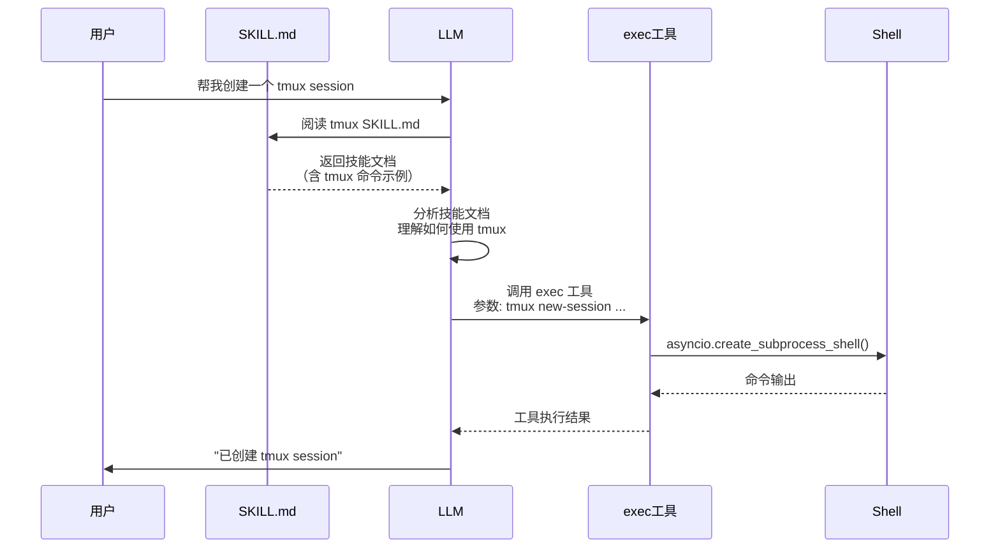

# Skills 中 Shell 命令的执行时机与机制

## 🎯 核心问题

如果 Skill 需要运行 Shell 命令（如 `nanobot/skills/tmux`），shell 是在何时执行的？

## ✅ 简短回答

**Skills 中的 Shell 命令不会自动执行**，而是：

1. ✅ **Shell 命令只是示例文档**，写在 SKILL.md 中
2. ✅ **LLM 阅读 SKILL.md**，了解如何使用 tmux
3. ✅ **用户发送请求**，LLM 根据技能文档决定使用 `exec` 工具
4. ✅ **Agent 执行 `exec` 工具**，通过 `asyncio.create_subprocess_shell()` 运行 Shell 命令

---

## 📊 完整执行流程



---

## 🔍 详细机制解析

### 1. SKILL.md 的作用

**tmux/SKILL.md 内容示例：**

```markdown
## Quickstart (isolated socket, exec tool)

```bash
SOCKET_DIR="${NANOBOT_TMUX_SOCKET_DIR:-${TMPDIR:-/tmp}/nanobot-tmux-sockets}"
mkdir -p "$SOCKET_DIR"
SOCKET="$SOCKET_DIR/nanobot.sock"
SESSION=nanobot-python

tmux -S "$SOCKET" new -d -s "$SESSION" -n shell
tmux -S "$SOCKET" send-keys -t "$SESSION":0.0 -- 'PYTHON_BASIC_REPL=1 python3 -q' Enter
```
```

**这些代码的作用：**
- ❌ **不会自动执行**
- ✅ 只是**示例代码**，展示如何使用 tmux
- ✅ LLM 通过阅读了解正确的 tmux 命令语法

---

### 2. Skill 注入到系统提示词

```python
# ContextBuilder.build_system_prompt()

# 总是激活的技能被完整加载
always_skills = ["tmux"]  # 如果 always=true
always_content = skills.load_skills_for_context(always_skills)

# 系统提示词包含完整 tmux 技能文档
system_prompt = f"""# nanobot 🐈

...

# Active Skills

## tmux

Use tmux only when you need an interactive TTY...

## Quickstart (isolated socket, exec tool)

```bash
SOCKET_DIR="${NANOBOT_TMUX_SOCKET_DIR:-${TMPDIR:-/tmp}/nanobot-tmux-sockets}"
...
```

...
"""
```

---

### 3. LLM 阅读并理解技能

**用户请求：** "帮我创建一个 tmux session"

**LLM 推理过程：**

```
1. 阅读 system prompt → 发现 tmux 技能在 "Active Skills" 中
2. 阅读 tmux 技能文档 → 了解如何创建 session
3. 找到示例代码：
   ```bash
   SOCKET_DIR="${NANOBOT_TMUX_SOCKET_DIR:-${TMPDIR:-/tmp}/nanobot-tmux-sockets}"
   mkdir -p "$SOCKET_DIR"
   SOCKET="$SOCKET_DIR/nanobot.sock"
   tmux -S "$SOCKET" new -d -s nanobot -n shell
   ```
4. 理解用户需求 → 创建 tmux session
5. 决定使用 exec 工具执行 tmux 命令
```

---

### 4. LLM 调用 exec 工具

**LLM 返回的工具调用：**

```python
response = LLMResponse(
    content="我将为你创建一个 tmux session。",
    tool_calls=[
        ToolCallRequest(
            id="call_001",
            name="exec",
            arguments={
                "command": (
                    'SOCKET_DIR="${NANOBOT_TMUX_SOCKET_DIR:-${TMPDIR:-/tmp}/nanobot-tmux-sockets}"\n'
                    'mkdir -p "$SOCKET_DIR"\n'
                    'SOCKET="$SOCKET_DIR/nanobot.sock"\n'
                    'tmux -S "$SOCKET" new -d -s nanobot -n shell'
                )
            }
        )
    ]
)
```

---

### 5. Agent 执行 exec 工具

```python
# loop.py:226-229
for tool_call in response.tool_calls:
    tools_used.append(tool_call.name)
    args_str = json.dumps(tool_call.arguments, ensure_ascii=False)
    logger.info("Tool call: {}({})", tool_call.name, args_str[:200])

    # ⚡ 核心：调用 exec 工具
    result = await self.tools.execute(tool_call.name, tool_call.arguments)
    messages = self.context.add_tool_result(
        messages, tool_call.id, tool_call.name, result
    )
```

---

### 6. ExecTool 执行 Shell 命令

```python
# shell.py:66-123
async def execute(self, command: str, working_dir: str | None = None, **kwargs) -> str:
    cwd = working_dir or self.working_dir or os.getcwd()

    # 1. 安全检查
    guard_error = self._guard_command(command, cwd)
    if guard_error:
        return guard_error

    # 2. 设置环境变量
    env = os.environ.copy()
    if self.path_append:
        env["PATH"] = env.get("PATH", "") + os.pathsep + self.path_append

    try:
        # 3. 创建子进程
        process = await asyncio.create_subprocess_shell(
            command,  # ← 用户的 shell 命令
            stdout=asyncio.subprocess.PIPE,
            stderr=asyncio.subprocess.PIPE,
            cwd=cwd,
            env=env,
        )

        try:
            # 4. 等待命令执行（带超时）
            stdout, stderr = await asyncio.wait_for(
                process.communicate(),
                timeout=self.timeout  # 默认 60 秒
            )

            # 5. 合并输出
            output_parts = []
            if stdout:
                output_parts.append(stdout.decode("utf-8", errors="replace"))
            if stderr:
                stderr_text = stderr.decode("utf-8", errors="replace")
                if stderr_text.strip():
                    output_parts.append(f"STDERR:\n{stderr_text}")

            if process.returncode != 0:
                output_parts.append(f"\nExit code: {process.returncode}")

            result = "\n".join(output_parts) if output_parts else "(no output)"

            # 6. 输出截断
            max_len = 10000
            if len(result) > max_len:
                result = result[:max_len] + f"\n... (truncated, {len(result) - max_len} more chars)"

            return result

        except asyncio.TimeoutError:
            process.kill()
            try:
                await asyncio.wait_for(process.wait(), timeout=5.0)
            except asyncio.TimeoutError:
                pass
            return f"Error: Command timed out after {self.timeout} seconds"

    except Exception as e:
        return f"Error executing command: {str(e)}"
```

---

## 🎯 关键时间线

| 时间 | 事件 | Shell 执行？ |
|------|------|--------------|
| T+0ms | 用户发送请求 | ❌ |
| T+5ms | LLM 收到请求 | ❌ |
| T+10ms | LLM 阅读 tmux SKILL.md | ❌ |
| T+15ms | LLM 理解技能文档 | ❌ |
| T+20ms | LLM 决定使用 exec 工具 | ❌ |
| T+25ms | LLM 返回工具调用（含 shell 命令） | ❌ |
| T+30ms | Agent 执行 exec 工具 | ❌ |
| T+35ms | ExecTool 调用 `asyncio.create_subprocess_shell()` | ✅ **Shell 开始执行** |
| T+500ms | 命令执行完成，返回输出 | ✅ **Shell 执行结束** |
| T+505ms | Agent 将结果添加到 messages | ❌ |
| T+510ms | LLM 收到工具结果 | ❌ |
| T+515ms | LLM 返回最终答案 | ❌ |

---

## 💡 关键机制总结

### 1. Skills 是"使用手册"，不是"执行脚本"

```python
# ❌ 错误理解
SKILL.md → 自动执行其中的 shell 命令

# ✅ 正确理解
SKILL.md → 告诉 LLM 如何使用工具（包括正确的 shell 命令语法）
```

### 2. LLM 是"执行者"，不是 Skills

```
流程：
SKILL.md (文档) → LLM (阅读) → LLM (构建命令) → exec 工具 (执行)
                    ↑                             ↑
                    只阅读                     真正执行
```

### 3. Exec 工具是"Shell 执行器"

```python
# shell.py:66-123
class ExecTool(Tool):
    async def execute(self, command: str, **kwargs) -> str:
        # 调用 asyncio.create_subprocess_shell(command)
        # 这是真正执行 shell 命令的地方
```

**安全机制：**
- 危险命令黑名单（rm -rf, format, dd）
- 路径穿越检测
- 超时保护（默认 60 秒）
- 输出截断（最大 10000 字符）

---

## 📝 完整示例

### 场景：用户要求创建 tmux session

#### 用户输入

```
帮我创建一个名为 mysession 的 tmux session
```

#### LLM 收到系统提示词（包含 tmux 技能）

```python
system_prompt = """# nanobot 🐈

...

# Active Skills

## tmux

Use tmux only when you need an interactive TTY. Prefer exec background mode for long-running, non-interactive tasks.

## Quickstart (isolated socket, exec tool)

```bash
SOCKET_DIR="${NANOBOT_TMUX_SOCKET_DIR:-${TMPDIR:-/tmp}/nanobot-tmux-sockets}"
mkdir -p "$SOCKET_DIR"
SOCKET="$SOCKET_DIR/nanobot.sock"
SESSION=nanobot-python

tmux -S "$SOCKET" new -d -s "$SESSION" -n shell
tmux -S "$SOCKET" send-keys -t "$SESSION":0.0 -- 'PYTHON_BASIC_REPL=1 python3 -q' Enter
```

## Targeting panes and naming

- Target format: `session:window.pane` (defaults to `0.0`).
- Keep names short; avoid spaces.
...
"""
```

#### LLM 推理

```
1. 阅读 tmux 技能文档
2. 理解用户需求：创建名为 "mysession" 的 session
3. 查看示例：tmux new-session 命令格式
4. 构建命令：
   - SOCKET_DIR 设置
   - 使用 tmux -S new-session 创建 session
   - session 名为 mysession
```

#### LLM 返回工具调用

```python
response = LLMResponse(
    content="我将为你创建一个名为 mysession 的 tmux session。",
    tool_calls=[
        ToolCallRequest(
            id="call_123",
            name="exec",
            arguments={
                "command": (
                    'SOCKET_DIR="${NANOBOT_TMUX_SOCKET_DIR:-${TMPDIR:-/tmp}/nanobot-tmux-sockets}"\n'
                    'mkdir -p "$SOCKET_DIR"\n'
                    'SOCKET="$SOCKET_DIR/nanobot.sock"\n'
                    'tmux -S "$SOCKET" new-session -d -s "mysession"'
                )
            }
        )
    ]
)
```

#### Agent 执行 ExecTool

```python
# loop.py:226
result = await self.tools.execute("exec", {
    "command": (
        'SOCKET_DIR="${NANOBOT_TMUX_SOCKET_DIR:-${TMPDIR:-/tmp}/nanobot-tmux-sockets}"\n'
        'mkdir -p "$SOCKET_DIR"\n'
        'SOCKET="$SOCKET_DIR/nanobot.sock"\n'
        'tmux -S "$SOCKET" new-session -d -s "mysession"'
    )
})
```

#### ExecTool 执行 Shell 命令

```python
# shell.py:76-98
process = await asyncio.create_subprocess_shell(
    command=(
        'SOCKET_DIR="${NANOBOT_TMUX_SOCKET_DIR:-${TMPDIR:-/tmp}/nanobot-tmux-sockets}"\n'
        'mkdir -p "$SOCKET_DIR"\n'
        'SOCKET="$SOCKET_DIR/nanobot.sock"\n'
        'tmux -S "$SOCKET" new-session -d -s "mysession"'
    ),
    stdout=asyncio.subprocess.PIPE,
    stderr=asyncio.subprocess.PIPE,
    cwd=workspace,
    env=env,
)

stdout, stderr = await asyncio.wait_for(
    process.communicate(),
    timeout=60
)
```

**实际执行的 Shell 命令：**

```bash
SOCKET_DIR="${NANOBOT_TMUX_SOCKET_DIR:-${TMPDIR:-/tmp}/nanobot-tmux-sockets}"
mkdir -p "$SOCKET_DIR"
SOCKET="$SOCKET_DIR/nanobot.sock"
tmux -S "$SOCKET" new-session -d -s "mysession"
```

#### 工具执行结果返回

```python
result = ""  # 如果成功，通常没有输出

# 或者
result = "Error: tmux: command not found"  # 如果 tmux 未安装
```

#### LLM 收到工具结果并返回最终答案

```python
response = await provider.chat(
    messages=[
        ...,
        {"role": "tool", "name": "exec", "content": result},
    ],
    tools=tools.get_definitions(),
)

# LLM 返回
response = LLMResponse(
    content="✅ 已成功创建 tmux session 'mysession'"
)
```

---

## 🔐 安全机制

### ExecTool 的安全检查

```python
# shell.py:125-157
def _guard_command(self, command: str, cwd: str) -> str | None:
    cmd = command.strip()
    lower = cmd.lower()

    # 1. 危险命令黑名单
    for pattern in self.deny_patterns:
        if re.search(pattern, lower):
            return "Error: Command blocked by safety guard (dangerous pattern detected)"

    # 2. Workspace 限制
    if self.restrict_to_workspace:
        if "..\\" in cmd or "../" in cmd:
            return "Error: Command blocked by safety guard (path traversal detected)"

        cwd_path = Path(cwd).resolve()

        # 提取绝对路径
        win_paths = re.findall(r"[A-Za-z]:\\[^\\\"']+", cmd)
        posix_paths = re.findall(r"(?:^|[\s|>])(/[^\s\"'>]+)", cmd)

        for raw in win_paths + posix_paths:
            try:
                p = Path(raw.strip()).resolve()
            except Exception:
                continue

            # 检查路径是否在 workspace 内
            if p.is_absolute() and cwd_path not in p.parents and p != cwd_path:
                return "Error: Command blocked by safety guard (path outside working dir)"

    return None
```

**示例拦截：**

```python
# ❌ 被拦截
exec(command="rm -rf /")
exec(command="format c:")
exec(command="cd /etc && cat passwd")

# ✅ 允许
exec(command="tmux new-session -d -s mysession")
exec(command="python script.py")
exec(command="ls -la workspace/")
```

---

## 📊 对比：Skills vs 真正的 Shell 脚本

| 特性 | Skills 中的 Shell | 真正的 Shell 脚本 |
|------|------------------|------------------|
| **执行方式** | LLM 阅读后调用 exec | 直接执行 |
| **执行时机** | 用户请求时 | 自动执行 |
| **灵活性** | LLM 可以修改命令 | 固定命令 |
| **安全性** | 通过 ExecTool 安全检查 | 依赖脚本自身 |
| **示例目的** | 教授 LLM 如何使用 | 实际执行任务 |

---

## 💡 设计优势

### 1. 知识分离

```
SKILL.md: "这是 tmux 的使用方法"
ExecTool: "安全执行任意 shell 命令"
LLM: "理解方法 → 选择工具 → 执行命令"
```

### 2. 灵活性

LLM 可以根据技能文档：
- 修改参数
- 组合多个命令
- 选择不同的策略

### 3. 安全性

所有 shell 命令通过统一的 `ExecTool` 执行：
- 统一的安全检查
- 统一的超时控制
- 统一的环境变量管理

---

## 🎯 总结

### 核心要点

1. **Skills 中的 Shell 命令是示例代码**，不会自动执行
2. **LLM 阅读 Skills 文档**，学习如何使用工具
3. **用户发送请求后**，LLM 根据技能文档决定使用 exec 工具
4. **Agent 执行 ExecTool**，调用 `asyncio.create_subprocess_shell()` 执行命令
5. **所有 Shell 命令** 都通过统一的安全检查和超时机制

### 执行时机

```
用户请求 → LLM 阅读 SKILL.md → LLM 构建 shell 命令
  → LLM 调用 exec 工具 → ExecTool 执行 shell 命令
  → 返回结果 → LLM 返回最终答案
```

### 关键角色

| 角色 | 作用 |
|------|------|
| **SKILL.md** | 使用手册，告诉 LLM 如何使用工具 |
| **LLM** | 理解需求，构建正确的 shell 命令 |
| **ExecTool** | 安全执行 shell 命令 |
| **Shell** | 实际执行命令的环境 |

---

## 🚀 相关资源

- **ExecTool 源码**：`nanobot/agent/tools/shell.py`
- **tmux SKILL.md**：`nanobot/skills/tmux/SKILL.md`
- **学习文档**：`nanobot-research/03-工具系统.md`
- **Agent Loop**：`nanobot-research/02-消息处理流程.md`
