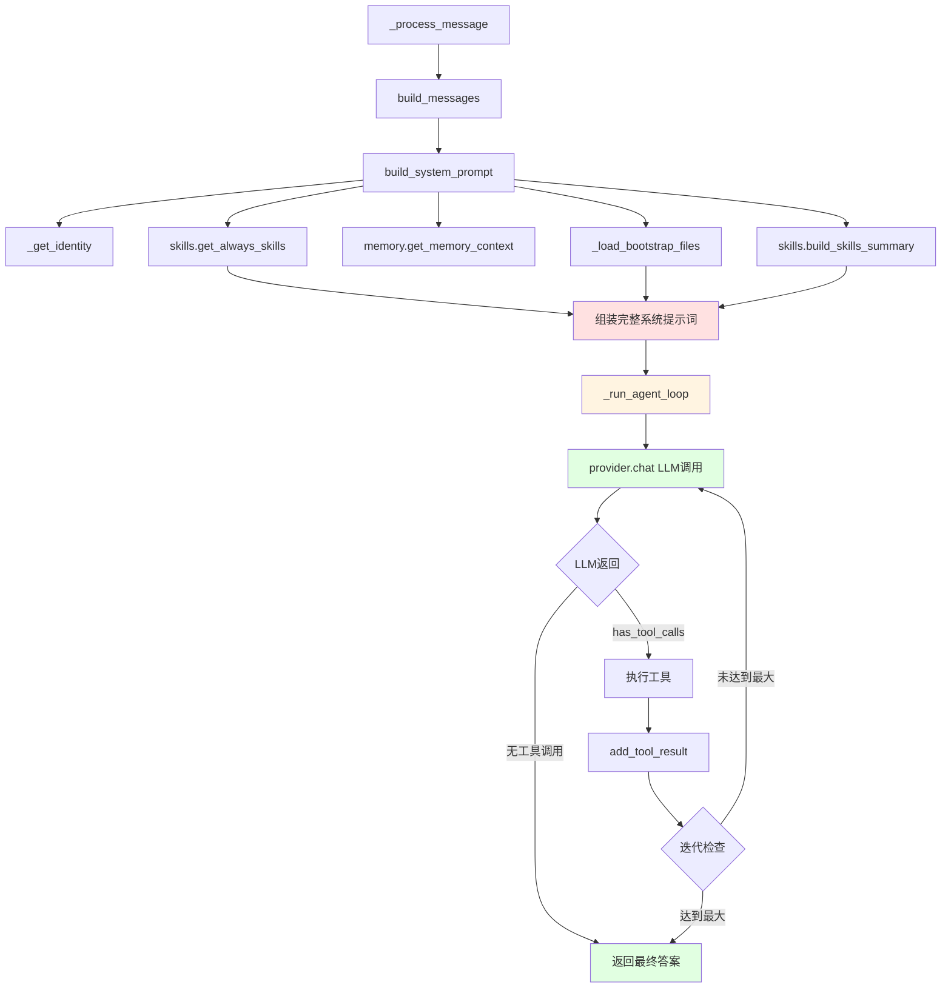
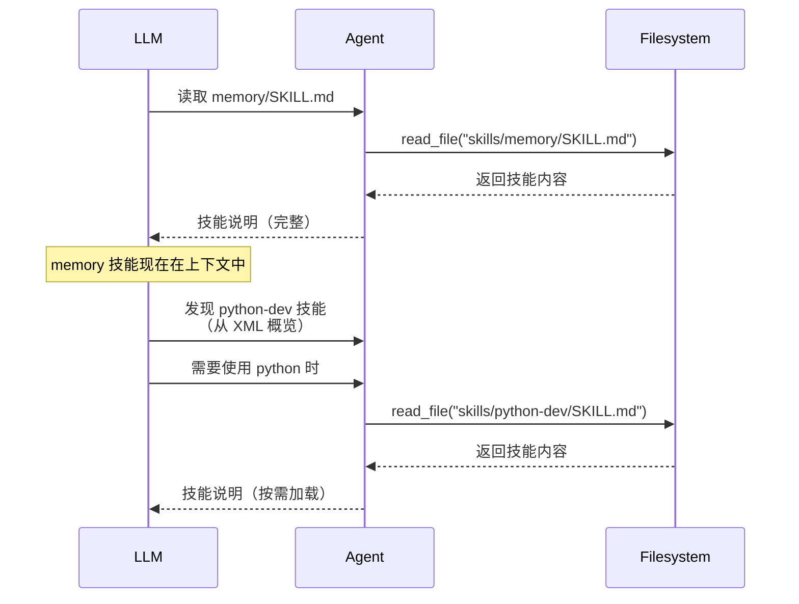

# nanobot Skills 在 Agent 循环中的处理机制

## 🎯 核心问题

Skills 是如何在 Agent 循环中被处理的？是在得到答案后处理，还是其他时机？

## ✅ 简短回答

**Skills 不是在"得到答案后"处理的**，而是：
- ✅ 在**调用 LLM 之前**被注入到系统提示词中
- ✅ LLM 通过阅读系统提示词了解有哪些技能
- ✅ LLM 根据需要选择使用哪些技能（通过工具调用）

---

## 📊 完整处理流程



---

## 🔍 详细流程解析

### 阶段1：系统提示词构建（Skills 注入点）

```python
# context.py:26-53
def build_system_prompt(self, skill_names: list[str] | None = None) -> str:
    parts = [self._get_identity()]

    # 层1：Bootstrap 文件
    bootstrap = self._load_bootstrap_files()
    if bootstrap:
        parts.append(bootstrap)

    # 层2：长期记忆
    memory = self.memory.get_memory_context()
    if memory:
        parts.append(f"# Memory\n\n{memory}")

    # ⚡ 层3：总是激活的技能 ← Skills 在这里注入
    always_skills = self.skills.get_always_skills()
    if always_skills:
        always_content = self.skills.load_skills_for_context(always_skills)
        if always_content:
            parts.append(f"# Active Skills\n\n{always_content}")

    # ⚡ 层4：所有技能概览 ← Skills 在这里注入
    skills_summary = self.skills.build_skills_summary()
    if skills_summary:
        parts.append(f"""# Skills

The following skills extend your capabilities. To use a skill, read its SKILL.md file using the read_file tool.
Skills with available="false" need dependencies installed first - you can try installing them with apt/brew.

{skills_summary}""")

    return "\n\n---\n\n".join(parts)
```

### 阶段2：获取总是激活的技能

```python
# skills.py:193-201
def get_always_skills(self) -> list[str]:
    """获取总是激活的技能"""
    result = []
    for s in self.list_skills(filter_unavailable=True):
        metadata = self.get_skill_metadata(s["name"]) or {}
        skill_meta = self._parse_nanobot_metadata(metadata.get("metadata", ""))

        # ⚡ 检查 always=true
        if skill_meta.get("always") or metadata.get("always"):
            result.append(s["name"])
    return result
```

### 阶段3：加载技能内容

```python
# skills.py:82-99
def load_skills_for_context(self, skill_names: list[str]) -> str:
    """加载指定技能到上下文"""
    parts = []
    for name in skill_names:
        content = self.load_skill(name)
        if content:
            content = self._strip_frontmatter(content)
            parts.append(f"### Skill: {name}\n\n{content}")

    return "\n\n---\n\n".join(parts) if parts else ""
```

**示例输出：**
```markdown
### Skill: memory

# Memory

## Structure
- `memory/MEMORY.md` — Long-term facts (preferences, project context, relationships). Always loaded into your context.
- `memory/HISTORY.md` — Append-only event log. NOT loaded into context. Search it with grep.

## Search Past Events

```bash
grep -i "keyword" memory/HISTORY.md
```
```

### 阶段4：生成技能概览

```python
# skills.py:101-140
def build_skills_summary(self) -> str:
    """构建所有技能的XML概览"""
    all_skills = self.list_skills(filter_unavailable=False)
    if not all_skills:
        return ""

    lines = ["<skills>"]
    for s in all_skills:
        name = escape_xml(s["name"])
        desc = escape_xml(self._get_skill_description(s["name"]))
        skill_meta = self._get_skill_meta(s["name"])
        available = self._check_requirements(skill_meta)

        lines.append(f"  <skill available=\"{str(available).lower()}\">")
        lines.append(f"    <name>{name}</name>")
        lines.append(f"    <description>{desc}</description>")
        lines.append(f"    <location>{s['path']}</location>")

        if not available:
            missing = self._get_missing_requirements(skill_meta)
            if missing:
                lines.append(f"    <requires>{escape_xml(missing)}</requires>")

        lines.append(f"  </skill>")
    lines.append("</skills>")

    return "\n".join(lines)
```

**示例输出：**
```xml
<skills>
  <skill available="true">
    <name>memory</name>
    <description>Two-layer memory system with grep-based recall.</description>
    <location>/workspace/skills/memory/SKILL.md</location>
  </skill>
  <skill available="false">
    <name>python-dev</name>
    <description>Python development helper.</description>
    <location>/workspace/skills/python-dev/SKILL.md</location>
    <requires>CLI: python, CLI: pip</requires>
  </skill>
</skills>
```

### 阶段5：Agent 循环中的 LLM 调用

```python
# loop.py:177-236
async def _run_agent_loop(
    self,
    initial_messages: list[dict],
    on_progress: Callable[..., Awaitable[None]] | None = None,
) -> tuple[str | None, list[str], list[dict]]:
    messages = initial_messages
    iteration = 0
    final_content = None
    tools_used: list[str] = []

    while iteration < self.max_iterations:
        iteration += 1

        # ⚡ LLM 调用，系统提示词中已包含 Skills
        response = await self.provider.chat(
            messages=messages,
            tools=self.tools.get_definitions(),
            model=self.model,
            temperature=self.temperature,
            max_tokens=self.max_tokens,
        )

        if response.has_tool_calls:
            # ... 工具执行逻辑 ...
        else:
            # ... 最终答案逻辑 ...
```

---

## 🧠 LLM 如何使用 Skills

### 系统提示词示例

当用户发送消息时，发送给 LLM 的 `messages` 结构如下：

```python
messages = [
    {
        "role": "system",
        "content": f"""# nanobot 🐈

You are nanobot, a helpful AI assistant.

## Runtime
macOS arm64, Python 3.12

## Workspace
Your workspace is at: /Users/eddy/.nanobot/workspace/

---

# Active Skills

### Skill: memory

# Memory

## Structure
- `memory/MEMORY.md` — Long-term facts (preferences, project context, relationships).
- `memory/HISTORY.md` — Append-only event log.

## When to Update MEMORY.md

Write important facts immediately using `edit_file` or `write_file`:
- User preferences ("I prefer dark mode")
- Project context ("The API uses OAuth2")
- Relationships ("Alice is project lead")

---

# Skills

The following skills extend your capabilities...

<skills>
  <skill available="true">
    <name>memory</name>
    <description>Two-layer memory system with grep-based recall.</description>
  </skill>
  <skill available="false">
    <name>python-dev</name>
    <requires>CLI: python</requires>
  </skill>
</skills>
"""
    },
    *history_messages,  # 历史对话
    {
        "role": "user",
        "content": "Current Time: 2026-02-27 10:30\nChannel: telegram\nChat ID: 123456"
    },
    {
        "role": "user",
        "content": "帮我记住我的生日是1990年5月1日"
    }
]
```

### LLM 推理过程

```
1. 阅读 system prompt
   └─ 发现 memory 技能在 "Active Skills" 中
   └─ 阅读 memory 技能的说明

2. 理解用户需求
   └─ "记住我的生日" → 需要保存到长期记忆

3. 根据 memory 技能说明
   └─ 技能说：使用 edit_file 或 write_file 更新 MEMORY.md
   └─ 应该记录：用户偏好

4. 决定操作
   └─ 先读取现有的 MEMORY.md 了解格式
   └─ 然后使用 edit_file 添加生日信息
```

### LLM 返回的工具调用

```python
response = LLMResponse(
    content="我将把你的生日记录到长期记忆中。",
    tool_calls=[
        ToolCallRequest(
            id="call_abc123",
            name="read_file",
            arguments={"path": "memory/MEMORY.md"}
        ),
        ToolCallRequest(
            id="call_abc124",
            name="edit_file",
            arguments={
                "path": "memory/MEMORY.md",
                "old_text": "## User Preferences\n",
                "new_text": "## User Preferences\n- User birthday: 1990-05-01\n"
            }
        )
    ]
)
```

---

## 🔑 关键机制总结

### 1. 两层技能注入

| 层次 | 注入方式 | LLM 访问方式 | 示例 |
|------|---------|---------------|------|
| **总是激活** | 完整 SKILL.md 内容直接嵌入系统提示词 | 直接阅读 | memory 技能 |
| **按需加载** | 只在 XML 概览中显示名称和位置 | 调用 `read_file` 读取 | python-dev 技能 |

### 2. Skills 是"知识"，不是"函数"

```python
# ❌ 错误理解
skills.execute("memory", {"fact": "birthday"})

# ✅ 正确理解
# skills 被注入到 system prompt，LLM 通过阅读了解如何使用
```

### 3. 渐进式发现



---

## 📊 完整示例流程

### 场景：用户要求记录偏好

**用户输入：** "我喜欢深色模式"

#### 步骤1：系统提示词构建

```python
# 1. 获取总是激活的技能
always_skills = ["memory"]

# 2. 加载技能内容
always_content = skills.load_skills_for_context(always_skills)
# 返回完整的 memory 技能说明

# 3. 生成技能概览
skills_summary = skills.build_skills_summary()
# 返回所有技能的 XML 概览

# 4. 组装系统提示词
system_prompt = build_system_prompt()
# 包含 memory 技能（完整） + 其他技能（概览）
```

#### 步骤2：LLM 调用

```python
messages = [
    {"role": "system", "content": system_prompt},  # ← Skills 在这里
    {"role": "user", "content": "Current Time: 2026-02-27 10:30\nChannel: telegram\nChat ID: 123456"},
    {"role": "user", "content": "我喜欢深色模式"}
]

response = await provider.chat(
    messages=messages,
    tools=tools.get_definitions()  # [read_file, write_file, edit_file, ...]
)
```

#### 步骤3：LLM 推理

```
1. 阅读 system prompt → 发现有 memory 技能
2. 阅读 memory 技能内容 → 发现应该使用 edit_file 更新 MEMORY.md
3. 理解任务 → 记录用户偏好到长期记忆
4. 检查工具 → 决定使用 read_file + edit_file
```

#### 步骤4：LLM 返回工具调用

```python
response = LLMResponse(
    content="我将记录你的偏好到长期记忆中。",
    tool_calls=[
        ToolCallRequest(
            id="call_001",
            name="read_file",
            arguments={"path": "memory/MEMORY.md"}
        ),
        ToolCallRequest(
            id="call_002",
            name="edit_file",
            arguments={
                "path": "memory/MEMORY.md",
                "old_text": "## User Preferences\n",
                "new_text": "## User Preferences\n- UI Theme: Dark Mode (2026-02-27)\n"
            }
        )
    ]
)
```

#### 步骤5：Agent 执行工具

```python
# 第一次循环
for tool_call in response.tool_calls:
    result = await tools.execute(tool_call.name, tool_call.arguments)
    messages = add_tool_result(messages, tool_call.id, tool_call.name, result)

# messages 现在包含：
# [
#     {"role": "system", "content": "..."},
#     {"role": "user", "content": "..."},
#     {"role": "assistant", "content": "...", "tool_calls": [...]},
#     {"role": "tool", "name": "read_file", "content": "当前 MEMORY.md 内容"},
#     {"role": "tool", "name": "edit_file", "content": "Successfully edited..."},
# ]

# 第二次循环
response = await provider.chat(messages=messages, tools=tools.get_definitions())
# LLM 看到工具结果，最终返回
response = LLMResponse(content="已记录：你喜欢深色模式")

# 无更多工具调用，循环结束
final_content = "已记录：你喜欢深色模式"
```

---

## ⏱️ 关键时间线

| 时间 | 事件 | Skills 作用 |
|------|------|------------|
| T+0ms | `build_system_prompt()` 被调用 | Skills 内容嵌入系统提示词 |
| T+5ms | LLM 收到 system prompt | LLM 阅读技能说明 |
| T+10ms | LLM 分析用户输入 | LLM 理解需要使用 memory 技能 |
| T+15ms | LLM 返回工具调用 | LLM 决定调用 read_file 和 edit_file |
| T+20ms | Agent 执行工具 | 按照技能说明操作 MEMORY.md |
| T+500ms | LLM 返回最终答案 | 基于技能指导完成任务 |

---

## 💡 设计优势

### 1. 渐进式加载

```
System Prompt 层次：
├─ Identity (固定)
├─ Bootstrap (个性化)
├─ Memory (长时记忆)
├─ Active Skills (完整内容，small)  ← always=true
└─ Skills Summary (概览，large)     ← 按需读取
```

**优势：**
- 总是激活的技能立即可用
- 其他技能通过概览渐进发现
- 避免上下文过大

### 2. 灵活性

```python
# LLM 可以选择：
# 1. 直接使用 memory 技能（已在上下文中）
# 2. 需要时读取其他技能（通过 read_file）
# 3. 不使用任何技能（直接回答）
```

### 3. 可扩展性

```
新增技能步骤：
1. 创建 SKILL.md 文件
2. 设置 always=true 或 false
3. 重启 nanobot
4. LLM 自动发现并使用
```

---

## 📝 总结

### 核心要点

1. **Skills 在调用 LLM 之前**被注入到系统提示词
2. **LLM 通过阅读系统提示词**了解有哪些技能和如何使用
3. **LLM 根据任务需求**选择使用适当的工具（配合技能指导）
4. **答案生成过程**遵循 Skills 中定义的方法论

### 关键区别

| 误解 | 正确理解 |
|------|----------|
| Skills 在得到答案后处理 | Skills 在 LLM 调用前注入 |
| Skills 是可执行的函数 | Skills 是知识文档（指导 LLM） |
| Agent 调用 Skills | LLM 阅读并应用 Skills 的方法 |
| Skills 返回结果 | Skills 提供方法，Agent 执行工具 |

### 执行流程

```
用户输入
  ↓
ContextBuilder.build_messages()
  ↓
build_system_prompt() ← Skills 注入
  ↓
LLM.chat() ← 带 Skills 的 system prompt
  ↓
LLM 推理
  ↓
LLM 返回工具调用
  ↓
Agent 执行工具
  ↓
LLM 返回最终答案
  ↓
用户收到响应 ✅
```

---

## 🚀 相关资源

- **SkillsLoader 源码**：`nanobot/agent/skills.py`
- **ContextBuilder 源码**：`nanobot/agent/context.py`
- **AgentLoop 源码**：`nanobot/agent/loop.py`
- **学习文档**：`nanobot-research/03-工具系统.md`
- **技能开发指南**：`nanobot-research/06-扩展开发指南.md`
