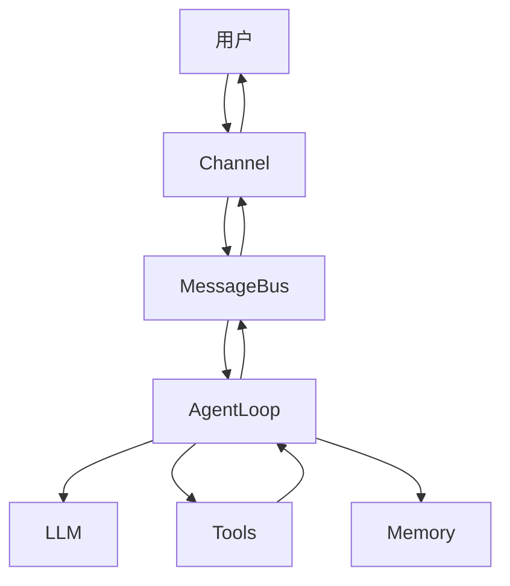

# nanobot 项目分析报告

**分析日期**：2026-02-28  
**项目名称**：nanobot  
**GitHub**：https://github.com/HKUDS/nanobot  
**Stars**：-  
**语言**：Python  
**License**：MIT

---

## 📊 项目概览

### 定位
- [x] RAG 框架
- [x] Agent 框架
- [ ] 完整应用
- [x] 库/SDK

### 目标场景
- [x] 企业知识库
- [x] 个人助手
- [x] 客服系统
- [ ] 数据分析
- [x] 其他：多平台聊天机器人

### 核心特点
1. **超轻量** - 核心代码仅 ~4,000 行
2. **多平台** - 支持 Telegram/Discord/飞书/微信等
3. **工具扩展** - 注册器模式的工具系统
4. **双层记忆** - MEMORY.md + HISTORY.md

---

## 🏗️ 架构分析

### 核心模块与源码索引

| 模块 | 代码量 | 职责 | 源码链接 |
|------|--------|------|---------|
| **Channel 层** | ~1,500 行 | 多平台接入 | [`nanobot/channels/`](https://github.com/HKUDS/nanobot/tree/main/nanobot/channels) |
| **MessageBus** | ~50 行 | 消息总线 | [`bus/queue.py`](https://github.com/HKUDS/nanobot/blob/main/nanobot/bus/queue.py) |
| **AgentLoop** | ~500 行 | 核心引擎 | [`agent/loop.py`](https://github.com/HKUDS/nanobot/blob/main/nanobot/agent/loop.py) |
| **Tool System** | ~600 行 | 工具系统 | [`agent/tools/`](https://github.com/HKUDS/nanobot/tree/main/nanobot/agent/tools) |
| **Memory** | ~150 行 | 记忆系统 | [`agent/memory.py`](https://github.com/HKUDS/nanobot/blob/main/nanobot/agent/memory.py) |
| **Context** | ~160 行 | 上下文构建 | [`agent/context.py`](https://github.com/HKUDS/nanobot/blob/main/nanobot/agent/context.py) |
| **Session** | ~210 行 | 会话管理 | [`session/manager.py`](https://github.com/HKUDS/nanobot/blob/main/nanobot/session/manager.py) |

### 数据流



---

## 🔍 核心流程源码解析

### 1. Agent 主循环

**文件**：[`agent/loop.py`](https://github.com/HKUDS/nanobot/blob/main/nanobot/agent/loop.py)

**核心方法**：
- [`run()`](https://github.com/HKUDS/nanobot/blob/main/nanobot/agent/loop.py#L247-L264) - 主循环，消费 inbound 队列
- [`_dispatch()`](https://github.com/HKUDS/nanobot/blob/main/nanobot/agent/loop.py#L284-L302) - 消息分发（带锁）
- [`_process_message()`](https://github.com/HKUDS/nanobot/blob/main/nanobot/agent/loop.py#L304-L450) - 核心处理逻辑
- [`_run_agent_loop()`](https://github.com/HKUDS/nanobot/blob/main/nanobot/agent/loop.py#L191-L236) - LLM↔工具交互循环

**关键代码**：
```python
# 来源：https://github.com/HKUDS/nanobot/blob/main/nanobot/agent/loop.py#L191-L236
async def _run_agent_loop(self, messages, on_progress=None):
    while iteration < self.max_iterations:
        # 1. 调用 LLM
        response = await self.provider.chat(
            messages=messages,
            tools=self.tools.get_definitions(),
            model=self.model
        )
        
        # 2. 检查工具调用
        if response.has_tool_calls:
            # 执行工具
            for tool_call in response.tool_calls:
                result = await self.tools.execute(
                    tool_call.name,
                    tool_call.arguments
                )
                messages = add_tool_result(...)
        else:
            # 3. 无工具调用，完成
            final_content = response.content
            break
    
    return final_content, tools_used
```

### 2. 工具注册与执行

**文件**：[`agent/tools/registry.py`](https://github.com/HKUDS/nanobot/blob/main/nanobot/agent/tools/registry.py)

**核心方法**：
- [`register()`](https://github.com/HKUDS/nanobot/blob/main/nanobot/agent/tools/registry.py#L38-L41) - 注册工具
- [`execute()`](https://github.com/HKUDS/nanobot/blob/main/nanobot/agent/tools/registry.py#L43-L55) - 执行工具（带验证）

**关键代码**：
```python
# 来源：https://github.com/HKUDS/nanobot/blob/main/nanobot/agent/tools/registry.py#L43-L55
async def execute(self, name: str, params: dict) -> str:
    _HINT = "\n\n[Analyze error above and try a different approach.]"
    
    # 1. 查找工具
    tool = self._tools.get(name)
    if not tool:
        return f"Error: Tool '{name}' not found"
    
    # 2. 参数验证
    errors = tool.validate_params(params)
    if errors:
        return f"Error: Invalid parameters: " + "; ".join(errors) + _HINT
    
    # 3. 执行工具
    result = await tool.execute(**params)
    
    # 4. 错误处理
    if isinstance(result, str) and result.startswith("Error"):
        return result + _HINT
    
    return result
```

### 3. 记忆系统

**文件**：[`agent/memory.py`](https://github.com/HKUDS/nanobot/blob/main/nanobot/agent/memory.py)

**核心方法**：
- [`get_memory_context()`](https://github.com/HKUDS/nanobot/blob/main/nanobot/agent/memory.py#L20-L30) - 获取长期记忆
- [`save_memory()`](https://github.com/HKUDS/nanobot/blob/main/nanobot/agent/memory.py#L32-L60) - 保存记忆
- [`append_to_history()`](https://github.com/HKUDS/nanobot/blob/main/nanobot/agent/memory.py#L62-L70) - 追加历史

**双层设计**：
```
MEMORY.md (长期记忆) - 结构化事实
  ↓
HISTORY.md (历史日志) - 时间线索引
```

### 4. 消息总线

**文件**：[`bus/queue.py`](https://github.com/HKUDS/nanobot/blob/main/nanobot/bus/queue.py)

**核心代码**（仅 44 行）：
```python
# 来源：https://github.com/HKUDS/nanobot/blob/main/nanobot/bus/queue.py
class MessageBus:
    def __init__(self):
        self.inbound: Queue[InboundMessage] = Queue()
        self.outbound: Queue[OutboundMessage] = Queue()
    
    async def publish_inbound(self, msg: InboundMessage):
        await self.inbound.put(msg)
    
    async def consume_inbound(self) -> InboundMessage:
        return await self.inbound.get()
```

---

## 🤖 Agent 方案分析

### Agent 架构

| 维度 | 实现方式 | 源码 |
|------|---------|------|
| **核心循环** | ReAct 模式 | [`loop.py#L191-L236`](https://github.com/HKUDS/nanobot/blob/main/nanobot/agent/loop.py#L191-L236) |
| **记忆系统** | 双层记忆 | [`memory.py`](https://github.com/HKUDS/nanobot/blob/main/nanobot/agent/memory.py) |
| **工具系统** | 注册器模式 | [`tools/registry.py`](https://github.com/HKUDS/nanobot/blob/main/nanobot/agent/tools/registry.py) |
| **规划能力** | 基础（多轮迭代） | [`loop.py#L191`](https://github.com/HKUDS/nanobot/blob/main/nanobot/agent/loop.py#L191) |
| **反思能力** | 基础（错误重试） | [`registry.py#L55`](https://github.com/HKUDS/nanobot/blob/main/nanobot/agent/tools/registry.py#L55) |

### 工具系统

| 工具类型 | 实现 | 源码 |
|---------|------|------|
| **文件操作** | read/write/edit/list | [`tools/filesystem.py`](https://github.com/HKUDS/nanobot/blob/main/nanobot/agent/tools/filesystem.py) |
| **Shell 命令** | exec（带安全检查） | [`tools/shell.py`](https://github.com/HKUDS/nanobot/blob/main/nanobot/agent/tools/shell.py) |
| **Web 搜索** | web_search（Brave API） | [`tools/web.py`](https://github.com/HKUDS/nanobot/blob/main/nanobot/agent/tools/web.py) |
| **Web 抓取** | web_fetch（readability） | [`tools/web.py`](https://github.com/HKUDS/nanobot/blob/main/nanobot/agent/tools/web.py#L56-L96) |
| **消息发送** | message（统一接口） | [`tools/message.py`](https://github.com/HKUDS/nanobot/blob/main/nanobot/agent/tools/message.py) |
| **子代理** | spawn（后台任务） | [`agent/subagent.py`](https://github.com/HKUDS/nanobot/blob/main/nanobot/agent/subagent.py) |

### 多 Agent 协作

- [x] 支持（SubagentManager）
  - 协作方式：主从模式
  - 通信机制：MessageBus
  - 源码：[`agent/subagent.py`](https://github.com/HKUDS/nanobot/blob/main/nanobot/agent/subagent.py)

---

## 💾 记忆系统分析

### 记忆类型

| 类型 | 存储方式 | 用途 | 源码 |
|------|---------|------|------|
| **短期记忆** | Session JSONL | 当前对话历史 | [`session/manager.py`](https://github.com/HKUDS/nanobot/blob/main/nanobot/session/manager.py) |
| **长期记忆** | MEMORY.md | 结构化事实 | [`agent/memory.py`](https://github.com/HKUDS/nanobot/blob/main/nanobot/agent/memory.py#L32-L60) |
| **历史日志** | HISTORY.md | 时间线索引 | [`agent/memory.py`](https://github.com/HKUDS/nanobot/blob/main/nanobot/agent/memory.py#L62-L70) |

### 记忆压缩策略

**触发机制**：
```python
# 来源：https://github.com/HKUDS/nanobot/blob/main/nanobot/agent/loop.py#L397-L414
if len(session.messages) - session.last_consolidated >= self.memory_window:
    # 异步触发合并，不阻塞主流程
    asyncio.create_task(_consolidate_and_unlock())
```

**合并 Prompt**：
```python
# 来源：https://github.com/HKUDS/nanobot/blob/main/nanobot/agent/loop.py#L416-L450
prompt = f"""
你是记忆合并助手。阅读下面的对话，调用 save_memory 工具：

## Current Long-term Memory
{MEMORY.md 内容}

## Conversation to Process
{最近对话}
"""
```

---

## 🛡️ 安全机制

### Shell 命令安全检查

**文件**：[`tools/shell.py`](https://github.com/HKUDS/nanobot/blob/main/nanobot/agent/tools/shell.py#L125-L157)

**危险命令黑名单**：
```python
# 来源：https://github.com/HKUDS/nanobot/blob/main/nanobot/agent/tools/shell.py#L24-L34
self.deny_patterns = [
    r"\brm\s+-[rf]{1,2}\b",          # rm -rf
    r"\bformat\b",                   # format
    r"\bdd\s+if=",                   # dd
    r">\s*/dev/sd",                  # 写入设备
    r"\b(shutdown|reboot|poweroff)\b",  # 系统电源
]
```

**路径检查**：
```python
# 来源：https://github.com/HKUDS/nanobot/blob/main/nanobot/agent/tools/shell.py#L140-L157
if self.restrict_to_workspace:
    if "..\\" in cmd or "../" in cmd:
        return "Error: Path traversal detected"
    
    # 检查绝对路径是否在 workspace 外
    for path in extract_paths(cmd):
        if not is_in_workspace(path):
            return "Error: Path outside working dir"
```

---

## 🎯 可提炼模式

### 1. 工具注册器模式

**问题**：如何动态扩展工具？

**解决方案**：
```python
# 源码：https://github.com/HKUDS/nanobot/blob/main/nanobot/agent/tools/registry.py
class ToolRegistry:
    def register(self, tool: Tool) -> None  # 注册
    async def execute(self, name: str, params: dict) -> str  # 执行
```

**提炼代码**：[`universal_agent/tools/registry.py`](../universal_agent/tools/registry.py)

### 2. 消息总线模式

**问题**：如何解耦多平台和 Agent？

**解决方案**：
```python
# 源码：https://github.com/HKUDS/nanobot/blob/main/nanobot/bus/queue.py
class MessageBus:
    inbound: Queue[InboundMessage]   # Channel → Agent
    outbound: Queue[OutboundMessage] # Agent → Channel
```

**提炼代码**：消息总线已集成到 [`universal_agent/core/agent.py`](../universal_agent/core/agent.py)

### 3. 双层记忆模式

**问题**：如何平衡性能和记忆完整性？

**解决方案**：
```
Session（短期） → 最近 N 轮对话（快速访问）
  ↓
MEMORY.md（长期） → 结构化事实（持久化）
  ↓
HISTORY.md（日志） → 时间线索引（grep 检索）
```

**提炼代码**：[`universal_agent/core/memory.py`](../universal_agent/core/memory.py)

---

## 📝 提炼总结

### 可复用代码清单

| 文件 | 原始行数 | 提炼后 | 复用率 | 提炼位置 |
|------|---------|-------|-------|---------|
| `agent/loop.py` | 501 | ~300 | 60% | [`core/agent.py`](../universal_agent/core/agent.py) |
| `agent/tools/registry.py` | 66 | ~100 | 100% | [`tools/registry.py`](../universal_agent/tools/registry.py) |
| `agent/memory.py` | 150 | ~100 | 67% | [`core/memory.py`](../universal_agent/core/memory.py) |
| `agent/context.py` | 161 | ~120 | 75% | [`core/context.py`](../universal_agent/core/context.py) |
| `session/manager.py` | 212 | ~150 | 71% | [`core/session.py`](../universal_agent/core/session.py) |
| `bus/queue.py` | 44 | 集成 | 100% | 集成到 Agent |

### 核心设计模式

1. **工具注册器** - 动态扩展
2. **消息总线** - 组件解耦
3. **双层记忆** - 性能与完整性
4. **上下文分层** - 渐进式加载

### 最佳实践

1. **工具设计**：抽象基类 + 参数验证 + 错误友好
2. **记忆管理**：双层设计 + 异步合并 + grep 检索
3. **安全机制**：Workspace 限制 + 命令黑名单 + 超时保护

---

## 🔗 重要源码索引

### 核心流程

- [`AgentLoop.run()`](https://github.com/HKUDS/nanobot/blob/main/nanobot/agent/loop.py#L247-L264) - 主循环入口
- [`AgentLoop._process_message()`](https://github.com/HKUDS/nanobot/blob/main/nanobot/agent/loop.py#L304-L450) - 消息处理
- [`AgentLoop._run_agent_loop()`](https://github.com/HKUDS/nanobot/blob/main/nanobot/agent/loop.py#L191-L236) - LLM 交互循环

### 工具系统

- [`ToolRegistry.execute()`](https://github.com/HKUDS/nanobot/blob/main/nanobot/agent/tools/registry.py#L43-L55) - 工具执行
- [`Tool.validate_params()`](https://github.com/HKUDS/nanobot/blob/main/nanobot/agent/tools/base.py#L55-L91) - 参数验证
- [`ExecTool._guard_command()`](https://github.com/HKUDS/nanobot/blob/main/nanobot/agent/tools/shell.py#L125-L157) - 安全检查

### 记忆系统

- [`MemoryStore.save_memory()`](https://github.com/HKUDS/nanobot/blob/main/nanobot/agent/memory.py#L32-L60) - 保存记忆
- [`AgentLoop._consolidate_memory()`](https://github.com/HKUDS/nanobot/blob/main/nanobot/agent/loop.py#L416-L450) - 记忆合并

### 会话管理

- [`SessionManager.get_or_create()`](https://github.com/HKUDS/nanobot/blob/main/nanobot/session/manager.py#L29-L43) - 获取会话
- [`SessionManager.save()`](https://github.com/HKUDS/nanobot/blob/main/nanobot/session/manager.py#L162-L178) - 保存会话

---

**分析人**：Jarvis  
**审核人**：Eddy  
**最后更新**：2026-02-28  
**状态**：✅ 完成  
**下次更新**：添加 langchain 分析后
