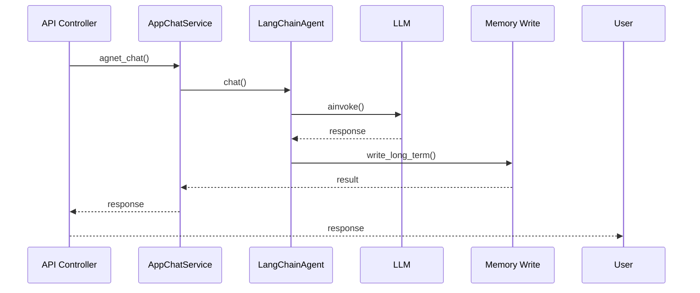
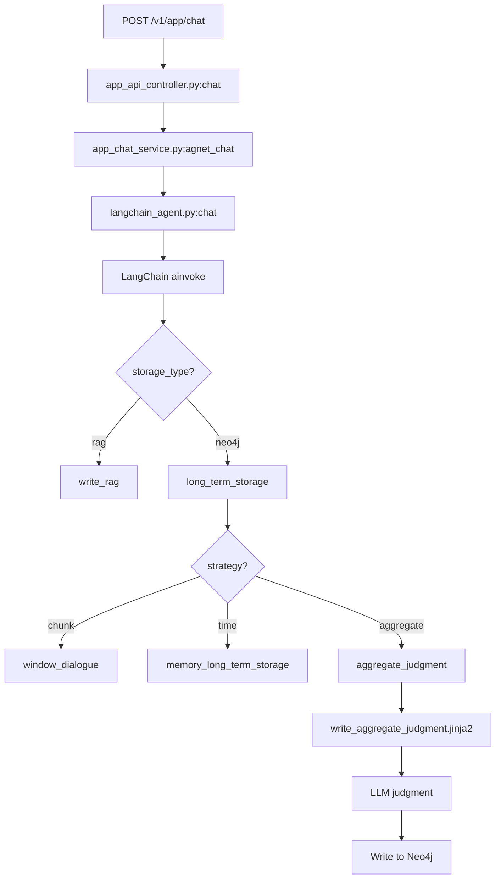
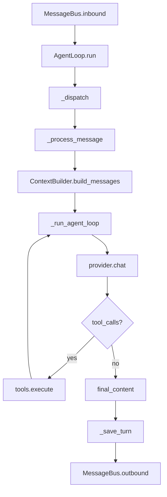

# GitHub 项目研究方法论 - 毛线团研究法

**创建日期**：2026-02-28  
**提出者**：Eddy  
**应用场景**：GitHub 项目深度研究

---

## 🧶 核心比喻

> 把 GitHub 项目当作一个**毛线团**：
> - **毛线头** = 入口（API/CLI/Shell 脚本）
> - **毛线** = 调用链
> - **毛线团** = 完整项目结构

**研究原则**：
1. 找到线头（入口点）
2. 顺着线走（调用顺序）
3. 不跳跃（不随机阅读文件）
4. 记录路径（绘制流程图）

---

## 📋 研究流程

### 阶段 1：找线头（入口点识别）

**目标**：找到项目的入口点

**入口类型**：
| 类型 | 位置 | 示例 |
|------|------|------|
| **API 入口** | `app/controllers/`, `app/routes/` | `POST /v1/app/chat` |
| **CLI 入口** | `bin/`, `scripts/`, `__main__.py` | `python -m package` |
| **Shell 脚本** | `*.sh`, `Makefile`, `docker-compose.yml` | `./deploy.sh` |
| **Web 入口** | `web/src/`, `frontend/` | `App.tsx`, `main.vue` |

**查找命令**：
```bash
# API 路由
grep -r "@router.post\|@app.get\|APIRouter" app/

# CLI 入口
find . -name "__main__.py" -o -name "cli.py" -o -name "main.py"

# Shell 脚本
find . -name "*.sh" -o -name "Makefile"

# 入口配置
cat docker-compose.yml
cat package.json | jq ".main"
```

**MemoryBear 示例**：
```
入口：POST /v1/app/chat
位置：app/controllers/service/app_api_controller.py
函数：chat()
```

---

### 阶段 2：顺线走（调用链追踪）

**目标**：按调用顺序追踪代码执行路径

**追踪方法**：

#### 方法 1：函数调用搜索

```bash
# 搜索函数调用
grep -r "def chat(" app/
grep -r "await chat(" app/
grep -r "\.chat(" app/

# 搜索类方法调用
grep -r "LangChainAgent(" app/
grep -r "AppChatService(" app/
```

#### 方法 2：导入关系分析

```bash
# 查看导入
grep -r "from app.services import" app/
grep -r "import.*Service" app/

# 生成导入图
pyan3 *.py --uses --dot > imports.dot
```

#### 方法 3：日志追踪（如果有）

```bash
# 搜索日志输出
grep -r "logger.info" app/ | grep "chat"
grep -r "log.*request" app/
```

**MemoryBear 示例**：
```
1. API Controller: chat()
   ↓ (grep -r "app_chat_service")
2. AppChatService: agnet_chat()
   ↓ (grep -r "LangChainAgent")
3. LangChainAgent: chat()
   ↓ (grep -r "agent.ainvoke")
4. LangChain Agent: ainvoke()
   ↓ (grep -r "write_long_term")
5. Memory Write: write_long_term()
```

---

### 阶段 3：记路径（流程图绘制）

**目标**：可视化调用链

**工具**：
- Mermaid（Markdown 原生支持）
- Draw.io（复杂流程图）
- Excalidraw（手绘风格）

**Mermaid 示例**：


**记录内容**：
- 每个节点的函数名
- 参数传递
- 返回值
- 关键代码行号
- 使用的 prompt（如果有）

---

### 阶段 4：理结构（模块关系图）

**目标**：理解项目整体架构

**方法**：
1. **目录树分析**
   ```bash
   tree -L 3 -I '__pycache__|node_modules|.git'
   ```

2. **模块依赖图**
   ```bash
   pyan3 *.py --uses --dot > modules.dot
   ```

3. **数据流分析**
   - 数据库表关系
   - 缓存使用位置
   - 外部服务调用

**MemoryBear 示例**：
```
app/
├── controllers/        # API 入口（线头）
│   └── service/
│       └── app_api_controller.py
├── services/           # 业务逻辑（主线）
│   └── app_chat_service.py
├── core/               # 核心引擎（关键模块）
│   ├── agent/
│   │   └── langchain_agent.py
│   ├── memory/
│   │   └── agent/langgraph_graph/
│   └── tools/
├── models/             # 数据模型
└── repositories/       # 数据访问
```

---

## 🎯 应用案例

### 案例 1：MemoryBear 记忆写入流程

**线头**：`POST /v1/app/chat`

**顺线追踪**：
```
1. app_api_controller.py:chat()
   - 第 119 行：@router.post("/chat")
   - 第 158 行：app_chat_service.agnet_chat()

2. app_chat_service.py:agnet_chat()
   - 第 39 行：函数定义
   - 第 172 行：LangChainAgent(...)
   - 第 201 行：agent.chat()

3. langchain_agent.py:chat()
   - 第 194 行：函数定义
   - 第 267 行：agent.ainvoke()
   - 第 280 行：write_long_term()

4. write_graph.py:write_long_term()
   - 第 68 行：函数定义
   - 第 73 行：if storage_type == 'rag'
   - 第 78 行：long_term_storage()

5. write_router.py:long_term_storage()
   - 第 134 行：window_dialogue()
   - 第 159 行：memory_long_term_storage()
   - 第 176 行：aggregate_judgment()

6. write_router.py:aggregate_judgment()
   - 第 198 行：template_service.render_template()
   - 第 203 行：write_aggregate_judgment.jinja2
```

**绘制流程图**：


**记录 Prompt 使用**：
- `write_aggregate_judgment.jinja2` - 记忆去重判断
- `summary_prompt.jinja2` - 记忆检索总结

---

### 案例 2：nanobot Agent 循环

**线头**：`MessageBus.inbound`

**顺线追踪**：
```
1. agent/loop.py:run()
   - 第 247 行：while self._running
   - 第 251 行：await self.bus.consume_inbound()
   - 第 263 行：asyncio.create_task(self._dispatch())

2. agent/loop.py:_dispatch()
   - 第 284 行：async with self._processing_lock
   - 第 287 行：await self._process_message()

3. agent/loop.py:_process_message()
   - 第 304 行：函数定义
   - 第 397 行：build_messages()
   - 第 419 行：_run_agent_loop()

4. agent/loop.py:_run_agent_loop()
   - 第 191 行：while iteration < max_iterations
   - 第 196 行：await provider.chat()
   - 第 204 行：if response.has_tool_calls
   - 第 226 行：await tools.execute()
```

**绘制流程图**：


---

## 📊 研究产出模板

### 文档结构

```markdown
# [项目名] - [研究主题]

## 🧶 入口点（线头）

- **类型**：API/CLI/Shell
- **位置**：`path/to/file.py`
- **函数**：`function_name()`
- **代码行**：第 X 行

## 📋 调用链（顺线）

```
1. file1.py:function1()
   ↓ (grep -r "function2")
2. file2.py:function2()
   ↓ (grep -r "function3")
3. file3.py:function3()
```

## 📊 流程图（路径）


## 📁 模块关系

```
project/
├── module1/
├── module2/
└── module3/
```

## 🔑 关键发现

1. ...
2. ...

## 📝 待研究分支

- [ ] 分支 1：...
- [ ] 分支 2：...
```

---

## 🛠️ 工具清单

### 代码搜索

| 工具 | 用途 | 命令示例 |
|------|------|---------|
| **grep** | 文本搜索 | `grep -r "def chat" app/` |
| **ripgrep (rg)** | 快速 grep | `rg "function_name"` |
| **astgrep** | AST 搜索 | `astgrep --pattern 'function()'` |

### 依赖分析

| 工具 | 用途 | 命令示例 |
|------|------|---------|
| **pyan3** | Python 依赖图 | `pyan3 *.py --uses --dot` |
| **importlab** | 导入分析 | `importlab main.py` |
| **pydeps** | 模块依赖 | `pydeps module --show-deps` |

### 可视化

| 工具 | 用途 | 输出格式 |
|------|------|---------|
| **Mermaid** | Markdown 流程图 | PNG/SVG |
| **Graphviz** | 复杂关系图 | PNG/SVG/PDF |
| **Excalidraw** | 手绘风格 | PNG/SVG |

### 日志分析

| 工具 | 用途 | 命令示例 |
|------|------|---------|
| **lnav** | 日志查看 | `lnav logs/*.log` |
| **jq** | JSON 日志 | `cat log.jsonl \| jq '.'` |

---

## ✅ 检查清单

### 研究前准备

- [ ] 克隆项目到本地
- [ ] 安装依赖
- [ ] 运行项目（如果可能）
- [ ] 准备搜索工具（grep/rg/pyan3）

### 研究中执行

- [ ] 找到入口点（线头）
- [ ] 追踪调用链（顺线）
- [ ] 绘制流程图（路径）
- [ ] 记录关键代码位置
- [ ] 记录使用的 prompt（如果有）

### 研究后整理

- [ ] 整理文档结构
- [ ] 验证所有代码位置
- [ ] 补充待研究分支
- [ ] 提交到 GitHub
- [ ] 同步到 Obsidian

---

## 📚 参考资源

### 代码理解

- [Reading Code Without Running It](https://jvns.ca/blog/2024/01/15/reading-code/)
- [How to Read Code](https://github.com/remoteinterview/code-reading-guide)

### 工具使用

- [ripgrep 使用指南](https://github.com/BurntSushi/ripgrep)
- [pyan3 文档](https://github.com/techtonik/pyan)
- [Mermaid 语法](https://mermaid.js.org/)

---

## 🎯 未来应用计划

### MemoryBear 后续研究

- [ ] 以 RAG 检索为入口，追踪检索流程
- [ ] 以工具系统为入口，追踪工具执行
- [ ] 以工作流引擎为入口，追踪工作流编排

### 下一个项目：langchain

- [ ] 找到入口：`langchain/chains/`
- [ ] 追踪调用链：Chain → LLM → Output
- [ ] 绘制流程图
- [ ] 记录 Prompt 使用

### 下一个项目：llama_index

- [ ] 找到入口：`llama_index/core/`
- [ ] 追踪调用链：QueryEngine → Retriever → Response
- [ ] 绘制流程图
- [ ] 记录索引策略

---

**创建人**：Jarvis  
**日期**：2026-02-28  
**状态**：✅ 已完成  
**应用项目**：MemoryBear, nanobot
