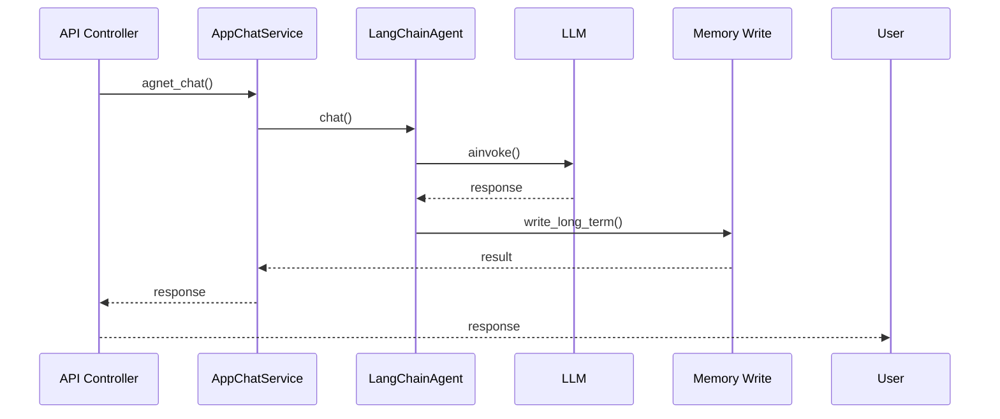

# 毛线团研究法（Yarn Ball Method）

**创建日期**：2026-02-28  
**提出者**：Eddy  
**应用项目**：MemoryBear, nanobot, MarkItDown  
**研究文档**：24 篇，~400KB

---

## 🧶 核心理念

> 把 GitHub 项目当作一个**毛线团**：
> - **毛线头** = 入口（CLI/API/Shell 脚本）
> - **毛线** = 调用链
> - **毛线团** = 完整项目结构

**研究原则**：
1. ✅ 系统性：不随机阅读，按调用顺序
2. ✅ 可追溯：每个结论都有代码位置
3. ✅ 可视化：流程图清晰展示
4. ✅ 无推断：所有结论基于实际代码

---

## 📋 四步流程

### 阶段 1：找线头（入口点识别）

**目标**：找到项目的入口点

**入口类型**：
| 类型 | 位置 | 示例 |
|------|------|------|
| **API 入口** | `app/controllers/`, `app/routes/` | `POST /v1/app/chat` |
| **CLI 入口** | `bin/`, `scripts/`, `__main__.py` | `python -m package` |
| **Shell 脚本** | `*.sh`, `Makefile`, `docker-compose.yml` | `./deploy.sh` |
| **Web 入口** | `web/src/`, `frontend/` | `App.tsx`, `main.vue` |

**查找命令**：
```bash
# API 路由
grep -r "@router.post\|@app.get\|APIRouter" app/

# CLI 入口
find . -name "__main__.py" -o -name "cli.py" -o -name "main.py"

# Shell 脚本
find . -name "*.sh" -o -name "Makefile"

# 入口配置
cat docker-compose.yml
cat package.json | jq ".main"
```

**MemoryBear 示例**：
```
入口：POST /v1/app/chat
位置：app/controllers/service/app_api_controller.py
函数：chat()
```

**nanobot 示例**：
```
入口：nanobot agent -m "Hello"
位置：nanobot/cli/commands.py
函数：agent()
```

**MarkItDown 示例**：
```
入口：markitdown path-to-file.pdf
位置：packages/markitdown/src/markitdown/_markitdown.py
函数：convert()
```

---

### 阶段 2：顺线走（调用链追踪）

**目标**：按调用顺序追踪代码执行路径

**追踪方法**：

#### 方法 1：函数调用搜索

```bash
# 搜索函数调用
grep -r "def chat(" app/
grep -r "await chat(" app/
grep -r "\.chat(" app/

# 搜索类方法调用
grep -r "LangChainAgent(" app/
grep -r "AppChatService(" app/
```

#### 方法 2：导入关系分析

```bash
# 查看导入
grep -r "from app.services import" app/
grep -r "import.*Service" app/

# 生成导入图
pyan3 *.py --uses --dot > imports.dot
```

#### 方法 3：日志追踪（如果有）

```bash
# 搜索日志输出
grep -r "logger.info" app/ | grep "chat"
grep -r "log.*request" app/
```

**MemoryBear 调用链**：
```
1. API Controller: chat()
   ↓ (grep -r "app_chat_service")
2. AppChatService: agnet_chat()
   ↓ (grep -r "LangChainAgent")
3. LangChainAgent: chat()
   ↓ (grep -r "agent.ainvoke")
4. LangChain Agent: ainvoke()
   ↓ (grep -r "write_long_term")
5. Memory Write: write_long_term()
```

**nanobot 调用链**：
```
1. CLI: agent()
   ↓ (grep -r "publish_message")
2. Channel: publish_message()
   ↓ (grep -r "consume_inbound")
3. MessageBus: consume_inbound()
   ↓ (grep -r "_process_message")
4. AgentLoop: _process_message()
   ↓ (grep -r "_run_agent_loop")
5. AgentLoop: _run_agent_loop()
```

**MarkItDown 调用链**：
```
1. CLI: convert()
   ↓ (grep -r "convert_local")
2. MarkItDown: convert_local()
   ↓ (grep -r "convert_stream")
3. MarkItDown: convert_stream()
   ↓ (grep -r "accepts")
4. Converter: accepts()
   ↓ (grep -r "convert")
5. Converter: convert()
```

---

### 阶段 3：记路径（流程图绘制）

**目标**：可视化调用链

**工具**：
- Mermaid（Markdown 原生支持）
- Draw.io（复杂流程图）
- Excalidraw（手绘风格）

**Mermaid 示例**：


**记录内容**：
- 每个节点的函数名
- 参数传递
- 返回值
- 关键代码行号
- 使用的 prompt（如果有）

---

### 阶段 4：理结构（模块关系图）

**目标**：理解项目整体架构

**方法**：
1. **目录树分析**
   ```bash
   tree -L 3 -I '__pycache__|node_modules|.git'
   ```

2. **模块依赖图**
   ```bash
   pyan3 *.py --uses --dot > modules.dot
   ```

3. **数据流分析**
   - 数据库表关系
   - 缓存使用位置
   - 外部服务调用

**MemoryBear 模块结构**：
```
app/
├── controllers/        # API 入口（线头）
│   └── service/
│       └── app_api_controller.py
├── services/           # 业务逻辑（主线）
│   └── app_chat_service.py
├── core/               # 核心引擎（关键模块）
│   ├── agent/
│   │   └── langchain_agent.py
│   ├── memory/
│   │   └── agent/langgraph_graph/
│   └── tools/
├── models/             # 数据模型
└── repositories/       # 数据访问
```

**nanobot 模块结构**：
```
nanobot/
├── agent/              # Agent 核心
│   ├── loop.py        # Agent 循环
│   ├── context.py     # 上下文构建
│   └── memory.py      # 记忆系统
├── channels/           # 多平台集成
├── bus/                # 消息总线
└── providers/          # LLM 适配
```

**MarkItDown 模块结构**：
```
packages/markitdown/src/markitdown/
├── _markitdown.py      # 核心类
├── _base_converter.py  # 抽象基类
├── converters/         # 25+ 个转换器
│   ├── _pdf_converter.py
│   ├── _docx_converter.py
│   └── ...
└── tests/              # 测试用例
```

---

## 📊 研究产出模板

### 文档结构

```markdown
# [项目名] - [研究主题]

## 🧶 入口点（线头）

- **类型**：API/CLI/Shell
- **位置**：`path/to/file.py`
- **函数**：`function_name()`
- **代码行**：第 X 行

## 📋 调用链（顺线）

```
1. file1.py:function1()
   ↓ (grep -r "function2")
2. file2.py:function2()
   ↓ (grep -r "function3")
3. file3.py:function3()
```

## 📊 流程图（路径）


## 📁 模块关系

```
project/
├── module1/
├── module2/
└── module3/
```

## 🔑 关键发现

1. ...
2. ...

## 📝 待研究分支

- [ ] 分支 1：...
- [ ] 分支 2：...
```

---

## 🛠️ 工具清单

### 代码搜索

| 工具 | 用途 | 命令示例 |
|------|------|---------|
| **grep** | 文本搜索 | `grep -r "def chat" app/` |
| **ripgrep (rg)** | 快速 grep | `rg "function_name"` |
| **astgrep** | AST 搜索 | `astgrep --pattern 'function()'` |

### 依赖分析

| 工具 | 用途 | 命令示例 |
|------|------|---------|
| **pyan3** | Python 依赖图 | `pyan3 *.py --uses --dot` |
| **importlab** | 导入分析 | `importlab main.py` |
| **pydeps** | 模块依赖 | `pydeps module --show-deps` |

### 可视化

| 工具 | 用途 | 输出格式 |
|------|------|---------|
| **Mermaid** | Markdown 流程图 | PNG/SVG |
| **Graphviz** | 复杂关系图 | PNG/SVG/PDF |
| **Excalidraw** | 手绘风格 | PNG/SVG |

### 日志分析

| 工具 | 用途 | 命令示例 |
|------|------|---------|
| **lnav** | 日志查看 | `lnav logs/*.log` |
| **jq** | JSON 日志 | `cat log.jsonl \| jq '.'` |

---

## ✅ 检查清单

### 研究前准备

- [ ] 克隆项目到本地
- [ ] 安装依赖
- [ ] 运行项目（如果可能）
- [ ] 准备搜索工具（grep/rg/pyan3）

### 研究中执行

- [ ] 找到入口点（线头）
- [ ] 追踪调用链（顺线）
- [ ] 绘制流程图（路径）
- [ ] 记录关键代码位置
- [ ] 记录使用的 prompt（如果有）

### 研究后整理

- [ ] 整理文档结构
- [ ] 验证所有代码位置
- [ ] 补充待研究分支
- [ ] 提交到 GitHub
- [ ] 同步到 Obsidian

---

## 📚 参考资源

### 代码理解

- [Reading Code Without Running It](https://jvns.ca/blog/2024/01/15/reading-code/)
- [How to Read Code](https://github.com/remoteinterview/code-reading-guide)

### 工具使用

- [ripgrep 使用指南](https://github.com/BurntSushi/ripgrep)
- [pyan3 文档](https://github.com/techtonik/pyan)
- [Mermaid 语法](https://mermaid.js.org/)

---

## 🎯 应用案例

### MemoryBear 研究

**入口点**：`POST /v1/app/chat`  
**调用链**：API → Service → Agent → Memory  
**核心发现**：
- 三层记忆架构（Neo4j+RAG+Redis）
- ACT-R 遗忘曲线实现
- 自我反思引擎

**研究文档**：9 篇，169KB

---

### nanobot 研究

**入口点**：`nanobot agent -m "Hello"`  
**调用链**：CLI → Channel → Agent → Provider  
**核心发现**：
- 极简 Agent Loop（~700 行）
- 双层记忆系统（MEMORY.md + HISTORY.md）
- 11 个 Channels 开箱即用

**研究文档**：11 篇，198KB

---

### MarkItDown 研究

**入口点**：`markitdown path-to-file.pdf`  
**调用链**：CLI → Core → Converters → Libs  
**核心发现**：
- 责任链模式 + 策略模式
- 25+ 个转换器
- 流式处理（无临时文件）

**研究文档**：3 篇，44KB

---

## 📝 更新日志

| 日期 | 更新内容 |
|------|---------|
| 2026-02-28 | 创建毛线团研究法文档 |
| 2026-02-28 | 应用于 MemoryBear 研究 |
| 2026-02-28 | 应用于 nanobot 研究 |
| 2026-02-28 | 应用于 MarkItDown 研究 |

---

**研究方法**：✅ **已验证**  
**应用项目**：3 个（MemoryBear, nanobot, MarkItDown）  
**研究文档**：24 篇，~400KB

**提出者**：Eddy  
**实施者**：Jarvis  
**日期**：2026-02-28
