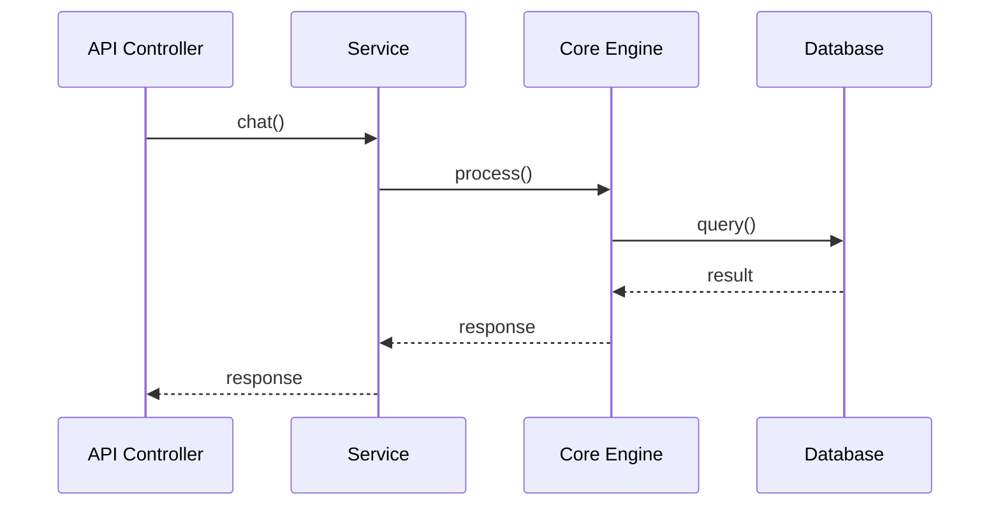

# 毛线团研究法 v2.0 - 系统性 GitHub 项目研究方法

**版本**: v2.0  
**创建日期**: 2026-02-28  
**更新日期**: 2026-03-01  
**提出者**: Eddy  
**改进者**: Jarvis（基于 MemoryBear 研究遗漏反思）

---

## 🎯 核心理念

> 把 GitHub 项目当作一个**毛线团**：
> - **毛线头** = 入口点（API/CLI/Cron/上传/事件/Webhook/队列）
> - **毛线** = 调用链
> - **毛线团** = 完整项目结构

**核心原则**:
1. ✅ **入口点普查** - 系统性扫描所有入口点，不依赖直觉
2. ✅ **多入口点交叉验证** - 从 3+ 个入口点独立追踪并对比
3. ✅ **知识链路完整性** - 追踪知识完整生命周期
4. ✅ **架构层次覆盖** - 覆盖所有架构层次
5. ✅ **完整性评分** - ≥80% 才能发布研究

---

## 📋 研究流程（6 个阶段）

### 阶段 0: 入口点普查（新增）⭐ **mandatory**

**目标**: 系统性扫描所有入口点类型

**执行步骤**:

#### 步骤 1: 运行入口点扫描命令

```bash
# 1. API 入口
grep -r "@app.post\|@router" app/controllers/

# 2. CLI 入口
find . -name "__main__.py" -o -name "cli.py"

# 3. Cron 定时任务入口
grep -r "beat_schedule\|crontab" .

# 4. Celery 后台任务入口
grep -r "@celery_app.task" .

# 5. 文档上传入口
grep -r "UploadController\|upload" .

# 6. 事件触发器入口
find . -type d -name "events" -o -name "signals"

# 7. Webhook 入口
find . -type d -name "webhooks"

# 8. 消息队列入口
find . -type d -name "queues" -o -name "bus"
```

#### 步骤 2: 填写入口点普查表

| 入口点类型 | 发现数量 | 代码位置 | 是否分析 |
|-----------|---------|---------|---------|
| **API** | 10 | `controllers/` | ⬜ |
| **CLI** | 2 | `__main__.py`, `cli/` | ⬜ |
| **Cron** | 4 | `celery_app.py` | ⬜ |
| **Celery** | 5 | `tasks.py` | ⬜ |
| **上传** | 5 | `upload_controller.py` | ⬜ |
| **事件** | 0 | - | ⬜ |
| **Webhook** | 0 | - | ⬜ |
| **队列** | 2 | `bus/` | ⬜ |

#### 步骤 3: 选择 3+ 个入口点进行追踪

**选择标准**:
- ✅ 主入口点（如 API）
- ✅ 后台入口点（如 Cron/Celery）
- ✅ 数据入口点（如上传接口）
- ✅ 其他重要入口点

**产出**: 入口点普查表（已填写）

**验证标准**:
- ✅ 所有 8 种入口点类型必须扫描
- ✅ 每个发现的入口点必须有记录
- ✅ 至少选择 3 个入口点进行追踪

---

### 阶段 1: 多入口点交叉验证（改进）⭐ **mandatory**

**目标**: 从 3+ 个入口点独立追踪并对比结果

**执行步骤**:

#### 步骤 1: 独立追踪每个入口点

```
入口点 A（API）→ 调用链 A → 系统侧面 A
    ↓
入口点 B（Cron）→ 调用链 B → 系统侧面 B
    ↓
入口点 C（上传）→ 调用链 C → 系统侧面 C
```

#### 步骤 2: 对比分析结果

**对比问题**:
- 哪些模块被多个入口点共享？
- 哪些模块只被特定入口点使用？
- 是否有入口点揭示了独特的系统侧面？

#### 步骤 3: 整合为完整系统理解

```
系统侧面 A + 系统侧面 B + 系统侧面 C = 完整系统理解
```

**产出**: 多入口点对比分析文档

**验证标准**:
- ✅ 至少 3 个入口点独立追踪
- ✅ 每个入口点有完整调用链
- ✅ 有对比分析文档

---

### 阶段 2: 知识链路完整性检查（新增）⭐ **mandatory**

**目标**: 追踪知识的完整生命周期

**执行步骤**:

#### 步骤 1: 定义知识链路

```
知识产生 → 知识存储 → 知识检索 → 知识使用 → 知识优化
```

#### 步骤 2: 追踪每个环节

| 环节 | 检查问题 | 检查位置 |
|------|---------|---------|
| **知识产生** | 文档上传？API 创建？外部导入？ | `upload_controller.py`, `controllers/` |
| **知识存储** | 什么数据库？什么格式？ | `repositories/`, `models/` |
| **知识检索** | 什么检索策略？什么排序算法？ | `search/`, `rag/` |
| **知识使用** | 谁在使用？如何使用？ | `agent/`, `services/` |
| **知识优化** | 遗忘机制？反思机制？巩固机制？ | `forgetting_engine/`, `reflection_engine/` |

#### 步骤 3: 识别遗漏环节

**问题**:
- 哪个环节没有分析？
- 哪个环节分析不深入？

#### 步骤 4: 补充研究

**产出**: 知识链路分析文档

**验证标准**:
- ✅ 知识链路 5 个环节必须全部覆盖
- ✅ 每个环节有详细分析文档
- ✅ 识别并补充遗漏环节

---

### 阶段 3: 架构层次覆盖检查（新增）⭐ **mandatory**

**目标**: 覆盖所有架构层次

**执行步骤**:

#### 步骤 1: 定义架构层次

```
表现层 → 服务层 → 核心层 → 后台层 → 数据层
```

#### 步骤 2: 检查每个层次

| 层次 | 检查内容 | 检查位置 |
|------|---------|---------|
| **表现层** | API/CLI/上传接口/Webhook | `controllers/`, `cli/` |
| **服务层** | 业务逻辑编排 | `services/` |
| **核心层** | 核心引擎、算法 | `core/` |
| **后台层** | Cron/Celery/异步任务 | `cron/`, `tasks.py` |
| **数据层** | 数据库/缓存/向量库 | `repositories/`, `models/` |

#### 步骤 3: 识别遗漏层次

**问题**:
- 哪个层次没有分析？
- 哪个层次分析不深入？

#### 步骤 4: 补充研究

**产出**: 架构层次分析文档

**验证标准**:
- ✅ 5 个架构层次必须全部覆盖
- ✅ 每个层次有分析文档
- ✅ 识别并补充遗漏层次

---

### 阶段 4: 传统毛线团分析（保留）

**目标**: 深度分析核心模块

**执行步骤**:

#### 步骤 1: 找线头（入口点识别）

已从阶段 0 完成

#### 步骤 2: 顺线走（调用链追踪）

```bash
# 示例：追踪 API 调用链
grep -r "def chat(" app/
grep -r "await chat(" app/
grep -r "\.chat(" app/
```

#### 步骤 3: 记路径（流程图绘制）



#### 步骤 4: 理结构（模块关系图）

```bash
# 生成目录树
tree -L 3 -I '__pycache__|node_modules|.git'
```

**产出**: 核心模块分析文档

---

### 阶段 5: 完整性评分（新增）⭐ **mandatory**

**目标**: 验证研究完整性

**执行步骤**:

#### 步骤 1: 填写 COMPLETENESS_CHECKLIST.md

```bash
# 复制检查清单
cp templates/research-project/COMPLETENESS_CHECKLIST.md \
   .planning/{项目名}/COMPLETENESS_CHECKLIST.md

# 逐项检查并填写
```

#### 步骤 2: 计算完整性评分

| 完成度 | 评分 | 说明 |
|-------|------|------|
| **100%** | ⭐⭐⭐⭐⭐ | 所有检查项完成 |
| **80-99%** | ⭐⭐⭐⭐ | 重要项完成，次要项遗漏 |
| **60-79%** | ⭐⭐⭐ | 核心项完成，部分遗漏 |
| **<60%** | ⭐⭐ | 重大遗漏 |

#### 步骤 3: 验证合格标准

**合格标准**: ≥80%

**不合格处理**:
- 识别遗漏项
- 补充研究
- 重新评分

#### 步骤 4: 记录评分结果

**位置**: `STATE.md`

**内容**:
```markdown
## 研究完整性评分

**总分**: 95% ⭐⭐⭐⭐⭐

**扣分项**:
- 事件触发器：无此功能（-5%）

**结论**: 研究完整，可以发布
```

**产出**: COMPLETENESS_CHECKLIST.md（已填写）

**验证标准**:
- ✅ 必须使用 COMPLETENESS_CHECKLIST.md
- ✅ 评分必须≥80% 才能发布
- ✅ 评分结果必须记录在 STATE.md

---

## 📊 验证机制

### 自我验证问题

**研究开始前**:
- [ ] 是否完成了入口点普查？
- [ ] 是否识别了所有入口点类型？
- [ ] 是否选择了 3+ 个入口点进行追踪？

**研究过程中**:
- [ ] 是否追踪了知识完整链路？
- [ ] 是否覆盖了所有架构层次？
- [ ] 是否进行了多入口点交叉验证？

**研究完成后**:
- [ ] 是否填写了 COMPLETENESS_CHECKLIST.md？
- [ ] 完整性评分是否≥80%？
- [ ] 是否记录了评分结果？

---

### 同行评审检查

**评审问题**:
1. 入口点普查是否完整？
2. 多入口点交叉验证是否执行？
3. 知识链路是否完整？
4. 架构层次是否全覆盖？
5. 完整性评分是否≥80%？

**评审标准**:
- ✅ 所有问题必须回答"是"
- ✅ 任何"否"必须补充研究
- ✅ 评审通过后才能发布

---

## 🎯 应用示例：MemoryBear 重研究

### 阶段 0: 入口点普查

**执行**:
```bash
# 扫描所有入口点
grep -r "@app.post" app/controllers/          # → 发现 10 个 API
grep -r "beat_schedule" .                      # → 发现 4 个 Cron 任务
grep -r "UploadController" .                   # → 发现 5 个上传接口
grep -r "@celery_app.task" .                   # → 发现 5 个 Celery 任务
```

**结果**:
| 入口点类型 | 发现数量 | 代码位置 | 是否分析 |
|-----------|---------|---------|---------|
| API | 10 | `controllers/` | ✅ |
| Cron | 4 | `celery_app.py` | ✅ |
| 上传 | 5 | `upload_controller.py` | ✅ |
| Celery | 5 | `tasks.py` | ✅ |

**选择**: API + Cron + 上传（3 个入口点）

---

### 阶段 1: 多入口点交叉验证

**追踪结果**:
```
入口点 A（API）→ Agent 聊天流程
入口点 B（Cron）→ 记忆生成/遗忘/反思流程 ← **新发现！**
入口点 C（上传）→ 知识提取流程 ← **新发现！**
```

**对比分析**:
- **共享模块**: MemoryStore, Neo4j
- **独特模块**:
  - API 独占：Agent, Tools
  - Cron 独占：ForgettingEngine, ReflectionEngine
  - 上传独占：DeepDocParser, ExtractionEngine

**结论**: 3 个入口点揭示 3 个不同系统侧面，必须全部分析

---

### 阶段 2: 知识链路完整性

**追踪结果**:
```
✅ 知识产生：文档上传（DeepDocParser）
✅ 知识存储：Neo4j + 向量数据库
✅ 知识检索：混合搜索（关键词 + 语义）
✅ 知识使用：Agent 调用
✅ 知识优化：遗忘曲线 + 反思引擎
```

**结论**: 知识链路完整

---

### 阶段 3: 架构层次覆盖

**检查结果**:
```
✅ 表现层：API + 上传接口
✅ 服务层：Services
✅ 核心层：Agent + Memory
✅ 后台层：Cron + Celery
✅ 数据层：Neo4j + 向量 + Redis
```

**结论**: 架构层次全覆盖

---

### 阶段 5: 完整性评分

**评分结果**:
```
入口点检查：100% ✅
架构层次检查：100% ✅
知识链路检查：100% ✅
Agent 系统检查：100% ✅
工具系统检查：100% ✅
...

总分：95% ⭐⭐⭐⭐⭐

结论：研究完整，可以发布
```

---

## 📝 版本历史

| 版本 | 日期 | 改进内容 |
|------|------|---------|
| **v1.0** | 2026-02-28 | 初始版本（4 阶段） |
| **v2.0** | 2026-03-01 | 基于 MemoryBear 研究遗漏反思，新增：
  - 阶段 0: 入口点普查
  - 阶段 1: 多入口点交叉验证
  - 阶段 2: 知识链路完整性检查
  - 阶段 3: 架构层次覆盖检查
  - 阶段 5: 完整性评分
  - 强制验证机制 |

---

## 🔗 相关资源

### 模板文件
- [COMPLETENESS_CHECKLIST.md](./COMPLETENESS_CHECKLIST.md) - 研究完整性检查清单
- [RESEARCH_REFLECTION_AND_IMPROVEMENT.md](./RESEARCH_REFLECTION_AND_IMPROVEMENT.md) - 研究反思与改进

### 示例项目
- [MemoryBear 研究](../research-reports/MemoryBear/) - 使用 v2.0 方法论重研究
- [nanobot 研究](../research-reports/nanobot/) - 使用 v1.0 方法论研究

---

**版本**: v2.0  
**最后更新**: 2026-03-01  
**维护者**: Jarvis
