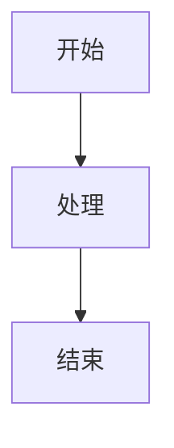

# 对比报告文档规范

> 自动创建 GitHub 项目对比报告的标准流程

**版本**：1.0  
**生效日期**：2026-02-28

---

## 📁 目录结构规范

### 标准结构

```
GitHub/comparison/
└── <项目 A> vs <项目 B>/
    ├── README.md              # 对比总览（可选）
    ├── Agent 运行步骤对比.md  # 核心流程对比
    ├── 架构设计对比.md        # 架构差异
    ├── 性能对比.md           # 基准测试
    └── 适用场景对比.md        # 场景推荐
```

### 命名规则

| 元素 | 格式 | 示例 |
|------|------|------|
| **对比目录** | `<项目 A> vs <项目 B>` | `nanobot vs MemoryBear` |
| **对比报告** | `<维度> 对比.md` | `Agent 运行步骤对比.md` |
| **项目名** | 使用 GitHub 仓库名 | `nanobot`, `MemoryBear` |

### 空格处理

- 目录名中的空格：使用实际空格（非 URL 编码）
- Git 提交时：自动处理
- Obsidian 链接：使用`[[链接\|文本]]`格式

---

## 📝 文档内容规范

### 必备章节

每个对比报告应包含：

1. **核心差异概览** - 表格形式
2. **架构对比** - 架构图 + 模块说明
3. **运行流程对比** - 流程图 + 步骤耗时
4. **关键代码对比** - 源码链接
5. **性能指标对比** - 数据对比
6. **适用场景对比** - 推荐表

### 源码引用格式

**行内引用**：
```markdown
[`Agent._run_agent_loop()`](https://github.com/HKUDS/nanobot/blob/main/nanobot/agent/loop.py#L191-L236)
```

**代码块引用**：
```python
# 来源：https://github.com/HKUDS/nanobot/blob/main/nanobot/agent/loop.py#L191-L236
async def _run_agent_loop(self, messages):
    while iteration < max_iterations:
        response = await provider.chat(messages, tools)
```

### 流程图格式

使用 Mermaid 语法：



### 表格格式

```markdown
| 维度 | 项目 A | 项目 B | 差异倍数 |
|------|--------|--------|---------|
| **响应延迟** | 600ms | 1,280ms | 2.1x |
| **准确性** | 70% | 75% | +7% |
```

---

## 🔄 创建流程

### 自动触发条件

当满足以下条件时，自动创建对比报告：

1. ✅ 已完成项目 A 的分析报告
2. ✅ 已完成项目 B 的分析报告
3. ✅ 两个项目属于同类型（Agent/RAG/Workflow）

### 创建步骤

#### 步骤 1：创建目录

```bash
mkdir -p "GitHub/comparison/<项目 A> vs <项目 B>"
```

#### 步骤 2：创建对比文档

```bash
# 复制模板
cp "GitHub/对比报告模板.md" "GitHub/comparison/<项目 A> vs <项目 B>/对比总览.md"
```

#### 步骤 3：填写内容

从两个项目的分析报告中提取：

- 核心差异
- 架构图
- 运行流程
- 性能数据
- 源码链接

#### 步骤 4：同步到 Obsidian

```bash
cp -R "GitHub/comparison/" "Obsidian/GitHub/comparison/"
```

#### 步骤 5：提交到 GitHub

```bash
cd ai-knowledge-base
git add .
git commit -m "添加对比报告：<项目 A> vs <项目 B>"
git push
```

---

## 📊 对比维度清单

### 必选维度

| 维度 | 说明 | 数据来源 |
|------|------|---------|
| **核心差异概览** | 一句话差异 + 关键指标 | 两个分析报告 |
| **Agent 运行步骤** | 完整流程对比 | 源码分析 |
| **适用场景** | 推荐场景表 | 项目定位 |

### 可选维度

| 维度 | 说明 | 何时使用 |
|------|------|---------|
| **架构设计** | 架构图 + 模块对比 | 架构差异大时 |
| **性能对比** | 基准测试数据 | 有实验数据时 |
| **代码质量** | 测试覆盖率、文档完整度 | 需要深度对比时 |
| **生态对比** | 社区、插件、扩展 | 开源项目对比时 |

---

## 🔗 链接规范

### 内部链接（Obsidian）

**格式**：
```markdown
[[../项目 A/分析报告\|项目 A 分析]]
[[../项目 B/分析报告\|项目 B 分析]]
```

### 外部链接（GitHub）

**格式**：
```markdown
[项目 A](https://github.com/用户/项目 A)
[项目 B](https://github.com/用户/项目 B)
```

### 源码链接

**格式**：
```markdown
[`函数名`](https://github.com/用户/项目/blob/分支/路径/文件.py#L 起始-L 结束)
```

---

## ✅ 检查清单

### 创建对比报告前

- [ ] 项目 A 分析报告已完成
- [ ] 项目 B 分析报告已完成
- [ ] 两个项目属于同类型
- [ ] 已提取关键差异点

### 创建对比报告后

- [ ] 核心差异概览表已填写
- [ ] 运行流程图已绘制
- [ ] 源码链接已添加
- [ ] 性能数据已对比
- [ ] 适用场景推荐已填写
- [ ] 同步到 Obsidian
- [ ] 提交到 GitHub

### 文档质量检查

- [ ] 所有源码链接可点击
- [ ] 流程图渲染正常
- [ ] 表格格式正确
- [ ] 内部链接有效
- [ ] 外部链接有效

---

## 📝 更新维护

### 更新触发条件

- 项目 A 或 B 有重大更新
- 发现新的对比维度
- 收到用户反馈需要补充

### 更新流程

1. 记录更新日期和原因
2. 更新对比内容
3. 更新更新日志
4. 重新同步和提交

---

## 🎯 最佳实践

### 1. 对比维度选择

**优先对比**：
- 核心运行流程
- 架构设计差异
- 性能指标
- 适用场景

**可选对比**：
- 代码风格
- 文档质量
- 社区活跃度

### 2. 数据准确性

- 性能数据标注测试环境
- 代码量使用统一工具（cloc）
- 源码链接精确到行号

### 3. 客观中立

- 使用实验室数据而非主观评价
- 标注数据来源
- 说明测试条件

---

## 📋 模板文件

### 对比报告模板

```markdown
# <项目 A> vs <项目 B> - <对比维度>

**对比日期**：YYYY-MM-DD  
**项目 A**：[名称](GitHub 链接) - 定位描述  
**项目 B**：[名称](GitHub 链接) - 定位描述  
**对比维度**：具体对比维度

---

## 📊 核心差异概览

| 维度 | 项目 A | 项目 B | 差异倍数 |
|------|--------|--------|---------|
| ... | ... | ... | ... |

---

## 🏗️ 架构对比

### 项目 A 架构


### 项目 B 架构


---

## 🔄 运行流程对比

### 项目 A 流程

| 步骤 | 操作 | 耗时 | 源码 |
|------|------|------|------|
| 1 | ... | ...ms | [链接]() |

### 项目 B 流程

| 步骤 | 操作 | 耗时 | 源码 |
|------|------|------|------|
| 1 | ... | ...ms | [链接]() |

---

## 💡 核心差异详解

### 差异 1：XXX

**项目 A**：
```python
# 来源：URL
代码...
```

**项目 B**：
```python
# 来源：URL
代码...
```

---

## 📊 性能对比

| 指标 | 项目 A | 项目 B | 说明 |
|------|--------|--------|------|
| ... | ... | ... | ... |

---

## 🎯 适用场景

| 场景 | 项目 A | 项目 B | 推荐 |
|------|--------|--------|------|
| ... | ✅/⚠️/❌ | ✅/⚠️/❌ | ... |

---

## 🔗 相关文档

- [项目 A 分析报告](../项目 A/分析报告.md)
- [项目 B 分析报告](../项目 B/分析报告.md)

---

**对比人**：XXX  
**审核人**：XXX  
**最后更新**：YYYY-MM-DD
```

---

**版本**：1.0  
**创建日期**：2026-02-28  
**维护者**：Eddy  
**AI 助手**：Jarvis
