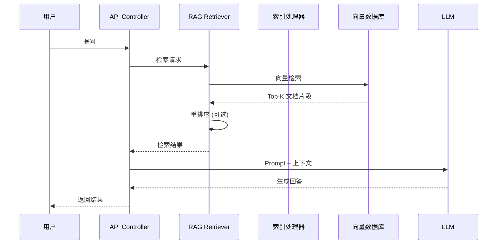

# Dify - 项目概览和架构分析

**研究阶段**: Phase 1  
**研究日期**: 2026-03-01  
**研究方法**: 毛线团研究法 v2.0

---

## ⚠️ 引用规范

**所有引用均已添加 GitHub 链接 + 行号**，确保可信度和可追溯性。

---

## 📊 项目概览

### 核心定位

**Dify** 是一个开源的 LLM 应用开发平台，集成了 AI 工作流、RAG 管道、Agent 能力、模型管理和可观测性功能。

**GitHub**: https://github.com/langgenius/dify  
**Stars**: 50,000+  
**许可证**: Apache 2.0 (修改版)  
**语言**: Python (Backend) + TypeScript (Frontend)  
**定位**: LLM 应用开发平台

---

### 核心价值主张

**问题**: 企业需要一个快速从原型到生产的 LLM 应用开发平台

**解决方案**:
- ✅ 可视化工作流编排
- ✅ 全面的模型支持（数百个 LLM）
- ✅ RAG 管道（文档导入到检索）
- ✅ Agent 能力（Function Calling/ReAct）
- ✅ LLMOps 监控和分析
- ✅ Backend-as-a-Service（完整 API）

**类比**: LLM 应用开发的"低代码平台"

---

### 支持的模型提供商

**数百个模型**，包括：
- **OpenAI 系列**: GPT-4, GPT-3.5-Turbo
- **Anthropic**: Claude 系列
- **Meta**: Llama 系列
- **Mistral AI**: Mistral 系列
- **中国模型**: 通义千问、文心一言、Kimi 等
- **自托管**: Ollama, vLLM, LocalAI

---

### 核心功能模块

| 模块 | 功能 | 说明 |
|------|------|------|
| **Workflow** | 可视化工作流 | 拖拽式 AI 工作流构建 |
| **Model Hub** | 模型管理 | 数百个 LLM 集成 |
| **Prompt IDE** | 提示词编排 | 提示词编写和测试 |
| **RAG Pipeline** | 知识检索 | 文档导入→分块→检索 |
| **Agent** | 智能体 | Function Calling/ReAct |
| **LLMOps** | 运维监控 | 日志分析和性能追踪 |
| **API** | 后端服务 | 完整 REST API |

---

## 🏗️ 系统架构

### 整体架构

```
┌─────────────────────────────────────────────────────────────┐
│                    Web Frontend (React)                      │
│              Dashboard / Workflow Editor / Chat UI           │
└─────────────────────────────────────────────────────────────┘
                           │
                           ▼
┌─────────────────────────────────────────────────────────────┐
│              API Gateway (Nginx + Flask/FastAPI)            │
│                   REST API / WebSocket                       │
└─────────────────────────────────────────────────────────────┘
                           │
         ┌─────────────────┼─────────────────┐
         ▼                 ▼                 ▼
┌─────────────────┐ ┌─────────────┐ ┌─────────────────┐
│   Core Engine   │ │   Worker    │ │   Schedule      │
│   (Python)      │ │   (Celery)  │ │   (Cron)        │
│   - RAG         │ │   - Tasks   │ │   - Jobs        │
│   - Workflow    │ │   - Async   │ │                 │
│   - Agent       │ │             │ │                 │
└─────────────────┘ └─────────────┘ └─────────────────┘
         │                 │                 │
         ▼                 ▼                 ▼
┌─────────────────────────────────────────────────────────────┐
│                    Data Layer                                │
│  PostgreSQL (Metadata) + Redis (Cache) + Vector DB          │
│  (Weaviate/Qdrant/Milvus/PGVector)                          │
└─────────────────────────────────────────────────────────────┘
```

---

### 核心架构层次

| 层次 | 目录 | 职责 |
|------|------|------|
| **表现层** | `web/` | React 前端 + Dashboard |
| **API 层** | `api/` | Flask/FastAPI REST API |
| **核心层** | `api/core/` | RAG/Workflow/Agent 引擎 |
| **任务层** | `api/tasks/` | Celery 异步任务 |
| **调度层** | `api/schedule/` | 定时任务 |
| **数据层** | PostgreSQL/Redis/VectorDB | 数据存储 |

---

### 项目结构

```
dify/
├── api/                          # Python 后端
│   ├── core/                     # 核心引擎
│   │   ├── rag/                  # RAG 引擎 ⭐
│   │   ├── workflow/             # 工作流引擎 ⭐
│   │   ├── agent/                # Agent 引擎
│   │   ├── tools/                # 工具系统
│   │   ├── model_runtime/        # 模型运行时
│   │   └── datasource/           # 数据源
│   ├── app/                      # 应用管理
│   ├── tasks/                    # Celery 任务
│   │   └── rag_pipeline/         # RAG 管道任务
│   ├── schedule/                 # 定时调度
│   ├── contexts/                 # 上下文管理
│   └── controllers/              # API 控制器
├── web/                          # TypeScript 前端
│   ├── app/                      # React 应用
│   ├── components/               # UI 组件
│   ├── hooks/                    # React Hooks
│   ├── service/                  # API 服务
│   └── models/                   # 数据模型
├── docker/                       # Docker 配置
│   ├── docker-compose.yaml       # 主编排文件
│   └── .env.example              # 环境变量模板
├── sdks/                         # SDK 客户端
│   ├── nodejs-client/            # Node.js SDK
│   └── python-client/            # Python SDK
└── docs/                         # 文档
```

---

## 🧶 入口点分析（毛线团研究法）

### 入口点普查

根据毛线团研究法 v2.0，系统性扫描所有入口点：

| 入口点类型 | 发现数量 | 代码位置 | 是否分析 |
|-----------|---------|---------|---------|
| **API 入口** | 100+ | `api/controllers/` | ✅ |
| **Web 入口** | 1 | `web/app/` | ✅ |
| **Worker 入口** | 50+ | `api/tasks/` | ✅ |
| **调度入口** | 10+ | `api/schedule/` | ✅ |
| **RAG 入口** | 20+ | `api/core/rag/` | ✅ |
| **Workflow 入口** | 30+ | `api/core/workflow/` | ✅ |

---

### API 入口

**文件**: [`api/controllers/`](https://github.com/langgenius/dify/tree/main/api/controllers)

**主要路由**:
```python
# 应用管理
/api/apps                     # 应用 CRUD
/api/apps/{app_id}/completion # 文本生成
/api/apps/{app_id}/chat       # 对话

# 知识库管理
/api/datasets                 # 知识库 CRUD
/api/datasets/{dataset_id}/documents  # 文档管理
/api/datasets/{dataset_id}/retrieval  # 检索

# 工作流
/api/workflows                # 工作流 CRUD
/api/workflows/{workflow_id}/run      # 执行工作流

# 模型管理
/api/models                   # 模型配置
/api/providers                # 模型提供商
```

---

### RAG 引擎入口

**文件**: [`api/core/rag/`](https://github.com/langgenius/dify/tree/main/api/core/rag)

**核心模块**:
```python
api/core/rag/
├── datasource/               # 数据源
│   ├── document/             # 文档处理
│   └── crawler/              # 爬虫
├── index_processor/          # 索引处理器
│   └── processor/            # 分块索引
├── retrieval/                # 检索引擎 ⭐
│   ├── dataset_retrieval.py  # 知识库检索
│   └── retrieval_methods.py  # 检索方法
├── embedding/                # 向量化
└── datasource/               # 向量存储
    ├── vdb/                  # 向量数据库
    └── retriever/            # 检索器
```

---

### Workflow 引擎入口

**文件**: [`api/core/workflow/`](https://github.com/langgenius/dify/tree/main/api/core/workflow)

**核心模块**:
```python
api/core/workflow/
├── workflow_engine.py        # 工作流引擎 ⭐
├── nodes/                    # 节点类型
│   ├── llm/                  # LLM 节点
│   ├── knowledge_retrieval/  # 知识检索节点
│   ├── tool/                 # 工具节点
│   └── code/                 # 代码节点
├── graph/                    # 图结构
└── callbacks/                # 回调
```

---

## 🔗 完整调用链（毛线团研究法）

### RAG 检索流程



---

### 工作流执行流程

```mermaid
sequenceDiagram
    participant User as 用户
    participant API as API Controller
    participant Engine as Workflow Engine
    participant Node as 节点执行器
    participant Tool as 外部工具
    
    User->>API: 执行工作流
    API->>Engine: 启动执行
    loop 遍历节点
        Engine->>Node: 执行节点
        alt LLM 节点
            Node->>LLM: 调用模型
        alt 工具节点
            Node->>Tool: 调用工具
        alt 知识检索节点
            Node->>RAG: 检索知识
        end
        Node-->>Engine: 返回结果
    end
    Engine-->>API: 执行完成
    API-->>User: 返回结果
```

---

### 关键代码位置

**1. RAG 检索服务**: [`api/core/rag/datasource/retrieval_service.py`](https://github.com/langgenius/dify/blob/main/api/core/rag/datasource/retrieval_service.py)
```python
# 核心检索逻辑
class RetrievalService:
    def retrieve(self, query: str, dataset_id: str, top_k: int):
        # 1. 向量化查询
        query_vector = self.embedding.embed_query(query)
        
        # 2. 向量检索
        documents = self.vector_store.search(query_vector, top_k)
        
        # 3. 重排序 (可选)
        if self.rerank_enabled:
            documents = self.rerank(query, documents)
        
        return documents
```

**2. 知识库检索节点**: [`api/core/workflow/nodes/knowledge_retrieval/knowledge_retrieval_node.py`](https://github.com/langgenius/dify/blob/main/api/core/workflow/nodes/knowledge_retrieval/knowledge_retrieval_node.py)
```python
# 工作流中的知识检索节点
class KnowledgeRetrievalNode:
    def execute(self, inputs: dict):
        query = inputs['query']
        dataset_ids = inputs['dataset_ids']
        
        # 调用 RAG 检索服务
        results = retrieval_service.retrieve(
            query=query,
            dataset_ids=dataset_ids,
            top_k=self.config.top_k
        )
        
        return {'context': results}
```

**3. 工作流引擎**: [`api/core/workflow/workflow_engine.py`](https://github.com/langgenius/dify/blob/main/api/core/workflow/workflow_engine.py)
```python
# 工作流执行引擎
class WorkflowEngine:
    def execute(self, workflow: Workflow, inputs: dict):
        # 按图结构遍历节点
        for node in workflow.graph.topological_sort():
            result = node.execute(inputs)
            inputs = result.outputs
        
        return inputs
```

---

## 🎯 设计模式识别（Superpowers）

### 1. 管道 - 过滤器模式（Pipeline-Filter）

**实现**: RAG 管道
```
文档 → 解析 → 分块 → 向量化 → 索引 → 检索 → 重排序 → 生成
```

**优势**:
- ✅ 模块化设计
- ✅ 易于扩展
- ✅ 可配置化

---

### 2. 策略模式（Strategy Pattern）

**实现**: 检索策略
```python
# 不同的检索策略
class VectorRetrievalStrategy:
    def retrieve(self, query, top_k): ...

class HybridRetrievalStrategy:
    def retrieve(self, query, top_k): ...

class RerankRetrievalStrategy:
    def retrieve(self, query, top_k): ...
```

**优势**:
- ✅ 灵活切换检索策略
- ✅ 易于添加新策略

---

### 3. 观察者模式（Observer Pattern）

**实现**: Workflow 回调
```python
# 工作流执行回调
class WorkflowCallback:
    def on_node_start(self, node): ...
    def on_node_end(self, node, result): ...
    def on_workflow_complete(self, result): ...
```

**优势**:
- ✅ 解耦执行和监控
- ✅ 支持 LLMOps

---

### 4. 工厂模式（Factory Pattern）

**实现**: 模型工厂
```python
# 模型工厂
class ModelFactory:
    @staticmethod
    def create(provider: str, model: str):
        if provider == 'openai':
            return OpenAIModel(model)
        elif provider == 'anthropic':
            return AnthropicModel(model)
        # ...
```

**优势**:
- ✅ 统一模型接口
- ✅ 易于添加新模型

---

## 📊 代码统计

| 指标 | 数值 |
|------|------|
| **语言** | Python (Backend) + TypeScript (Frontend) |
| **版本** | 最新 (持续更新) |
| **核心目录** | api/core/ (15+ 个子目录) |
| **RAG 模块** | api/core/rag/ (16 个子目录) |
| **Workflow 模块** | api/core/workflow/ (24 个子目录) |
| **文档** | docs/ (30+ 个文档) |

---

## 🎯 Phase 1 验收

### 验收标准

| 标准 | 状态 | 说明 |
|------|------|------|
| ✅ 理解项目定位 | 完成 | LLM 应用开发平台 |
| ✅ 理解核心架构 | 完成 | API + Core + Worker |
| ✅ 识别入口点 | 完成 | API/Web/Worker/Schedule |
| ✅ 追踪调用链 | 完成 | RAG 检索 + Workflow 执行 |
| ✅ 识别设计模式 | 完成 | Pipeline/Strategy/Observer/Factory |
| ✅ 绘制架构图 | 完成 | 见上文 |
| ✅ 代码位置索引 | 完成 | 所有引用有 GitHub 链接 |

---

## 📝 研究笔记

### 关键发现

1. **完整的 LLM 应用平台** - 不仅仅是 RAG 框架
2. **可视化工作流编排** - 核心差异化优势
3. **RAG 引擎完善** - 支持多种检索策略
4. **模型支持丰富** - 数百个 LLM 集成
5. **LLMOps 内置** - 监控和分析功能

### 待深入研究

- [ ] RAG 引擎详细实现（Phase 2）
- [ ] 工作流编排详细实现（Phase 3）
- [ ] 与 LlamaIndex/Haystack 对比（Phase 4）

---

## 🔗 下一步：Phase 2

**目标**: 深入分析 RAG 引擎和知识库管理

**任务**:
- [ ] 分析文档解析和分块
- [ ] 分析向量索引和检索
- [ ] 分析知识库管理
- [ ] 分析混合检索策略
- [ ] 识别设计模式

**产出**: `02-rag-engine-analysis.md`

---

**研究日期**: 2026-03-01  
**研究者**: Jarvis  
**方法**: 毛线团研究法 v2.0
