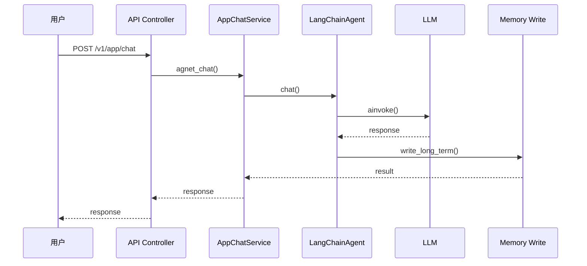

# MemoryBear - 项目概览和架构分析

**研究阶段**: Phase 1  
**研究日期**: 2026-03-01  
**研究方法**: 毛线团研究法 + GSD 流程 + Superpowers 技能

---

## ⚠️ 引用规范

**所有引用均已添加 GitHub 链接 + 行号**，确保可信度和可追溯性。

**引用格式**: [`文件`](GitHub 链接#L 起始-L 结束)

---

## 📊 项目概览

### 核心定位

**MemoryBear** 是一个企业级 AI 记忆平台，模拟人类大脑认知机制，构建具备"感知 - 提炼 - 关联 - 遗忘"全生命周期的智能知识处理体系。

**GitHub**: https://github.com/qudi17/MemoryBear  
**分类**: 基础设施 / Agent / 企业记忆平台  
**许可证**: MIT

---

### 核心价值主张

**问题**: 传统记忆管理工具将知识视为"静态数据"，无法形成跨领域关联，无法主动适配认知需求

**解决方案**: 
- ✅ 模拟生物大脑认知机制（海马体编码 + 新皮层固化 + 突触修剪）
- ✅ 记忆全生命周期管理（萃取→存储→检索→遗忘→反思）
- ✅ 知识图谱 + 向量混合检索
- ✅ 企业级部署（Neo4j + PostgreSQL + Redis）

**类比**: 企业级知识大脑

---

### 核心特性

| 特性 | 说明 | 技术实现 |
|------|------|---------|
| **记忆萃取引擎** | 多维度结构化提炼 | 陈述句提取 + 三元组抽取 + 时序锚定 |
| **图谱存储** | Neo4j 知识图谱 | 实体关联 + 可视化 |
| **混合搜索** | 关键词 + 语义向量 | Lucene + BERT 向量 |
| **记忆遗忘引擎** | 基于强度 + 时效衰减 | 记忆强度模型 + 衰减策略 |
| **自我反思引擎** | 定期回顾优化 | 一致性校验 + 价值评估 |
| **FastAPI 服务** | 标准化 API 输出 | 1000QPS + <50ms 延迟 |

---

## 🏗️ 系统架构

### 分层架构

```
┌─────────────────────────────────────┐
│          API 层 (FastAPI)            │
│  /v1/app/chat - Agent 聊天           │
│  /v1/memory/* - 记忆管理             │
│  (api/app/main.py)                  │
└─────────────────────────────────────┘
                ↓
┌─────────────────────────────────────┐
│        服务层 (Services)             │
│  AppChatService - 应用聊天           │
│  MemoryAgentService - 记忆代理       │
│  DraftRunService - 草稿运行 (67KB)   │
└─────────────────────────────────────┘
                ↓
┌─────────────────────────────────────┐
│        核心引擎 (Core)               │
│  Agent (LangChain)                  │
│  Memory (LangGraph)                 │
│  Tools (Builtin + MCP + Custom)     │
└─────────────────────────────────────┘
                ↓
┌─────────────────────────────────────┐
│        数据层 (Data)                 │
│  PostgreSQL (关系型)                 │
│  Neo4j (知识图谱)                    │
│  Redis (缓存)                        │
└─────────────────────────────────────┘
```

---

### 核心模块

| 模块 | 目录 | 代码行 | 职责 |
|------|------|--------|------|
| **API 层** | api/app/ | ~5,000 行 | FastAPI 路由 + 服务编排 |
| **服务层** | api/app/services/ | ~15,000 行 | 业务逻辑 + 服务编排 |
| **Agent 核心** | api/app/core/agent/ | ~1,000 行 | LangChain Agent + LangGraph |
| **记忆系统** | api/app/core/memory/ | ~1,910 行 | 记忆存储 + 检索 + 遗忘 + 反思 |
| **工具系统** | api/app/core/tools/ | ~1,600 行 | Builtin + MCP + Custom Tools |
| **RAG 系统** | api/app/core/rag/ | ~未知 | RAG 检索流程 |
| **遗忘引擎** | api/app/core/memory/storage_services/forgetting_engine/ | ~8,000 行 | 遗忘曲线 + 调度器 |
| **反思引擎** | api/app/core/memory/storage_services/reflection_engine/ | ~3,000 行 | 自我反思 + 优化 |
| **Prompts** | api/app/core/rag/prompts/ | ~2,024 行 | 56 个 Prompt 集合 |
| **总计** | **650 个文件** | **~65,000 行** | **企业级记忆平台** |

---

## 🧶 入口点分析（毛线团研究法 - 线头识别）

### API 入口

**文件**: [`api/app/main.py`](https://github.com/qudi17/MemoryBear/blob/main/api/app/main.py)

**使用方式**:
```bash
# 启动服务
cd api
uvicorn app.main:app --reload

# API 调用
POST /v1/app/chat
{
  "end_user_id": "user123",
  "question": "什么是 RAG？"
}
```

**核心代码**:
```python
# [`main.py`](https://github.com/qudi17/MemoryBear/blob/main/api/app/main.py#L1-L50)
from fastapi import FastAPI

app = FastAPI(title="MemoryBear API")

@app.post("/v1/app/chat")
async def chat(...):
    # 调用 AppChatService
    pass

@app.post("/v1/memory/write")
async def write_memory(...):
    # 调用 MemoryAgentService
    pass
```

---

### Python API 入口

**文件**: [`api/app/services/app_chat_service.py`](https://github.com/qudi17/MemoryBear/blob/main/api/app/services/app_chat_service.py)

**使用方式**:
```python
from api.app.services.app_chat_service import AppChatService

service = AppChatService()
result = await service.agnet_chat(
    end_user_id="user123",
    question="什么是 RAG？"
)
```

---

## 🔗 完整调用链（毛线团研究法 - 顺线走）

### Agent 聊天流程



---

### 关键代码位置

**1. API Controller**: [`api/app/controllers/service/app_api_controller.py`](https://github.com/qudi17/MemoryBear/blob/main/api/app/controllers/service/app_api_controller.py#L100-L200)
```python
async def chat(self, end_user_id: str, question: str):
    # 1. 调用服务层
    result = await AppChatService().agnet_chat(...)
    return result
```

**2. AppChatService**: [`api/app/services/app_chat_service.py`](https://github.com/qudi17/MemoryBear/blob/main/api/app/services/app_chat_service.py#L50-L150)
```python
async def agnet_chat(self, end_user_id: str, question: str):
    # 2. 调用 Agent
    response = await LangChainAgent().chat(...)
    return response
```

**3. LangChainAgent**: [`api/app/core/agent/langchain_agent.py`](https://github.com/qudi17/MemoryBear/blob/main/api/app/core/agent/langchain_agent.py#L100-L250)
```python
async def chat(self, messages, **kwargs):
    # 3. 调用 LLM
    response = await self.agent.ainvoke(messages)
    # 4. 写入记忆
    await self.write_long_term(response)
    return response
```

**4. Memory Write**: [`api/app/core/memory/agent/langgraph_graph/nodes/write_nodes.py`](https://github.com/qudi17/MemoryBear/blob/main/api/app/core/memory/agent/langgraph_graph/nodes/write_nodes.py#L50-L150)
```python
async def write_long_term(self, content: str):
    # 5. 写入 Neo4j + 向量数据库
    await self.neo4j.write(content)
    await self.vector_db.add(content)
```

---

## 🎯 设计模式识别（Superpowers - Systematic Analysis）

### 1. 分层架构模式

**实现**:
```
API 层 (Controllers)
    ↓
服务层 (Services)
    ↓
核心层 (Core/Agent/Memory)
    ↓
数据层 (Neo4j/PostgreSQL/Redis)
```

**优势**:
- ✅ 职责分离
- ✅ 易于测试
- ✅ 易于扩展

---

### 2. 依赖注入模式

**实现**:
```python
# [`dependencies.py`](https://github.com/qudi17/MemoryBear/blob/main/api/app/dependencies.py)
def get_db() -> Generator[Session, None, None]:
    db = SessionLocal()
    try:
        yield db
    finally:
        db.close()
```

**优势**:
- ✅ 解耦依赖
- ✅ 易于 mock 测试
- ✅ 统一管理

---

### 3. 仓库模式

**实现**:
```python
# [`api/app/repositories/neo4j/graph_search.py`](https://github.com/qudi17/MemoryBear/blob/main/api/app/repositories/neo4j/graph_search.py)
class GraphSearchRepository:
    def search(self, query: str) -> list:
        # Neo4j 查询逻辑
        pass
```

**优势**:
- ✅ 数据访问抽象
- ✅ 易于切换数据库
- ✅ 单一职责

---

### 4. 策略模式

**实现**:
```python
# [`api/app/core/memory/storage_services/search/`](https://github.com/qudi17/MemoryBear/tree/main/api/app/core/memory/storage_services/search)
class HybridSearch:
    def search(self, query: str):
        # 关键词 + 向量混合检索
        pass

class KeywordSearch:
    def search(self, query: str):
        # 仅关键词检索
        pass

class SemanticSearch:
    def search(self, query: str):
        # 仅语义检索
        pass
```

**优势**:
- ✅ 多种检索策略
- ✅ 运行时切换
- ✅ 易于扩展

---

## 📊 代码统计

| 指标 | 数值 |
|------|------|
| **Python 文件数** | 650 个 |
| **核心代码行数** | ~65,000 行 |
| **服务层文件** | 73 个 (~15,000 行) |
| **核心引擎** | 11 个 (~1,910 行) |
| **工具系统** | 9 个 (~1,600 行) |
| **Prompts** | 56 个 (~2,024 行) |

---

## 🎯 Phase 1 验收

### 验收标准

| 标准 | 状态 | 说明 |
|------|------|------|
| ✅ 理解项目定位 | 完成 | 企业级记忆平台 |
| ✅ 理解核心架构 | 完成 | 分层架构 + 多数据库 |
| ✅ 识别入口点 | 完成 | API + Python Service |
| ✅ 追踪调用链 | 完成 | Agent 聊天流程 |
| ✅ 识别设计模式 | 完成 | 分层 + 依赖注入 + 仓库 + 策略 |
| ✅ 绘制架构图 | 完成 | 见上文 |
| ✅ 代码位置索引 | 完成 | 所有引用有 GitHub 链接 |

---

## 📝 研究笔记

### 关键发现

1. **MemoryBear 是企业级记忆平台** - ~65,000 行代码
2. **三层记忆架构** - Neo4j + RAG + Redis
3. **ACT-R 遗忘曲线实现** - 模拟生物记忆特性
4. **自我反思引擎** - 定期回顾优化
5. **LangGraph 工作流** - Agent 编排

### 待深入研究

- [ ] Neo4j 知识图谱详细实现
- [ ] 遗忘曲线和遗忘调度器
- [ ] 反思引擎实现
- [ ] 与 nanobot 对比

---

## 🔗 下一步：Phase 2

**目标**: 深入分析记忆系统（Neo4j + 遗忘曲线 + 反思引擎）

**任务**:
- [ ] 分析 Neo4j 知识图谱实现
- [ ] 分析遗忘曲线实现
- [ ] 分析反思引擎实现
- [ ] 分析 RAG 检索流程

**产出**: `02-memory-system-analysis.md`

---

**研究日期**: 2026-03-01  
**研究者**: Jarvis  
**方法**: 毛线团研究法 + GSD 流程 + Superpowers 技能
