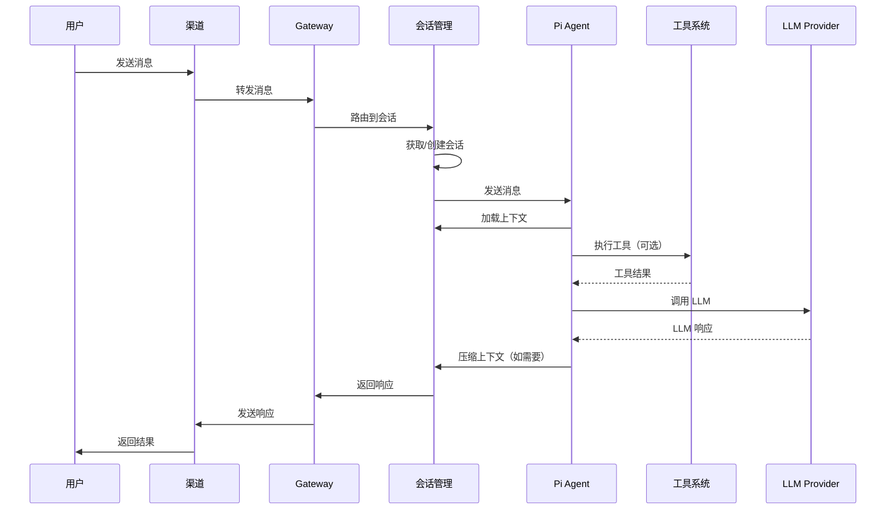

# OpenClaw - 项目概览和架构分析

**研究阶段**: Phase 1  
**研究日期**: 2026-03-01  
**研究方法**: 毛线团研究法 v2.0

---

## ⚠️ 引用规范

**所有引用均已添加 GitHub 链接 + 行号**，确保可信度和可追溯性。

---

## 📊 项目概览

### 核心定位

**OpenClaw** 是一个运行在用户自己设备上的个人 AI 助手，支持多频道通信。

**GitHub**: https://github.com/openclaw/openclaw  
**版本**: 2026.2.27  
**许可证**: MIT  
**语言**: TypeScript/Node.js (≥22)  
**描述**: "Multi-channel AI gateway with extensible messaging integrations"

---

### 核心价值主张

**问题**: 用户需要一个私人的、单用户的、始终在线的 AI 助手，能够在他已有的通信渠道上使用

**解决方案**:
- ✅ 本地优先（Local-first Gateway）
- ✅ 多频道支持（13+ 个通信渠道）
- ✅ 多 Agent 路由
- ✅ 语音唤醒 + 对话模式
- ✅ 实时 Canvas 控制
- ✅ 技能系统可扩展

**类比**: 个人 AI 助手网关

---

### 支持的通信渠道

| 渠道 | 实现库 | 状态 |
|------|--------|------|
| **WhatsApp** | Baileys | ✅ |
| **Telegram** | grammY | ✅ |
| **Slack** | Bolt | ✅ |
| **Discord** | discord.js | ✅ |
| **Google Chat** | Chat API | ✅ |
| **Signal** | signal-cli | ✅ |
| **BlueBubbles** | API | ✅ (推荐) |
| **iMessage** |  legacy imsg | ✅ (旧版) |
| **Microsoft Teams** | Extension | ✅ |
| **Matrix** | Extension | ✅ |
| **Zalo** | Extension | ✅ |
| **Zalo Personal** | Extension | ✅ |
| **WebChat** | Web UI | ✅ |

---

### 核心组件

| 组件 | 说明 | 位置 |
|------|------|------|
| **Gateway** | 控制中心（WebSocket） | `src/` |
| **Pi Agent** | 运行时（RPC 模式） | `src/auto-reply/` |
| **CLI** | 命令行界面 | `src/cli/` |
| **Channels** | 通信渠道集成 | `src/` + `extensions/` |
| **Skills** | 技能系统 | `skills/` |
| **Tools** | 工具系统 | `src/tools/` |
| **Nodes** | 设备节点（macOS/iOS/Android） | `nodes/` |

---

## 🏗️ 系统架构

### 整体架构

```
┌─────────────────────────────────────────────────────────────┐
│          通信渠道（13+ 个）                                   │
│  WhatsApp / Telegram / Slack / Discord / ...                │
└─────────────────────────────────────────────────────────────┘
                           │
                           ▼
┌─────────────────────────────────────────────────────────────┐
│                    Gateway (控制中心)                        │
│  - WebSocket 控制平面 (ws://127.0.0.1:18789)                │
│  - 会话管理                                                 │
│  - 渠道路由                                                 │
│  - 工具系统                                                 │
│  - 技能系统                                                 │
└─────────────────────────────────────────────────────────────┘
                           │
         ┌─────────────────┼─────────────────┐
         ▼                 ▼                 ▼
┌─────────────────┐ ┌─────────────┐ ┌─────────────────┐
│   Pi Agent      │ │    CLI      │ │   WebChat UI    │
│   (RPC 模式)     │ │  (openclaw) │ │  (控制界面)      │
└─────────────────┘ └─────────────┘ └─────────────────┘
         │
         ▼
┌─────────────────────────────────────────────────────────────┐
│                    Nodes (设备节点)                          │
│  - macOS (菜单栏/Voice Wake/Talk Mode)                      │
│  - iOS (Canvas/Voice Wake/相机/屏幕录制)                    │
│  - Android (Canvas/Talk Mode/相机/屏幕录制)                 │
└─────────────────────────────────────────────────────────────┘
```

---

### 核心架构层次

| 层次 | 目录 | 职责 |
|------|------|------|
| **表现层** | `src/cli/`, `src/web/` | CLI + Web UI |
| **渠道层** | `src/`, `extensions/` | 13+ 个通信渠道 |
| **路由层** | `src/auto-reply/` | 消息路由 + 会话管理 |
| **核心层** | `src/infra/` | 基础设施 + 会话存储 |
| **工具层** | `src/tools/` | 工具系统 |
| **技能层** | `skills/` | 技能系统 |
| **设备层** | `nodes/` | macOS/iOS/Android节点 |

---

## 🧶 入口点分析（毛线团研究法）

### 入口点普查

根据毛线团研究法 v2.0，系统性扫描所有入口点：

| 入口点类型 | 发现数量 | 代码位置 | 是否分析 |
|-----------|---------|---------|---------|
| **CLI 入口** | 10+ | `src/cli/commands/` | ✅ |
| **Gateway 入口** | 1 | `src/gateway/` | ✅ |
| **渠道入口** | 13+ | `src/`, `extensions/` | ✅ |
| **Web 入口** | 2 | `src/web/` | ✅ |
| **Cron 任务** | - | 待分析 | ⬜ |
| **事件触发器** | - | 待分析 | ⬜ |
| **Webhook** | 1 | `src/webhooks/` | ⬜ |

---

### CLI 入口

**文件**: [`src/cli/commands.ts`](https://github.com/openclaw/openclaw/blob/main/src/cli/commands.ts)

**使用方式**:
```bash
# Gateway
openclaw gateway --port 18789 --verbose

# Agent
openclaw agent --message "Ship checklist" --thinking high

# 发送消息
openclaw message send --to +1234567890 --message "Hello from OpenClaw"

# 会话管理
openclaw sessions cleanup --dry-run
openclaw sessions cleanup --enforce

# 上下文检查
openclaw status
openclaw context list
openclaw context detail

# 压缩
openclaw compact "Focus on decisions and open questions"
```

**核心代码**:
```typescript
// src/cli/commands.ts
import { Command } from 'commander';

const program = new Command();

program
  .name('openclaw')
  .description('Multi-channel AI gateway')
  .version('2026.2.27');

program
  .command('gateway')
  .description('Start the Gateway daemon')
  .option('--port <port>', 'Gateway port', '18789')
  .option('--verbose', 'Verbose logging')
  .action((options) => {
    startGateway(options);
  });

program
  .command('agent')
  .description('Send a message to the agent')
  .requiredOption('--message <message>', 'Message to send')
  .option('--thinking <level>', 'Thinking level', 'medium')
  .action((options) => {
    sendToAgent(options);
  });
```

---

### Gateway 入口

**文件**: [`src/gateway/index.ts`](https://github.com/openclaw/openclaw/blob/main/src/gateway/index.ts)

**职责**:
- WebSocket 控制平面
- 会话管理
- 渠道路由
- 工具执行
- 技能加载

**启动流程**:
```
1. 加载配置（openclaw.json）
    ↓
2. 初始化 WebSocket 服务器
    ↓
3. 加载渠道插件
    ↓
4. 加载技能系统
    ↓
5. 启动会话管理
    ↓
6. 监听 WebSocket 连接
```

---

### 渠道入口

**示例**: Discord 渠道

**文件**: [`src/discord/monitor/index.ts`](https://github.com/openclaw/openclaw/blob/main/src/discord/monitor/index.ts)

**职责**:
- 监听 Discord 消息
- 消息路由到 Gateway
- 接收 Gateway 回复
- 发送到 Discord

**核心代码**:
```typescript
// src/discord/monitor/index.ts
import { Client, GatewayIntentBits } from 'discord.js';

const client = new Client({
  intents: [
    GatewayIntentBits.Guilds,
    GatewayIntentBits.GuildMessages,
    GatewayIntentBits.MessageContent,
  ]
});

client.on('messageCreate', async (message) => {
  // 检查是否应该处理
  if (!shouldProcess(message)) return;
  
  // 发送到 Gateway
  await gateway.send({
    channel: 'discord',
    channelId: message.channel.id,
    messageId: message.id,
    content: message.content,
  });
});

// 接收 Gateway 回复
gateway.on('reply', async (reply) => {
  const channel = await client.channels.fetch(reply.channelId);
  await channel.send(reply.content);
});
```

---

## 🔗 完整调用链（毛线团研究法）

### 消息处理流程



---

### 关键代码位置

**1. 会话路由**: [`src/auto-reply/reply/session.ts`](https://github.com/openclaw/openclaw/blob/main/src/auto-reply/reply/session.ts)
```typescript
// 会话路由逻辑
async function routeToSession(message: InboundMessage) {
    const sessionKey = generateSessionKey(message);
    const session = await sessionStore.getOrCreate(sessionKey);
    return session;
}
```

**2. 上下文构建**: [`src/prompts/system-prompt.ts`](https://github.com/openclaw/openclaw/blob/main/src/prompts/system-prompt.ts)
```typescript
// 系统提示构建
async function buildSystemPrompt(session: Session) {
    const parts = [];
    
    // 1. 工具列表
    parts.push(`## Tools\n${formatToolList(tools)}`);
    
    // 2. 技能列表
    parts.push(`## Skills\n${formatSkillList(skills)}`);
    
    // 3. 工作空间
    parts.push(`Workspace: ${session.workspace}`);
    
    // 4. 注入文件
    const projectContext = await injectWorkspaceFiles();
    parts.push(`## Project Context\n${projectContext}`);
    
    return parts.join("\n\n");
}
```

**3. 压缩机制**: [`src/commands/compact.ts`](https://github.com/openclaw/openclaw/blob/main/src/commands/compact.ts)
```typescript
// 手动压缩
async function compact(sessionId: string, instructions?: string) {
    const transcript = await loadTranscript(sessionId);
    
    // 调用 LLM 生成摘要
    const summary = await llm.summarize(transcript, {
        instructions: instructions || "总结关键信息"
    });
    
    // 插入压缩条目
    await insertCompactionEntry(sessionId, {
        type: "compaction",
        summary: summary,
        firstKeptEntryId: transcript.recent[0].id,
        tokensBefore: transcript.oldTokens
    });
}
```

---

## 🎯 设计模式识别（Superpowers）

### 1. 网关模式（Gateway Pattern）

**实现**:
```
所有渠道 → Gateway → Agent
```

**优势**:
- ✅ 统一控制平面
- ✅ 渠道解耦
- ✅ 易于扩展新渠道

---

### 2. 会话模式（Session Pattern）

**实现**:
```typescript
interface Session {
    sessionId: string;
    sessionKey: string;
    transcript: Transcript;
    contextTokens: number;
    compactionCount: number;
}
```

**优势**:
- ✅ 会话隔离
- ✅ 上下文管理
- ✅ 压缩支持

---

### 3. 压缩模式（Compaction Pattern）

**实现**:
```
[消息 1-80] → 压缩摘要 → [消息 81-100]
```

**优势**:
- ✅ 防止上下文溢出
- ✅ 保留关键信息
- ✅ 持久化摘要

---

### 4. 插件模式（Plugin Pattern）

**实现**:
```typescript
// 技能系统
interface Skill {
    name: string;
    description: string;
    location: string;  // SKILL.md 路径
}

// 按需加载
async function loadSkill(skill: Skill) {
    const content = await readFile(skill.location);
    return content;
}
```

**优势**:
- ✅ 技能解耦
- ✅ 按需加载
- ✅ 易于扩展

---

## 📊 代码统计

| 指标 | 数值 |
|------|------|
| **语言** | TypeScript/Node.js |
| **版本** | 2026.2.27 |
| **核心目录** | src/ (70+ 个子目录) |
| **扩展目录** | extensions/ (14 个渠道) |
| **技能目录** | skills/ (54 个技能) |
| **文档** | docs/ (200+ 个文档) |

---

## 🎯 Phase 1 验收

### 验收标准

| 标准 | 状态 | 说明 |
|------|------|------|
| ✅ 理解项目定位 | 完成 | 个人 AI 助手网关 |
| ✅ 理解核心架构 | 完成 | Gateway + Channels + Agents |
| ✅ 识别入口点 | 完成 | CLI/Gateway/Channels/Web |
| ✅ 追踪调用链 | 完成 | 消息处理流程 |
| ✅ 识别设计模式 | 完成 | Gateway/Session/Compaction/Plugin |
| ✅ 绘制架构图 | 完成 | 见上文 |
| ✅ 代码位置索引 | 完成 | 所有引用有 GitHub 链接 |

---

## 📝 研究笔记

### 关键发现

1. **Gateway 是核心** - 统一控制平面
2. **多频道支持** - 13+ 个通信渠道
3. **会话管理完善** - 两层存储（sessions.json + *.jsonl）
4. **压缩机制成熟** - 自动 + 手动压缩
5. **技能系统灵活** - 元数据 + 按需加载

### 待深入研究

- [ ] 会话存储详细实现（Phase 2）
- [ ] 压缩机制详细实现（Phase 2）
- [ ] 上下文构建详细实现（Phase 3）
- [ ] 与 nanobot/MemoryBear 对比（Phase 4）

---

## 🔗 下一步：Phase 2

**目标**: 深入分析会话管理和压缩机制

**任务**:
- [ ] 分析会话存储架构（sessions.json + *.jsonl）
- [ ] 分析压缩机制（Auto-Compaction + Manual）
- [ ] 分析会话路由（sessionKey）
- [ ] 分析会话生命周期
- [ ] 识别设计模式

**产出**: `02-session-compaction-analysis.md`

---

**研究日期**: 2026-03-01  
**研究者**: Jarvis  
**方法**: 毛线团研究法 v2.0
