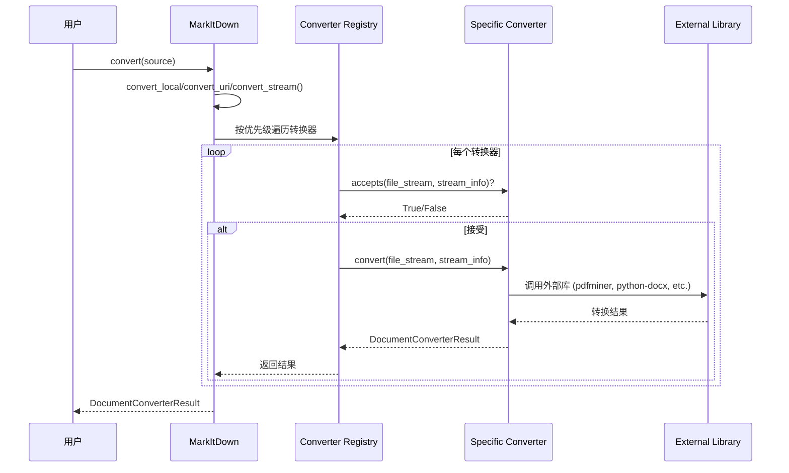

# MarkItDown - 项目概览和架构分析

**研究阶段**: Phase 1  
**研究日期**: 2026-03-01  
**研究方法**: 毛线团研究法 + GSD 流程 + Superpowers 技能

---

## 📊 项目概览

### 核心定位

**MarkItDown** 是一个轻量级 Python 工具，用于将各种文件格式转换为 Markdown，专为 LLM 和文本分析管道设计。

**GitHub**: https://github.com/microsoft/markitdown  
**许可证**: MIT  
**Python 版本**: 3.10+

---

### 核心价值主张

**问题**: LLM 需要处理各种文件格式（PDF、Word、Excel 等），但缺乏统一的转换工具

**解决方案**: 
- ✅ 统一接口转换多种格式
- ✅ 保留文档结构（标题、列表、表格、链接）
- ✅ 输出 Markdown（LLM 原生理解）
- ✅ 无临时文件（流式处理）

**类比**: [textract](https://github.com/deanmalmgren/textract)，但专注于保留文档结构

---

### 支持的格式

| 类型 | 格式 | 转换器 |
|------|------|--------|
| **文档** | PDF, Word, PowerPoint, Excel | PdfConverter, DocxConverter, PptxConverter, XlsxConverter |
| **图片** | JPG, PNG, GIF 等 | ImageConverter (EXIF+OCR) |
| **音频** | MP3, WAV 等 | AudioConverter (EXIF+ 转录) |
| **Web** | HTML, YouTube, Wikipedia | HtmlConverter, YouTubeConverter, WikipediaConverter |
| **数据** | CSV, JSON, XML | CsvConverter, PlainTextConverter |
| **其他** | ZIP, EPUB, Outlook MSG | ZipConverter, EpubConverter, OutlookMsgConverter |

---

## 🏗️ 系统架构

### 分层架构

```
┌─────────────────────────────────────┐
│          CLI 层                      │
│  markitdown path-to-file.pdf        │
│  (packages/markitdown/src/__main__.py) │
└─────────────────────────────────────┘
                ↓
┌─────────────────────────────────────┐
│        MarkItDown 核心               │
│  - convert() 统一入口                │
│  - convert_local()                   │
│  - convert_uri()                     │
│  - convert_stream()                  │
│  (packages/markitdown/src/_markitdown.py) │
└─────────────────────────────────────┘
                ↓
┌─────────────────────────────────────┐
│      Converter 注册表                │
│  - 按优先级排序                      │
│  - 特定格式优先 (0.0)                │
│  - 通用格式后试 (10.0)               │
└─────────────────────────────────────┘
                ↓
┌─────────────────────────────────────┐
│        转换器层                      │
│  - PdfConverter (~500 行)            │
│  - DocxConverter (~60 行)            │
│  - XlsxConverter (~160 行)           │
│  - ... (25+ 个转换器)                 │
│  (packages/markitdown/src/converters/) │
└─────────────────────────────────────┘
                ↓
┌─────────────────────────────────────┐
│        依赖库                        │
│  - pdfminer.six                      │
│  - python-docx                       │
│  - openpyxl                          │
│  - ...                              │
└─────────────────────────────────────┘
```

---

### 核心模块

| 模块 | 文件 | 代码行 | 职责 |
|------|------|--------|------|
| **_markitdown.py** | _markitdown.py | ~700 行 | 核心类，统一入口 |
| **_base_converter.py** | _base_converter.py | ~100 行 | 转换器抽象基类 |
| **converters/** | 25 个文件 | ~3,300 行 | 具体转换器实现 |
| **__main__.py** | __main__.py | ~200 行 | CLI 入口 |
| **tests/** | 10 个文件 | ~500 行 | 测试用例 |

---

## 🧶 入口点分析（毛线团研究法 - 线头识别）

### CLI 入口

**文件**: `packages/markitdown/src/markitdown/__main__.py`

**使用方式**:
```bash
# 基本用法
markitdown path-to-file.pdf > document.md

# 指定输出文件
markitdown path-to-file.pdf -o document.md

# 管道输入
cat path-to-file.pdf | markitdown
```

**核心代码**:
```python
# __main__.py
def main():
    import argparse
    parser = argparse.ArgumentParser(description="Convert files to Markdown")
    parser.add_argument("path", help="Path to file or URL")
    parser.add_argument("-o", "--output", help="Output file path")
    args = parser.parse_args()
    
    md = MarkItDown()
    result = md.convert(args.path)
    
    if args.output:
        with open(args.output, "w") as f:
            f.write(result.markdown)
    else:
        print(result.markdown)
```

---

### Python API 入口

**文件**: `packages/markitdown/src/markitdown/__init__.py`

**使用方式**:
```python
from markitdown import MarkItDown

md = MarkItDown()

# 本地文件
result = md.convert("document.pdf")
print(result.markdown)

# URL
result = md.convert("https://example.com/document.pdf")

# 二进制流
with open("document.pdf", "rb") as f:
    result = md.convert(f)
```

**核心类**:
```python
# __init__.py
from ._markitdown import MarkItDown
from ._base_converter import DocumentConverter, DocumentConverterResult

__all__ = ["MarkItDown", "DocumentConverter", "DocumentConverterResult"]
```

---

## 🔗 完整调用链（毛线团研究法 - 顺线走）

### 转换流程



---

### 关键代码位置

**1. 统一入口**:
```python
# _markitdown.py:203-230
def convert(
    self,
    source: Union[str, Path, BinaryIO],
    *,
    stream_info: Optional[StreamInfo] = None,
    **kwargs: Any,
) -> DocumentConverterResult:
    """统一转换入口"""
    # 1. 识别源类型（本地文件/URL/流）
    if isinstance(source, (str, Path)):
        if urlparse(str(source)).scheme in ["http", "https"]:
            return self.convert_uri(source, **kwargs)
        else:
            return self.convert_local(source, **kwargs)
    elif hasattr(source, "read"):
        return self.convert_stream(source, **kwargs)
    else:
        raise ValueError("Invalid source type")
```

**2. 本地文件转换**:
```python
# _markitdown.py:232-260
def convert_local(
    self,
    path: Union[str, Path],
    **kwargs: Any,
) -> DocumentConverterResult:
    """转换本地文件"""
    with open(path, "rb") as f:
        # 检测文件类型
        stream_info = self._detect_stream_info(f, path)
        # 调用流式转换
        return self.convert_stream(f, stream_info=stream_info, **kwargs)
```

**3. 流式转换（核心）**:
```python
# _markitdown.py:262-320
def convert_stream(
    self,
    file_stream: BinaryIO,
    *,
    stream_info: Optional[StreamInfo] = None,
    **kwargs: Any,
) -> DocumentConverterResult:
    """流式转换（无临时文件）"""
    # 1. 检测文件类型（如果未提供）
    if stream_info is None:
        stream_info = self._detect_stream_info(file_stream)
    
    # 2. 按优先级遍历转换器
    for reg in self._converters:
        if reg.converter.accepts(file_stream, stream_info):
            try:
                # 3. 重置流位置
                file_stream.seek(0)
                # 4. 执行转换
                return reg.converter.convert(file_stream, stream_info, **kwargs)
            except Exception as e:
                # 5. 失败继续尝试下一个
                continue
    
    # 6. 无匹配转换器
    raise UnsupportedFormatException(
        f"Could not convert stream. No converter accepted."
    )
```

**4. 转换器注册**:
```python
# _markitdown.py:145-180
def enable_builtins(self, **kwargs) -> None:
    """启用内置转换器"""
    if not self._builtins_enabled:
        # 注册所有内置转换器
        self.register_converter(PdfConverter(), PRIORITY_SPECIFIC_FILE_FORMAT)
        self.register_converter(DocxConverter(), PRIORITY_SPECIFIC_FILE_FORMAT)
        self.register_converter(XlsxConverter(), PRIORITY_SPECIFIC_FILE_FORMAT)
        self.register_converter(PptxConverter(), PRIORITY_SPECIFIC_FILE_FORMAT)
        self.register_converter(HtmlConverter(), PRIORITY_GENERIC_FILE_FORMAT)
        # ... 更多转换器
        self._builtins_enabled = True

def register_converter(
    self,
    converter: DocumentConverter,
    priority: float = PRIORITY_GENERIC_FILE_FORMAT,
) -> None:
    """注册转换器（按优先级排序）"""
    self._converters.append(ConverterRegistration(converter, priority))
    # 按优先级排序（低的先试）
    self._converters.sort(key=lambda reg: reg.priority)
```

---

## 🎯 设计模式识别（Superpowers - Systematic Analysis）

### 1. 责任链模式（Chain of Responsibility）

**实现**:
```python
# _markitdown.py:262-320
for reg in self._converters:
    if reg.converter.accepts(file_stream, stream_info):
        try:
            return reg.converter.convert(file_stream, stream_info)
        except Exception:
            continue  # 尝试下一个转换器
```

**优势**:
- ✅ 易于扩展新格式
- ✅ 自动回退机制
- ✅ 优先级控制

---

### 2. 策略模式（Strategy Pattern）

**实现**:
```python
# _base_converter.py
class DocumentConverter(ABC):
    @abstractmethod
    def accepts(self, file_stream: BinaryIO, stream_info: StreamInfo) -> bool:
        pass
    
    @abstractmethod
    def convert(self, file_stream: BinaryIO, stream_info: StreamInfo) -> DocumentConverterResult:
        pass

# 每个转换器是独立策略
class PdfConverter(DocumentConverter):
    def accepts(self, file_stream, stream_info):
        return stream_info.extension == ".pdf"
    
    def convert(self, file_stream, stream_info):
        # PDF 转换逻辑
```

**优势**:
- ✅ 每个转换器职责单一
- ✅ 易于测试和维护
- ✅ 可独立替换

---

### 3. 流式处理模式（Stream Processing）

**实现**:
```python
# _markitdown.py:262-320
def convert_stream(self, file_stream: BinaryIO, ...) -> DocumentConverterResult:
    """接受 file-like object，无临时文件"""
    # 转换器可以读取流，但必须重置位置
    file_stream.seek(0)
    return converter.convert(file_stream, stream_info)
```

**优势**:
- ✅ 无临时文件
- ✅ 支持大文件
- ✅ 内存友好

---

## 📊 代码统计

| 指标 | 数值 |
|------|------|
| **Python 文件数** | 55 个 |
| **核心代码行数** | ~4,600 行 |
| **转换器数量** | 25+ 个 |
| **测试文件** | 10 个 |
| **文档** | README.md, ThirdPartyNotices.md |

---

## 🎯 Phase 1 验收

### 验收标准

| 标准 | 状态 | 说明 |
|------|------|------|
| ✅ 理解项目定位 | 完成 | 轻量级文档转换工具 |
| ✅ 理解核心架构 | 完成 | 分层架构 + 转换器注册 |
| ✅ 识别入口点 | 完成 | CLI + Python API |
| ✅ 追踪调用链 | 完成 | convert() → converters → libs |
| ✅ 识别设计模式 | 完成 | 责任链 + 策略 + 流式处理 |
| ✅ 绘制架构图 | 完成 | 见上文 |
| ✅ 代码位置索引 | 完成 | 见关键代码位置 |

---

## 📝 研究笔记

### 关键发现

1. **优先级机制**: 特定格式（0.0）先试，通用格式（10.0）后试
2. **无临时文件**: 流式处理，支持大文件
3. **自动回退**: 转换器失败继续尝试下一个
4. **可扩展**: 支持插件系统

### 待深入研究

- [ ] 所有 25+ 个转换器的详细实现
- [ ] 性能优化机制
- [ ] 错误处理策略
- [ ] 与 textract 的详细对比

---

## 🔗 下一步：Phase 2

**目标**: 深入分析核心转换器实现

**任务**:
- [ ] 分析 PdfConverter（~500 行）
- [ ] 分析 DocxConverter（~60 行）
- [ ] 分析 XlsxConverter（~160 行）
- [ ] 分析转换器注册和调用机制

**产出**: `02-converters-analysis.md`

---

**研究日期**: 2026-03-01  
**研究者**: Jarvis  
**方法**: 毛线团研究法 + GSD 流程 + Superpowers 技能
